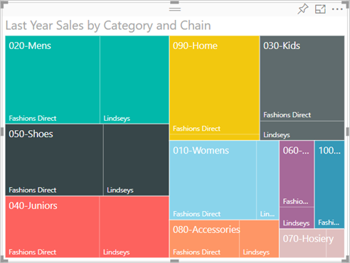
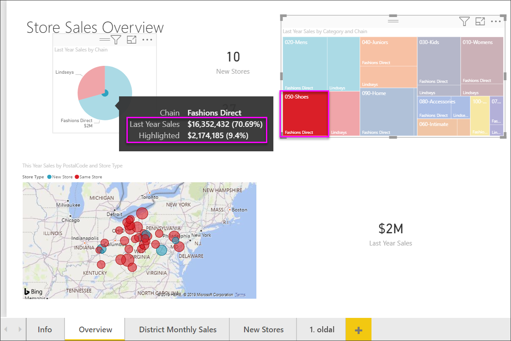

# Fatérképek a Power BI-ban

[!INCLUDE[consumer-appliesto-nyyn](../includes/consumer-appliesto-nyyn.md)]

[!INCLUDE [power-bi-visuals-desktop-banner](../includes/power-bi-visuals-desktop-banner.md)]

A fatérképek a hierarchikus adatokat beágyazott téglalapokként jelenítik meg. A hierarchia minden egyes szintjét egy színes téglalap (más néven „ág”) jelöli, amely további téglalapokat („leveleket”) tartalmaz. A Power BI az egyes téglalapok közötti távolságot a mért értékek alapján határozza meg. A téglalapok méret szerint vannak rendezve, a bal felső saroktól (legnagyobb), a jobb alsó sarokig (legkisebb).

Ha például az értékesítést elemzi, akkor használhat legfelső szintű ágakat a ruházati kategóriákhoz: **Urban** (Város), **Rural** (Vidék), **Youth** (Fiatalok), és **Mix** (Vegyes). A Power BI a kategória téglalapjait levelekre bontja szét az adott kategórián belüli ruházati gyártók szerit. Ezek a téglalapok az eladott darabszámok alapján kapnák a méretüket és az árnyalatukat.

A fenti **Urban** ágban sok **VanArsdel** márkájú ruhát adtak el. **Natura** és **Fama** márkából kevesebbet értékesítettek. Csak néhány **Leo** márkájú fogyott. Így a fatérkép **Urban** ágában az alábbiak vannak:

* A **VanArsdel** rendelkezik a legnagyobb téglalappal a bal felső sarokban.

* Valamivel kisebb téglalapban jelenik meg a **Natura** és a **Fama**.

* Számos egyéb téglalap jelöli az összes többi ruházati márkát.

* Egy egészen kis méretű jut a **Leo** márkára.

Az egyéb ruházati kategóriákban értékesített tételek számát pedig az egyes levélcsomópontok mérete és árnyalata alapján hasonlíthatom össze: minél nagyobb és sötétebb egy adott téglalap, annál nagyobb értéket jelöl.

## Mikor érdemes fatérképet használni

A fatérképek használata nagyszerű választás, ha:

* Nagy mennyiségű hierarchikus adatot szeretne megjeleníteni.

* Egy oszlopdiagram nem tudja hatékonyan kezelni a nagy mennyiségű értéket.

* Az egyes részek és az egész közötti arányokat szeretné megjeleníteni.

* A hierarchia egyes kategóriaszintjein belül megfigyelhető eloszlási mintákat szeretné megjeleníteni.

* Méret és színek alapján szeretne attribútumokat megjeleníteni.

* Mintákat, kiugró adatokat, legfontosabb résztvevőket és kivételeket szeretne azonosítani.

## Előfeltétel

Ez az oktatóanyag a [Kiskereskedelmi elemzési minta PBIX-fájlt](https://download.microsoft.com/download/9/6/D/96DDC2FF-2568-491D-AAFA-AFDD6F763AE3/Retail%20Analysis%20Sample%20PBIX.pbix) használja.

1. A menüsor bal felső részén válassza a **Fájl** > **Megnyitás** lehetőséget
   
2. Keresse meg a **Kiskereskedelmi elemzési minta PBIX-fájlt**

1. Nyissa meg a **Kiskereskedelmi elemzési minta PBIX-fájlt** jelentésnézetben .

1. Kiválasztás  új oldal hozzáadásához.

> [!NOTE]
> A jelentés egy Power BI-munkatárssal való megosztásához mindkettőjüknek Power BI Pro-licenccel kell rendelkezniük, vagy a jelentésnek egy Premium kapacitásban kell lennie.    

Ha beszerezte a **Kiskereskedelmi elemzési mintát**, elkezdheti a munkát.

## Egyszerű fatérkép létrehozása

Létrehoz egy jelentést, és hozzáad egy egyszerű fatérképet.

1. A **Mezők** panelen válassza az **Értékesítés** > **Tavalyi értékesítések** mértéket.

   

1. A fatérkép ikon kiválasztása  a diagram fatérképpé konvertálásához.

   

1. Válassza az **Elem** > **Kategória** lehetőséget, amellyel hozzáadhatja a **Kategória** elemet a **Csoport** panelhez.

    A Power BI létrehoz egy fatérképet, amelyen a téglalapok mérete az összes eladáson alapszik, a szín pedig a kategóriát jelöli. Lényegében egy olyan hierarchiát hozott létre, amely az összes értékesítés kategóriák szerinti relatív arányát jeleníti meg. A legtöbb eladás a **Men's** (Férfi) kategóriában van, a legkevesebb pedig a **Hosiery** (Harisnya) kategóriában.

    

1. Válassza az **Üzlet** > **Üzletlánc** elemet, amellyel hozzáadhatja az **Üzletlánc** elemet a **Részletek** panelhez, így elkészül a fatérkép. Így már kategóriák és üzletláncok szerint is össze tudja hasonlítani a tavalyi év értékesítéseit.

   

   > [!NOTE]
   > A Színtelítettség és a Részletek gyűjtők nem használható egyszerre.

1. Helyezze a kurzort egy **Chain** elem fölé, hogy megjelenjen az adott **Kategória** elemleírása.

    Például, ha a kurzorral a **090-Home** téglalap **Fashions Direct** levelére mutat, akkor megjelenik a Home (Otthoni) kategória Fashion Direct részéhez tartozó elemleírás.

   

## Kiemelés és keresztszűrés

Egy **Kategória** vagy **Részlet** kiemelése egy fatérképen keresztkiemelést és keresztszűrést végez a jelentésoldalon lévő többi vizualizáción. A lépések elvégzéséhez adjon vizualizációkat a jelentésoldalhoz, vagy másolja a fatérképet a jelentésben szereplő egyéb oldalak egyikéhez. A fatérkép alábbi képe az **Áttekintés** lapra lett átmásolva. 

1. A fatérképen válasszon egy **kategóriát**, vagy válasszon egy **láncot** egy **kategórián** belül. Ez kiemeli a lapon lévő többi vizualizáció megfelelő adatait is. A **050-Shoes** kiválasztása például megmutatja, hogy a tavalyi év cipőeladásai **16 352 432 USD** értéket képviseltek, amelyből **2 174 185 USD** a **Fashions Directtől** származott.

   

1. A **Last Year Sales by Chain** (Előző évi értékesítések üzletlánc szerint) tortadiagramban válassza a **Fashions Direct** szeletet, ezzel keresztszűrést végezhet a fatérképen.
   

1. A keresztkiemelések és keresztszűrések használatának módját a [Vizualizációk közötti interakciók módosítása Power BI-jelentésekben](../service-reports-visual-interactions.md) című cikk ismerteti.

## Következő lépések

* [Vízesésdiagramok a Power BI-ban](power-bi-visualization-waterfall-charts.md)

* [Vizualizációtípusok a Power BI-ban](power-bi-visualization-types-for-reports-and-q-and-a.md)
