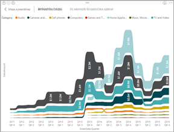

# Vizualizációtípusok a Power BI-ban
## Power BI-vizualizációk
Hamarosan új vizualizációkkal bővítjük a kínálatot. Kövessen bennünket!

Tekintse meg továbbá a [Microsoft AppSource](https://appsource.microsoft.com/marketplace/apps?product=power-bi-visuals) folyamatosan bővülő kínálatát, ahol [egyéni vizualizációkat](../power-bi-custom-visuals.md) tölthet le saját irányítópultjához és jelentéseihez. Kreatív kedvében van? [Megtudhatja, hogyan hozhat létre saját vizualizációkat, és hogyan adhatja hozzá őket a közösségi oldalhoz](../developer/office-store.md).  

## A Power BI-ban elérhető vizualizációk listája
Ezek a vizualizációk mind hozzáadhatók a Power BI-jelentésekhez, megadhatók a Q&A-ben, illetve rögzíthetők az irányítópultokon.

### Területdiagramok: Alapszintű (rétegzett) és halmozott

>[!TIP]
>Az alapszintű területdiagram a vonaldiagramon alapul, és a tengely és a vonal közötti terület fel van töltve.

További információt az [alapszintű területdiagramot](power-bi-visualization-basic-area-chart.md) ismertető cikkben talál.

### Sáv- és oszlopdiagramok

 

>[!TIP]
>A sávdiagram egy adott érték különböző kategóriákban való megjelenítésének alapvető eszköze.

### Kártyák: Többsoros

### Kártyák: Egyszámos

További információt a [Kártya létrehozása (nagy számot tartalmazó csempe)](power-bi-visualization-card.md) című témakörben talál.

### Kombinált diagramok

>[!TIP]
>A kombinált diagram egy oszlopdiagram és egy vonaldiagram egyesítésével jön létre. *Vonal- és halmozott oszlopdiagram*, illetve *Vonal- és csoportosított oszlopdiagram* közül választhat.

További információt a [Power BI kombinált diagramjait](power-bi-visualization-combo-chart.md) ismertető cikkben talál.

### Perecdiagramok

>[!TIP]
>A perecdiagramok a kördiagramokhoz hasonlítanak.  A részek egészhez való viszonyát ábrázolják.

További információt a [Power BI perecdiagramjait](power-bi-visualization-doughnut-charts.md) ismertető cikkben talál.

### Tölcsérdiagramok

>[!TIP]
>A tölcsérdiagramokkal megjeleníthetők a szakaszos folyamatok úgy, hogy az egyes elemek sorban haladnak egyik szakaszról a másikra.  Akkor használjon tölcsérdiagramot, ha az egyes szakaszok közötti fokozatos változást szeretné megjeleníteni, például egy értékesítési folyamatot, amely értékesítési lehetőségekkel kezdődik, és a vásárlás teljesítésével végződik.

További információt a [Power BI tölcsérdiagramjait](power-bi-visualization-funnel-charts.md) ismertető cikkben talál.

### Mérőóra-diagramok

>[!TIP]
>Az adatok jelenlegi állását szemléltetik egy adott célhoz képest.

További információt a [Power BI mérőóra-diagramjait](power-bi-visualization-radial-gauge-charts.md) ismertető cikkben talál.

<!-- ### Key influencers chart

A key influencer chart displays the major contributors to a selected result or value. -->

### KPI-k

>[!TIP]
>Egy mérhető cél elérésében megtett előrehaladást ábrázolják.

További információt a [Power BI KPI-jeit](power-bi-visualization-kpi.md) ismertető cikkben talál.

### Vonaldiagramok

>[!TIP]
>Egy teljes értéksorozat összesített formáját szemléltetik, legtöbbször az idő függvényében.

### Térképek: Alapszintű térképek

>[!TIP]
>A kategorikus és mennyiségi információk térbeli helyekhez való társítására szolgálnak.

További információ: [Tippek és trükkök térképes vizualizációkhoz](power-bi-map-tips-and-tricks.md).

### Térképek: ArcGIS-térképek

További információt a [Power BI ArcGIS-térképeit](power-bi-visualization-arcgis.md) ismertető cikkben talál.

### Térképek: Kitöltött térképek (Choropleth)

>[!TIP]
>Minél intenzívebb egy szín, annál nagyobb értéket jelez.

További információt a [Power BI kitöltött térképeit](power-bi-visualization-filled-maps-choropleths.md) ismertető cikkben talál.

### Térképek: Alakzatleképezések

>[!TIP]
>Az egyes régiókat szín alapján hasonlítja össze.

További információt a [Power BI alakzatleképezéseit](desktop-shape-map.md) ismertető cikkben talál.

### Mátrix

További információt a [Power BI mátrixvizualizációit](desktop-matrix-visual.md) ismertető cikkben talál.

### Tortadiagramok

A tortadiagramok a részek egészhez való viszonyát ábrázolják. 

### Szalagdiagram

A szalagdiagramokon jól látható, hogy melyik adatkategória a legmagasabb rangú (értékű). A szalagdiagramokkal hatékonyan ábrázolható a rangok időbeli változása: minden időszakban a legmagasabb rangú (értékű) kategória látható felül.

### Pont- és buborékdiagramok

>[!TIP]
>2 (pont) vagy 3 (buborék) numerikus érték kapcsolatát jelenítik meg – van-e kapcsolat, mi a sorrend stb.

További információt a [Power BI pontdiagramjait](power-bi-visualization-scatter.md) ismertető cikkben talál.

### Nagy pontsűrűség

>[!TIP]
>Ha a vizualizációban túl sok adatpont van, az lelassíthatja és túl zsúfolttá teheti, ezért egy kifinomult mintavételezési algoritmus biztosítja a vizualizáció pontosságát.

További információt a [Power BI nagy sűrűségű pontdiagramjait](desktop-high-density-scatter-charts.md) ismertető cikkben talál.

### Szeletelők

További információt a [Power BI szeletelőit](power-bi-visualization-slicers.md) ismertető cikkben talál.

### Önálló képek

További információkért lásd: [Képwidget hozzáadása egy irányítópulthoz](../service-dashboard-add-widget.md).

### Táblák

>[!TIP]
>Jól használhatók olyan elemek mennyiségi összehasonlításához, amelyek sok kategóriába sorolhatók be.

További információ: [Táblák használata a Power BI-ban](power-bi-visualization-tables.md).

### Fatérképek

További információt a [Power BI fatérképeit](power-bi-visualization-treemaps.md) ismertető cikkben talál.

>[!TIP]
>Ezek a diagramok színes téglalapokból állnak, amelyek a méretükkel jelölik az értékeket.  Lehetnek hierarchikusak, a fő téglalapokban található kisebb téglalapokkal.

### Vízesésdiagramok

>[!TIP]
>A vízesésdiagramok göngyölített összeget jelenítenek meg az értékek összeadásakor vagy kivonásakor.

További információt a [Power BI vízesésdiagramjait](power-bi-visualization-waterfall-charts.md) ismertető cikkben talál.

## A Q&A által használt vizualizáció megadása
Ha természetes nyelvű lekérdezéseket ír a Power BI Q&A használatával, megadhatja a vizualizáció típusát a lekérdezésben.  Például:

„***értékesítés államonként fatérképen***”

## Következő lépések
[Vizualizációk Power BI-jelentésekben](power-bi-report-visualizations.md)    
[A megfelelő vizualizáció – referenciaanyag az sqlbi.com-on](http://www.sqlbi.com/wp-content/uploads/videotrainings/dashboarddesign/visuals-reference-may2017-A3.pdf)