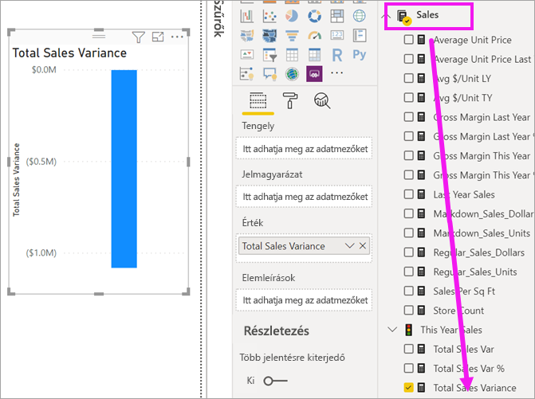
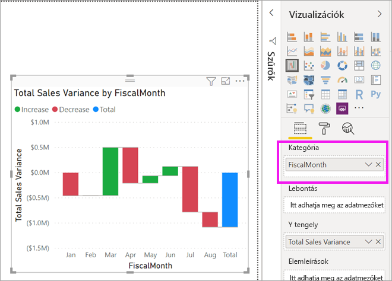
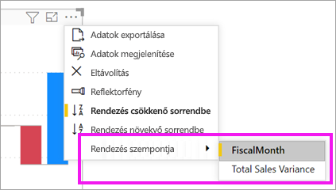
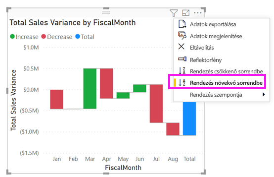
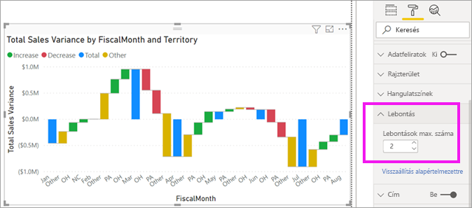

# Vízesésdiagramok a Power BI-ban

[!INCLUDE[consumer-appliesto-nyyn](../includes/consumer-appliesto-nyyn.md)]

[!INCLUDE [power-bi-visuals-desktop-banner](../includes/power-bi-visuals-desktop-banner.md)]

A vízesésdiagramok göngyölített összeget jelenítenek meg, amint a Power BI az értékeket összeadja vagy kivonja. Ez hasznos annak megértéséhez, hogy egy kezdeti értékre (pl. nettó bevétel) hogyan hat egy sornyi pozitív és negatív változás.

Az oszlopok színkódolással rendelkeznek, így gyorsan megállapíthatja az értékek növekedését és csökkenését. A kezdeti és végértékeket tartalmazó oszlopok gyakran [a vízszintes tengelyről indulnak](https://support.office.com/article/Create-a-waterfall-chart-in-Office-2016-for-Windows-8de1ece4-ff21-4d37-acd7-546f5527f185#BKMK_Float "kezdés a vízszintes tengelyen"), míg a középső értékek lebegő oszlopokat képeznek. Emiatt a stílus miatt a vízesésdiagramokat híddiagramoknak is nevezik.

## Mikor érdemes vízesésdiagramot használni?

A vízesésdiagram remek választás a következőkhöz:

* Ha a mérték az idősorok vagy különböző kategóriák között is változik.

* Ha naplózni kívánja az összértéket befolyásoló főbb változásokat.

* Ha a vállalat éves profitját szeretné ábrázolni különféle bevételi források megjelenítésével, majd az összbevétel (vagy veszteség) kiemelésével.

* Ha a vállalat alkalmazottainak számát szeretné ábrázolni az év eleji és év végi értékekkel.

* Ha szeretné megjeleníteni, hogy mennyi pénzt keresett és költött az egyes hónapok során, valamint a fiók folyóegyenlegét.

## Előfeltétel

Ez az oktatóanyag a [Kiskereskedelmi elemzési minta PBIX-fájlt](https://download.microsoft.com/download/9/6/D/96DDC2FF-2568-491D-AAFA-AFDD6F763AE3/Retail%20Analysis%20Sample%20PBIX.pbix) használja.

1. A menüsor bal felső részén válassza a **Fájl** > **Megnyitás** lehetőséget
   
2. Keresse meg a **Kiskereskedelmi elemzési minta PBIX-fájlt**

1. Nyissa meg a **Kiskereskedelmi elemzési minta PBIX-fájlt** jelentésnézetben .

1. Kiválasztás  új oldal hozzáadásához.

> [!NOTE]
> A jelentés egy Power BI-munkatárssal való megosztásához mindkettőjüknek Power BI Pro-licenccel kell rendelkezniük, vagy a jelentésnek egy Premium kapacitásban kell lennie.    

## Vízesésdiagram létrehozása

Olyan vízesésdiagramot fog létrehozni, amely megjeleníti a havi értékesítési eltérést (a becsült és a tényleges értékek közötti különbséget).

### A vízesésdiagram létrehozása

1. A **Mezők** panelen válassza az **Értékesítés** > **Teljes értékesítési eltérés** lehetőséget.

   

1. Válassza a vízesés ikont 

    

1. Válassza az **Idő**  > **FiscalMonth** (Pénzügyi hónap) lehetőséget, és adja hozzá a **Kategória** területhez.

    

### A vízesésdiagram rendezése

1. Ügyeljen rá, hogy a Power BI hónap szerint időrendi sorrendben rendezze a vízesésdiagramot. Válassza a diagram jobb felső sarkában található **További lehetőségek** (...) elemet.

    Ehhez a példához válassza a **Rendezési szempont**, majd a **FiscalMonth** lehetőséget. A kijelölés melletti sárga jelzés mutatja, mikor alkalmazza a rendszer a kijelölést.

    
    
    A hónapok időrendben történő megjelenítéséhez válassza a **Növekvő rendezés** lehetőséget. Az előző lépéshez hasonlóan ellenőrizze, hogy megjelenik-e egy sárga jelzés a **Rendezés növekvő sorrendben** lehetőség bal oldalán. Ez jelzi, hogy a kiválasztott beállítás van használatban.

    

    

    Figyelje meg, hogy a diagram januártól augusztusig van rendezve a FiscalMonth (Pénzügyi év) kategóriában.  

### A vízesésdiagram felfedezése

Derítse ki részletesebben, hogy mi járul hozzá legnagyobb mértékben az egyes hónapok közötti változáshoz.

1.  Válassza az **Üzlet** > **Terület** lehetőséget, így a **Terület** bekerül a **Lebontás** gyűjtőbe.

    

    A Power BI a **Részletezésben** szereplő adatokat használja további adatok vizualizációhoz adására. Alapértelmezés szerint a havi növekedésekhez és csökkenésekhez hozzájáruló 5 legfontosabb fő tényezőt adja hozzá minden egyes pénzügyi hónaphoz. Ez azt jelenti, hogy a februárhoz például most hat adatpont tartozik és nem csak egy.  

    

    Tegyük fel, hogy csak a két legfontosabb közreműködő érdekli.

1. A **Formázás** panelen válassza a **Lebontás** lehetőséget, és a **Maximum lebontás** beállítást állítsa **2** értékre.

    

    A vízesésdiagram gyors áttekintéséből kiderül, hogy Ohio és Pennsylvania területek járulnak hozzá a változáshoz a legnagyobb (negatív és pozitív) mértékben.

    

## Következő lépések

* [Vizualizációk Power BI-jelentésen belüli működésének módosítása](../service-reports-visual-interactions.md)

* [Vizualizációtípusok a Power BI-ban](power-bi-visualization-types-for-reports-and-q-and-a.md)
