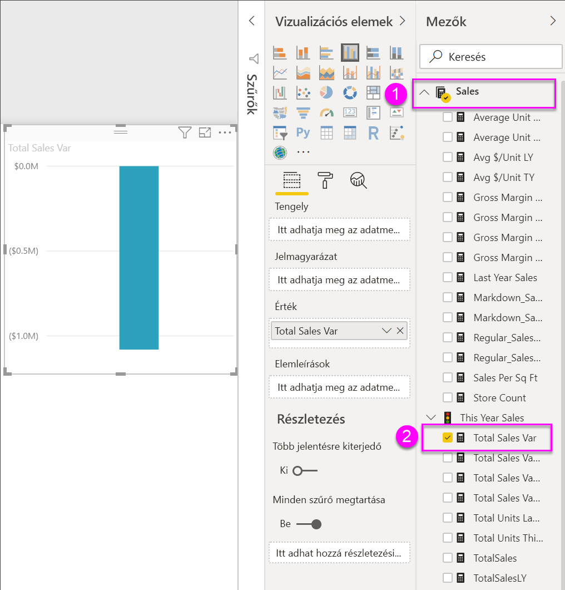
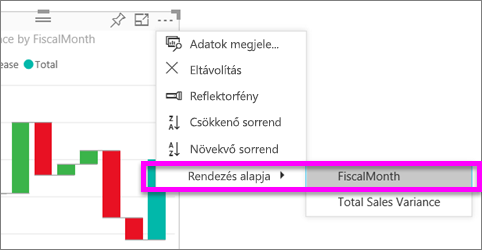
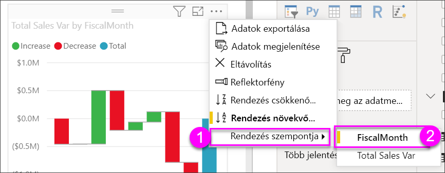
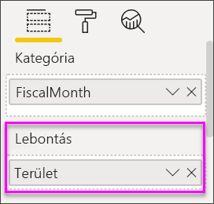
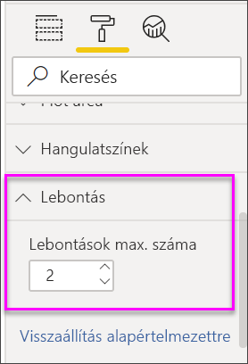

# Vízesésdiagramok a Power BI-ban

[!INCLUDE [power-bi-visuals-desktop-banner](../includes/power-bi-visuals-desktop-banner.md)]

A vízesésdiagramok göngyölített összeget jelenítenek meg, amint a Power BI az értékeket összeadja vagy kivonja. Ez hasznos annak megértéséhez, hogy egy kezdeti értékre (pl. nettó bevétel) hogyan hat egy sornyi pozitív és negatív változás.

Az oszlopok színkódolással rendelkeznek, így gyorsan megállapíthatja az értékek növekedését és csökkenését. A kezdeti és végértékeket tartalmazó oszlopok gyakran [a vízszintes tengelyről indulnak](https://support.office.com/article/Create-a-waterfall-chart-in-Office-2016-for-Windows-8de1ece4-ff21-4d37-acd7-546f5527f185#BKMK_Float "kezdés a vízszintes tengelyen"), míg a középső értékek lebegő oszlopokat képeznek. Emiatt a stílus miatt a vízesésdiagramokat híddiagramoknak is nevezik.

   > [!NOTE]
   > Ez a videó a Power BI Desktop egy régebbi verzióját használja.
   > 
   > 

<iframe width="560" height="315" src="https://www.youtube.com/embed/qKRZPBnaUXM" frameborder="0" allow="autoplay; encrypted-media" allowfullscreen></iframe>

## Mikor érdemes vízesésdiagramot használni?

A vízesésdiagram remek választás a következőkhöz:

* Ha a mérték az idősorok vagy különböző kategóriák között is változik.

* Ha naplózni kívánja az összértéket befolyásoló főbb változásokat.

* Ha a vállalat éves profitját szeretné ábrázolni különféle bevételi források megjelenítésével, majd az összbevétel (vagy veszteség) kiemelésével.

* Ha a vállalat alkalmazottainak számát szeretné ábrázolni az év eleji és év végi értékekkel.

* Ha szeretné megjeleníteni, hogy mennyi pénzt keresett és költött az egyes hónapok során, valamint a fiók folyóegyenlegét.

## Előfeltétel

Ez az oktatóanyag a [Kiskereskedelmi elemzési minta PBIX-fájlt](https://download.microsoft.com/download/9/6/D/96DDC2FF-2568-491D-AAFA-AFDD6F763AE3/Retail%20Analysis%20Sample%20PBIX.pbix) használja.

1. A menüsor bal felső részén válassza a **Fájl** > **Megnyitás** lehetőséget
   
2. Keresse meg a **Kiskereskedelmi elemzési minta PBIX-fájlt**

1. Nyissa meg a **Kiskereskedelmi elemzési minta PBIX-fájlt** jelentésnézetben .

1. Kiválasztás  új oldal hozzáadásához.

## Vízesésdiagram létrehozása

Olyan vízesésdiagramot fog létrehozni, amely megjeleníti a havi értékesítési eltérést (a becsült és a tényleges értékek közötti különbséget).

1. A **Mezők** panelen válassza az **Értékesítés** > **Teljes értékesítési eltérés** lehetőséget.

   

1. Válassza a vízesés ikont 

    

1. Válassza az **Idő**  > **FiscalMonth** (Pénzügyi hónap) lehetőséget, és adja hozzá a **Kategória** területhez.

    

1. Ügyeljen rá, hogy a Power BI időrendi sorrendben rendezze a vízesésdiagramot. Válassza a diagram jobb felső sarkában található **További lehetőségek** (...) elemet.

    Ehhez a példához a **Rendezés növekvő sorrendben** van kiválasztva.

    Ellenőrizze, hogy megjelenik-e egy sárga jelzés a **Rendezés növekvő sorrendben** lehetőség bal oldalán. Ez jelzi, hogy a kiválasztott beállítás van használatban.

    

    Most válasszuk a **Rendezés** lehetőséget, majd a **FiscalMonth** elemet. Ahogyan az előző lépésben, a választott elem melletti sárga jelölő mutatja, hogy a kiválasztott beállítás alkalmazása folyamatban van.

    

    Ha megnézi az X tengely értékeit is, láthatja, hogy azok is sorrendben jelennek meg **januártól** **augusztusig**.

    Derítse ki részletesebben, hogy mi járul hozzá legnagyobb mértékben az egyes hónapok közötti változáshoz.

1.  Válassza az **Üzlet** > **Terület** lehetőséget, így a **Terület** bekerül a **Lebontás** gyűjtőbe.

    

    A Power BI alapértelmezés szerint a havi növekedésekhez és csökkenésekhez hozzájáruló 5 fő tényezőt adja hozzá. Az alábbi ábrán a vizualizáció panelje ki van bontva, hogy több adat férjen el rajta. 

    

    Minket azonban csak az első 2 közreműködő érdekel.

1. A **Formázás** panelen válassza a **Lebontás** lehetőséget, és a **Maximum lebontás** beállítást állítsa **2** értékre.

    

    A vízesésdiagram gyors áttekintéséből kiderül, hogy Ohio és Pennsylvania területek járulnak hozzá a változáshoz a legnagyobb (negatív és pozitív) mértékben.

    

## Következő lépések

* [Vizualizációk Power BI-jelentésen belüli működésének módosítása](../service-reports-visual-interactions.md)

* [Vizualizációtípusok a Power BI-ban](power-bi-visualization-types-for-reports-and-q-and-a.md)
