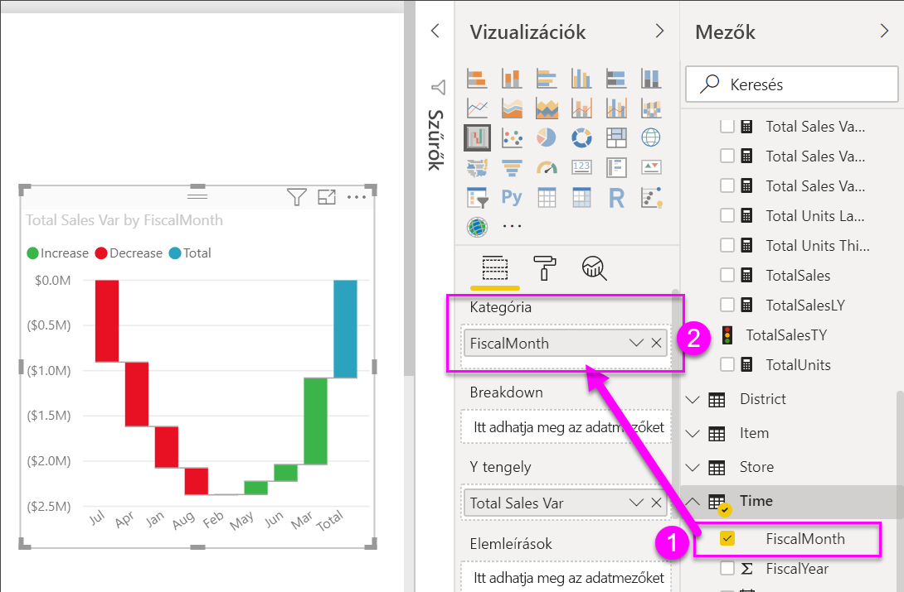
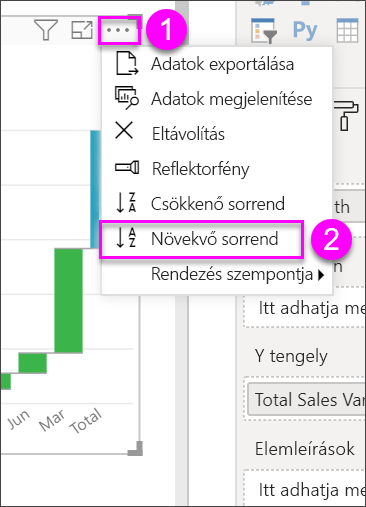

# Vízesésdiagramok a Power BI-ban

A vízesésdiagramok göngyölített összeget jelenítenek meg, amint a Power BI az értékeket összeadja vagy kivonja. Ez hasznos annak megértéséhez, hogy egy kezdeti értékre (pl. nettó bevétel) hogyan hat egy sornyi pozitív és negatív változás.

Az oszlopok színkódolással rendelkeznek, így gyorsan megállapíthatja az értékek növekedését és csökkenését. A kezdeti és végértékeket tartalmazó oszlopok gyakran [a vízszintes tengelyről indulnak](https://support.office.com/article/Create-a-waterfall-chart-in-Office-2016-for-Windows-8de1ece4-ff21-4d37-acd7-546f5527f185#BKMK_Float "a vízszintes tengelyről indulnak"), míg a középső értékek lebegő oszlopokat képeznek. Emiatt a stílus miatt a vízesésdiagramokat híddiagramoknak is nevezik.

<iframe width="560" height="315" src="https://www.youtube.com/embed/qKRZPBnaUXM" frameborder="0" allow="autoplay; encrypted-media" allowfullscreen></iframe>

## Mikor érdemes vízesésdiagramot használni?

A vízesésdiagram remek választás a következőkhöz:

* Ha a mérték az idősorok vagy különböző kategóriák között is változik.

* Ha naplózni kívánja az összértéket befolyásoló főbb változásokat.

* Ha a vállalat éves profitját szeretné ábrázolni különféle bevételi források megjelenítésével, majd az összbevétel (vagy veszteség) kiemelésével.

* Ha a vállalat alkalmazottainak számát szeretné ábrázolni az év eleji és év végi értékekkel.

* Ha szeretné megjeleníteni, hogy mennyi pénzt keresett és költött az egyes hónapok során, valamint a fiók folyóegyenlegét.

## Előfeltételek

* A Power BI szolgáltatás vagy a Power BI Desktop

* Kiskereskedelmi elemzési mintajelentés

## A Kiskereskedelmi elemzési mintajelentés beszerzése

Ez az útmutatás a Kiskereskedelmi elemzési mintát használja. A vizualizációk létrehozásához az adatkészletre és a jelentésre vonatkozó szerkesztési jogosultságok szükségesek. A Power BI mintái mind szerkeszthetőek. Ha mások osztanak meg Önnel jelentést, abban az esetben nem fog tudni vizualizációkat létrehozni jelentésekben. A leírás követéséhez nyissa meg a [Kiskereskedelmi elemzési minta jelentést](../sample-datasets.md).

Ha beszerezte a **Kiskereskedelmi elemzési mintát**, elkezdheti a munkát.

## Vízesésdiagram létrehozása

Olyan vízesésdiagramot fog létrehozni, amely megjeleníti a havi értékesítési eltérést (a becsült és a tényleges értékek közötti különbséget).

1. A **Saját munkaterületen** válassza az **Adatkészletek** > **Jelentés létrehozása** lehetőséget.

    

1. A **Mezők** panelen válassza az **Értékesítés** > **Teljes értékesítési eltérés** lehetőséget.

   

1. Válassza a vízesés ikont  a diagram fatérképpé konvertálásához.

    Ha a **Teljes értékesítési eltérés** nem az **Y tengely** területén található, húzza át oda.

    

1. Válassza az **Idő**  > **FiscalMonth** (Pénzügyi hónap) lehetőséget, és adja hozzá a **Kategória** területhez.

    

1. Ügyeljen rá, hogy a Power BI időrendi sorrendben rendezze a vízesésdiagramot. Válassza a diagram jobb felső sarkában található három pontot (...).

    Ellenőrizze, hogy megjelenik-e egy sárga jelzés a **Rendezés növekvő sorrendben** és a **PénzügyiHónap** lehetőségek bal oldalán

    

    Ha megnézi az X tengely értékeit is, láthatja, hogy azok is sorrendben jelennek meg **januártól** **augusztusig**.

    Derítse ki részletesebben, hogy mi járul hozzá legnagyobb mértékben az egyes hónapok közötti változáshoz.

1. Húzza a **Tároló** > **Terület** elemet a **Lebontás** gyűjtőbe.

    

    A Power BI alapértelmezés szerint a havi növekedésekhez és csökkenésekhez hozzájáruló 5 fő tényezőt adja hozzá.

    

    Minket azonban csak az első 2 közreműködő érdekel.

1. A **Formázás** panelen válassza a **Lebontás** lehetőséget, és a **Maximum lebontás** beállítást állítsa **2** értékre.

    

    A vízesésdiagram gyors áttekintéséből kiderül, hogy Ohio és Pennsylvania területek járulnak hozzá a változáshoz a legnagyobb (negatív és pozitív) mértékben.

    

    Ez érdekes eredmény. Vajon azért van Ohio és Pennsylvania ilyen jelentős befolyással, mert ezen a két területen jóval több az értékesítés, mint a többin? Ezt könnyedén ellenőrizhetjük.

1. Hozzon létre egy térképet az idei értékesítési érték és a tavalyi értékesítési érték terület szerinti megjelenítéséhez.

    

    A térkép alátámasztja ezt az elméletet. Látható, hogy ezen a 2 területen volt a legmagasabb az értékesítés a tavalyi (buborék mérete) és az idei évben (buborék árnyékolása).

## Kiemelés és keresztszűrés

További információ a **Szűrők** panel használatáról: [Szűrők hozzáadása jelentésekhez Szerkesztés nézetben](../power-bi-report-add-filter.md).

A vízesésdiagram egyes oszlopainak kiemelésével a rendszer keresztszűri a jelentésoldalon lévő többi vizualizációt és viszont. Az **Összesen** oszlop azonban nem aktivál kiemelést, és nem reagál a keresztszűrésre.

## Következő lépések

* [Vizualizációk Power BI-jelentésen belüli működésének módosítása](../service-reports-visual-interactions.md)

* [Vizualizációtípusok a Power BI-ban](power-bi-visualization-types-for-reports-and-q-and-a.md)
