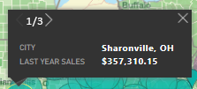
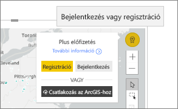

# ArcGIS-térképek használata a Power BI-ban
Ez a témakör az ArcGIS-térképet a Power BI szolgáltatás, a Desktop alkalmazás vagy a mobilalkalmazás felületén használó felhasználó szemszögéből van megírva. Ha egy ArcGIS Maps for Power BI-vizualizációt a tervezője megoszt Önnel, számos különféle módon használhatja a vizualizációt.  További információ az ArcGIS-térképek létrehozásáról: [Az Esri ArcGIS-térképeinek oktatóanyaga](../visuals/power-bi-visualization-arcgis.md).

Az ArcGIS-térképek és a Power BI együttes használata új lehetőségeket kínál a térképkezelésben, amelyek messze túlmutatnak a pontok térképeken való elhelyezésén. A jelentéstervezők egy térképpel kezdenek, amelyhez demográfiai adatok rétegeit csatolják. A térképen megjelenített helyalapú adatrétegek (például népszámlálási adatok) és a térbeli elemzés egyesítésével jobban megértheti a vizualizációkban szereplő adatokat.

> [!TIP]
> A GIS az angol Geographic Information System (térinformatikai rendszer) kifejezés rövidítése.
> 

Ez az ArcGIS Maps for Power BI-vizualizáció a tavalyi értékesítési adatokat jeleníti meg városok szerint, valamint egy utcaszintű alaptérképet és a háztartásonkénti átlagjövedelmet megjelenítő referenciaréteget tartalmaz. A térképen két jelölőt (vörös és sárga) és egy, az utazási időt jelző körívet (lila) tartalmaz.

> [!TIP]
> Példákat és beszámolókat az [Esri Power BI-oldalán](https://www.esri.com/powerbi) talál. Ezután tekintse meg az Esri [ArcGIS Maps for Power BI termékének Első lépések oldalát](https://doc.arcgis.com/en/maps-for-powerbi/get-started/about-maps-for-power-bi.htm) is.
> 
> 

## Felhasználói beleegyezés

Az első alkalommal, amikor egy kollégája megoszt Önnel egy ArcGIS-térképet, a Power BI megjelenít egy jóváhagyási kérést. Az ArcGIS Maps for Power BI terméket az Esri (https://www.esri.com) ) fejleszti, így a térképek használatára az Esri szerződési feltételei és adatvédelmi szabályzata vonatkoznak. Ha a Power BI-felhasználó alkalmazni szeretné az ArcGIS Maps for Power BI vizualizációit, el kell fogadnia a feltételeket.

## A rétegek értelmezése

Az ArcGIS Maps for Power BI-vizualizációk a demográfiai helyinformációk több típusú rétegét tartalmazhatják.

### Alaptérképek

Minden ArcGIS Maps for Power BI-vizualizáció egy alaptérképpel kezdődik. Gondoljon úgy az alaptérképekre, mint az adatok vásznára. Az alaptérkép lehet egyszerű sötét vagy világos vászon,

 

vagy egy utcákat és közlekedési részleteket tartalmazó vászon. 

  

Az alaptérképet a rendszer teljes egészében alkalmazza a vászonra: pásztázás és nagyítás közben a térkép frissül. Nagyítson a térképre, ha még részletesebb információkat szeretne látni az utcákról és a közlekedésről. Ha az egyik kontinensről a másikra pásztáz, a részletességi szint azonos marad. Itt Portóból Pekingbe pásztáztunk.

  

### Referenciarétegek

A jelentés *tervezője* hozzáadhat egy referenciaréteget. A referenciarétegeket, amelyek a demográfiai helyinformációk egy további rétegét biztosítják, az Esri üzemelteti. Az alábbi példa a népsűrűség referenciarétegét tartalmazza. A sötétebb színek nagyobb sűrűséget jelölnek.

  

### Infografikák

Egy jelentés *tervezője* több infografikai réteget adhat hozzá. Az infografikák gyors vizuális jelölők, amelyek a vizualizációs vászon jobb oldala mentén jelennek meg. Az infografikai rétegeket, amelyek a demográfiai helyinformációk egy további rétegét biztosítják, az Esri üzemelteti. Az alábbi példában három infografika alkalmazását láthatja. Magán a térképen nem jelennek meg, csak a kártyákon. Az infografikai kártyák nagyítás, pásztázás és helyek térképen történő kiválasztása közben frissülnek.

  

### Gombostűk

A gombostűk pontos helyeket jelölnek, például egy várost vagy egy címet. A jelentések *tervezői* néha az utazási időt jelző körívvel együtt használják a gombostűket. Ez a példa az üzleteket jeleníti meg az észak-karolinai Charlotte 50 mérföldes körzetében.

 

## ArcGIS Maps for Power BI-vizualizációk használata
Az elérhető funkciók attól függően változnak, hogy a térképet hogyan osztották meg Önnel, valamint a Power BI-fiók típusától. Ha kérdése van, forduljon a rendszergazdához. Az ArcGIS Maps for Power BI-vizualizációk a jelentésekben lévő egyéb vizualizációkhoz hasonlóan viselkednek. [Megtekintheti a vizualizáció létrehozásához használt adatokat](../consumer/end-user-show-data.md), megtekintheti a térképet [Fókusz módban és teljes képernyős módban](../consumer/end-user-focus.md), [megjegyzéseket adhat hozzá](../consumer/end-user-comment.md), [használhatja azokat a szűrőket](../consumer/end-user-report-filter.md), amelyeket a jelentés *tervezője* adott meg és így tovább. Az ArcGIS-vizualizációk képesek a jelentés oldalán található más vizualizációk keresztszűrésére, és fordítva.

Az elemleírások megjelenítéséhez vigye az egérmutatót az alaptérkép helyeire (például egy buborékra). Az ArcGIS-vizualizációk kijelölési eszközeivel emellett további elemleírásokat jeleníthet meg, valamint konkrét kijelöléseket hajthat végre az alaptérképen vagy a referenciarétegen.  

### Kijelölési eszközök

Az ArcGIS Maps for Power BI öt kijelölési módot tesz lehetővé. Egyszerre legfeljebb 250 adatpont jelölhető ki.

#### Az egyszeres kijelölési eszköz

 

Jelöljön ki egy adatpontot, egy buborékot, egy gombostűt vagy a referenciaréteg egy egyéni adatpontját. A Power BI megjeleníti a kijelölés részleteit tartalmazó elemleírást. Az egyszeres kijelölés a kijelölés alapján keresztszűri a jelentés oldalán található egyéb vizualizációkat, és a kijelölt területre frissíti az infografikai kártyákat. 

Itt egy barna buborékadatpontot jelöltünk ki az alaptárképen. A Power BI:
- kiemeli a kijelölést,
- megjeleníti az adott adatponthoz tartozó elemleírást, 
- frissíti az infografikai kártyákat, hogy csak a kijelöléshez tartozó adatok jelenjenek meg, valamint
- keresztkiemeli az oszlopdiagramot.

Ha a térkép tartalmaz referenciaréteget, a helyek kijelölésekor a részletek egy elemleírásban jelennek meg. Itt Seneca megyét jelöltük ki, és a referenciaréteg azon adatait (népsűrűség) látjuk, amelyeket a jelentés *tervezője* adott hozzá a térképhez. Ebben a példában az adatpont két különböző megyét tartalmaz, így az elemleírásnak két oldala van. Mindkét oldalon van egy diagram. A diagram sávjainak kijelölésével további részleteket jeleníthet meg. 

> [!TIP]
  > Ha ránagyít a térképre egy bizonyos hely kijelöléséhez, néha csökkenteni tudja az elemleírás oldalainak számát.  Ellenkező esetben előfordulhat, hogy a Power BI egyszerre jeleníti meg az egymást fedő helyek elemleírásait. Az elemleírások közt a nyilak használatával léptethet.
  > 
  > 

#### A többszörös kijelölési eszköz

 

A térképre rajzolt négyszögbe foglalt összes adatpont kijelölése. A CTRL billentyű lenyomásával több négyszögletes terület is kijelölhető. A többszörös kiválasztás a kijelölt terület alapján frissíti az infografikai kártyákat és a keresztkiemeli a jelentés oldalán található egyéb vizualizációkat.

 

#### A referenciaréteg eszköz

 

A referenciafóliákon lévő határvonalak és sokszögek használhatók a bennfoglalt adatok kijelölésére. Bár nehezen látható, a referenciarétegen van egy sárga körvonal. Az egyszeres kijelölési eszköztől eltérően nem kapunk elemleírást. Ehelyett a körvonal határain belül található adatpontokkal kapcsolatos adatok jelennek meg. Ebben a példában a kijelölésünk egy adatpontot tartalmaz: ez egy Winston Salemben található Lindseys üzlet.

 

#### A puffer eszköz

 

Lehetővé teszi az adatpontok kijelölését egy pufferréteg használatával. Ezzel az eszközzel például kijelölhet egy utazási időt jelző körívet, majd tovább használhatja a jelentés többi részét. Az utazási időt jelző körív aktív marad, és az infografikai kártyák továbbra is tükrözik az utazási időt jelző körívet, azonban ha más adatpontokat jelöl ki a térképen, a rendszer keresztszűrést alkalmaz a jelentés oldalán található egyéb vizualizációkra.

 

#### A Hasonló keresése eszköz

 

Lehetővé teszi a hasonló attribútumokkal rendelkező helyek keresését. Először válasszon ki egy vagy több fontos helyet vagy referenciahelyet, és határozzon meg legfeljebb öt, az elemzésben használni kívánt dimenziót. A Hasonló keresése eszköz ezután kiszámítja azt a 10 helyet a térképen, amelyek leginkább hasonlítanak az Ön által meghatározott helyekhez. Ezután az infografikai kártyák használatával jobban megismerheti az egyes eredményekhez kapcsolódó demográfiai adatokat, utazási időkkel kapcsolatos területeket hozhat létre, hogy képet alkothasson arról, hogy az egyes helyektől mi érhető el autóval, illetve akár magával a Hasonló keresése eszközzel is szűrheti a jelentést, és több megállapítást kaphat. A legfontosabb az, hogy minden számítás helyileg a gépén történik, így biztos lehet abban, hogy a bizalmas adatai biztonságban maradnak.

## Megfontolandó szempontok és korlátozások
Az ArcGIS Maps for Power BI az alábbi szolgáltatásokban és alkalmazásokban érhető el:

|Szolgáltatás/alkalmazás  |Elérhetőség  |
|---------|---------|
|Power BI Desktop     |     Igen    |
|Power BI service (app.powerbi.com)     |    Igen     |
|Power BI mobilalkalmazások     |  Igen      |
|Power BI webes közzététel     |  Nem       |
|Power BI Embedded     |     Nem    |
|Power BI szolgáltatás beágyazása (PowerBI.com)  | Nem |

## Hogyan működnek az ArcGIS Maps for Power BI térképei?
Az ArcGIS Maps for Power BI szolgáltatója az Esri (https://www.esri.com). Az ArcGIS Maps for Power BI használatára az Esri [szerződési feltételei](https://go.microsoft.com/fwlink/?LinkID=8263222) és [adatvédelmi szabályzata](https://go.microsoft.com/fwlink/?LinkID=826323) vonatkoznak. Ha a Power BI-felhasználó használni kívánja az ArcGIS Maps for Power BI vizualizációit, el kell fogadnia a feltételeket (részletekért tekintse meg a felhasználói beleegyezésről szóló szakaszt).  Az Esri ArcGIS Maps for Power BI használatára az Esri szerződési feltételei és adatvédelmi szabályzata vonatkoznak, amelynek hivatkozását a jóváhagyási párbeszédpanelen találja. Az ArcGIS Maps for Power BI első használata előtt minden felhasználónak el kell fogadnia a feltételeket. Miután a felhasználók elfogadták a feltételeket, a program elküldi a vizualizációhoz tartozó adatokat az Esrinek geokódolásra, amelyne során a helyadatok térképen megjeleníthető szélességi és hosszúsági adatokká lesznek átalakítva. Érdemes annak tudatában használni a szolgáltatást, hogy az Esri minden, adatvizualizációhoz tartozó adatot megkaphat. Az Esri olyan szolgáltatásokat nyújt, mint az alaptérképek, térelemzés, geokódolás és hasonlók. Az ArcGIS Maps for Power BI vizualizáció ezekkel a szolgáltatásokkal egy SSL-kapcsolaton keresztül kommunikál, amelyet egy Esri által nyújtott és fenntartott tanúsítvány véd. További információt az ArcGIS Maps for Power BI szolgáltatásról az Esri [ArcGIS Maps for Power BI termékoldalán](https://www.esri.com/powerbi) találhat.

### Power BI Plus

Amikor egy felhasználó az ArcGIS Maps for Power BI egy, az Esri által ajánlott Plus-előfizetésére regisztrál, közvetlen kapcsolatba kerül az Esrivel. A Power BI nem küld személyes felhasználói adatokat az Esrinek. A felhasználó a bejelentkezés után megadja a saját AAD-identitását egy Esri által nyújtott AAD-alkalmazásnak. Ezzel személyes adatokat oszt meg közvetlenül az Esrivel. Ha egy felhasználó Plus-tartalmat ad hozzá egy ArcGIS Maps for Power BI-vizualizációhoz, a kollégáinak is Esri Plus-előfizetésre lesz szüksége az adott vizualizáció megtekintéséhez vagy szerkesztéséhez. 

Az Esri ArcGIS Maps for Power BI működésével kapcsolatos részletes technikai kérdésekkel az Esri támogatási oldalához fordulhat.

## Megfontolandó szempontok és hibaelhárítás

**Az ArcGIS-térkép nem jelenik meg**    
Azokban a szolgáltatásokban és alkalmazásokban, ahol az ArcGIS Maps for Power BI nem elérhető, a képi megjelenítésben üres vizualizáció jelenik meg a Power BI emblémával.

**Nem jelenik meg az összes információ a térképen**    
A térkép szélességi/hosszúsági adatainak geokódolásakor legfeljebb 30 000 adatpont jelenik meg. Az olyan adatpontok geokódolása során, mint az irányítószámok és utcacímek, csak az első 15 000 adatpont lesz geokódolva. A helynevek és országok geokódolására az 1500 címes korlát nem vonatkozik.

**Van valamilyen díja az ArcGIS Maps for Power BI használatának?**

Az ArcGIS Maps for Power BI minden Power BI-felhasználó számára elérhető külön költségvonzatok nélkül. Ezt az összetevőt az **Esri** biztosítja, ezért használata az **Esri** használati feltételeinek és adatvédelmi szabályzatának elfogadásához kötött, ahogy az a cikkben korábban olvasható. Ha feliratkozik az ArcGIS **Plus** szolgáltatásra, az díjfizetési kötelezettséggel jár.

**Hibaüzenetet kapok arról, hogy megtelt a gyorsítótár**

Ez a viselkedés egy programhiba, amelynek a javítása folyamatban van.  Addig is a hibaüzenetben lévő hivatkozásra kattintva megtudhatja, hogyan ürítheti a Power BI gyorsítótárát.

**Kapcsolat nélkül is megtekinthetem az ArcGIS-térképeimet?**

Nem, a térképek megjelenítéséhez a Power BI-nak kapcsolódnia kell a hálózathoz.

## Következő lépések
Ahonnan segítséget kaphat: Az **Esri**[átfogó dokumentációt](https://go.microsoft.com/fwlink/?LinkID=828772) biztosít az **ArcGIS Maps for Power BI** szolgáltatáskészletére vonatkozóan.

A Power BI [**ArcGIS Maps for Power BI** termékkel kapcsolatos közösségi csatornáján](https://go.microsoft.com/fwlink/?LinkID=828771) felteheti kérdéseit, megtalálhatja a legfrissebb információkat, jelentheti a hibákat és válaszokat kaphat.

[Az ArcGIS Maps for Power BI termékoldala](https://www.esri.com/powerbi)
