# A Formázás panel bemutatása
Ha egy jelentéshez szerkesztési engedélyekkel rendelkezik, számos formázási lehetőséget érhet el. A Power BI-jelentésekben módosíthatja az adatsorozatok és adatpontok színét, sőt akár a vizualizációk hátterét is. Megváltoztathatja az X és az Y tengely megjelenését. Emellett a vizualizációk, alakzatok és címek betűtípus-tulajdonságait is beállíthatja. A Power BI-jelentések megjelenését teljes körűen vezérelheti.

Első lépésként nyisson meg egy jelentést a Power BI Desktopban vagy a Power BI szolgáltatásban. Mindkettő szinte azonos formázási beállításokat kínál. Ha a Power BI szolgáltatásban nyit meg jelentést, mindenképpen válassza a menüsáv **Szerkesztés** elemét. 

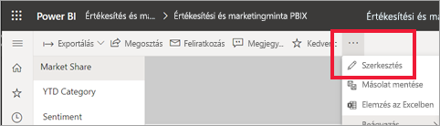

Ha egy jelentést szerkeszt, és ki van jelölve egy vizualizáció, megjelenik a **Megjelenítések** panel. Ezen a panelen módosíthatja a vizualizációkat. Közvetlenül a **Megjelenítések** panel alatt három ikon látható: a **Mezők** (sávok), a **Formátum** (festőhenger), és az **Analitika** (nagyító). Az alábbi ábrán a **Mezők** ikon van kijelölve, amit az ikon alatti sárga sáv jelez.

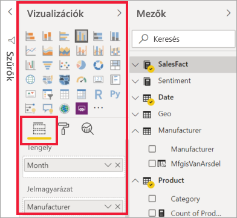

Ha a **Formátum** ikonra kattint, az alatta lévő terület a jelenleg kijelölt vizualizációhoz elérhető testreszabásokat jeleníti meg.  

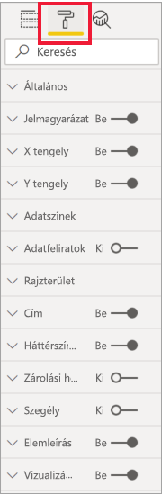

Az egyes vizualizációk számos elemét testre szabhatja. Az elérhető lehetőségek a választott vizualizációtól függenek. Néhány elérhető lehetőség:

* Jelmagyarázat
* X tengely
* Y tengely
* Adatszínek
* Adatfeliratok
* Alakzatok
* Rajzterület
* Cím
* Háttér
* Zárolási helyzet
* Szegély
* Elemleírások
* Vizualizációs fejlécek
* Alakzatok
* Pozíció    
és további lehetőségek.

> [!NOTE]
>  
> Ezen elemek nem mindegyike látható az összes vizualizációs típus esetében. A választott vizualizáció hatással lesz az elérhető testreszabásokra; például tortadiagram kijelölése esetén nem látható X tengely, mivel a tortadiagramoknak nincs X tengelye.

Vegye figyelembe azt is, hogy ha még nincs vizualizáció kijelölve, akkor az ikonok helyett a **Szűrők** elem jelenik meg, amely lehetővé teszi szűrők alkalmazását az oldalon lévő összes vizualizációra.

A formázási beállításokat úgy ismerheti meg a legjobban, ha kipróbálja őket. A módosításait bármikor visszavonhatja, vagy visszaállhat az alapértelmezett beállításokra. Nagyon sok lehetőség érhető el, és a lista folyamatosan bővül. Egyetlen cikkben nem lehet leírni az összes formázási beállítást. Kezdésképpen azonban tekintsünk meg néhányat közösen. 

1. A vizualizáció színeinek módosítása   
2. Stílus beállítása    
3. Értéktengely tulajdonságainak módosítása    
4. Adatfeliratok hozzáadása    

## Színek használata

Vegyük végig a vizualizáció színeinek testreszabásához szükséges lépéseket.

1. Aktiváljon egy vizualizációt annak kijelölésével.

2. A festőhenger ikonra kattintva nyissa meg a Formázás lapot. A Formázás lap megjeleníti a kijelölt vizualizációhoz elérhető összes formázási elemet.

    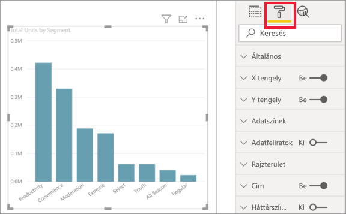

3. Az **Adatszínek** elemet kijelölve jelenítse meg a rendelkezésre álló testreszabásokat.  

    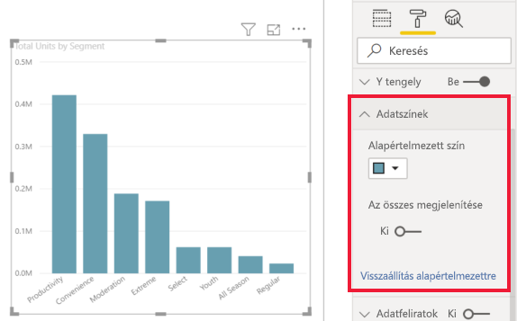

4. Módosítsa **Az összes megjelenítése** lehetőséget Bekapcsolva értékre, majd jelöljön ki különböző színeket az oszlopokhoz.

    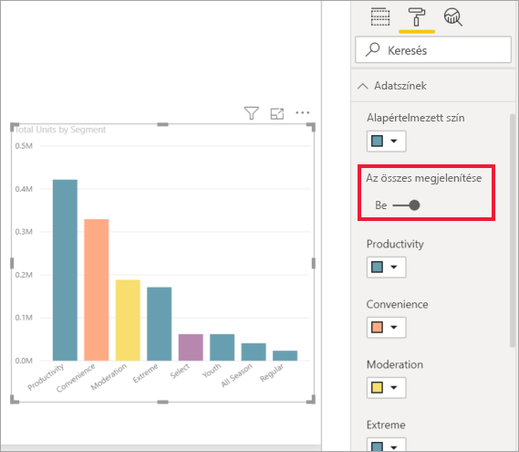

Alább néhány tippet talál a színek használatával kapcsolatosan. Az alábbi listán szereplő számok a következő képernyőn is megjelennek, jelezve, hol érheti el vagy módosíthatja ezeket a hasznos elemeket.

1. Nem megfelelő a szín? Semmi probléma, csak válassza a **Visszaállítás alapértelmezettre** lehetőséget, és a kijelölés visszaáll az alapértelmezett beállításra. 

2. Nem megfelelők a módosított színek? Válassza a **Visszaállítás alapértelmezettre** lehetőséget az **Adatok színe** szakaszban, és a színek visszaállnak az alapértelmezett beállításokra. 

3. Szeretne egy olyan színt használni, amely nem jelenik a palettán? Egyszerűen válassza az **Egyéni szín** elemet, és válasszon a színspektrumból.  

   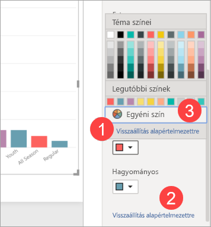

Nincs elragadtatva az előbb végzett módosítástól? A szokásos **CTRL + Z** billentyűkombinációval visszavonhatja.

## Stílus alkalmazása egy táblázatra
Néhány Power BI-vizualizáció esetén elérhető a **Stílus** beállítás. Egyetlen kattintással egyszerre alkalmazhat több formázási beállítást a vizualizációjára. 

1. Jelöljön ki egy táblázatot vagy mátrixot, hogy az aktív legyen.   
1. Nyissa meg a Formázás panelt, és válassza ki a **Stílus** elemet.

   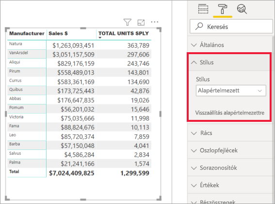

1. A legördülő listából válasszon ki egy stílust. 

   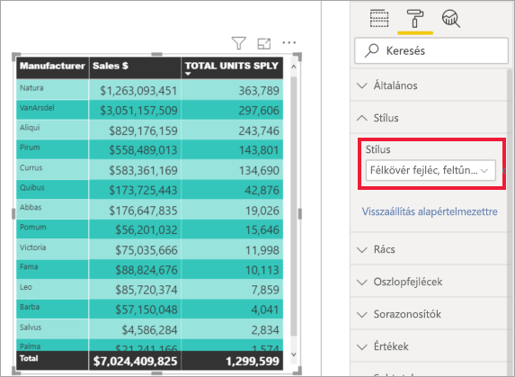

A stílus alkalmazása után is módosíthatja a vizualizáció formázási tulajdonságait, például a színeket.

## Tengely tulajdonságainak módosítása

Gyakran érdemes módosítani az X vagy az Y tengelyt. A színek használatához hasonlóan a módosítani kívánt tengely mellett balra látható lefelé mutató nyíl ikonra kattintva módosíthatja, a következő ábrán látható módon.  
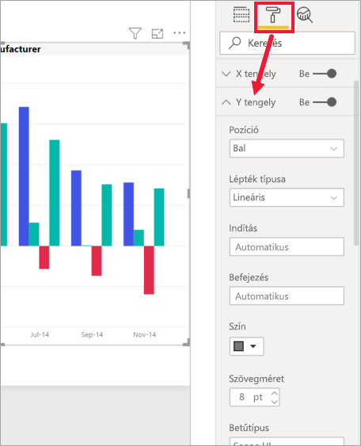

Az alábbi példában az Y tengelyt a következőképpen formáztuk:
- a címkéket áthelyeztük a vizualizáció jobb oldalára

- a kezdő értéket nullára módosítottuk

- a címke szövegszínét feketére módosítottuk

- a címke betűméretét 12-es méretre módosítottuk

- címet adtunk az Y tengelyhez

    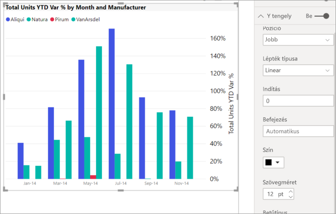

Teljesen eltávolíthatja a tengelyek feliratait, ehhez kattintson az **X tengely** vagy az **Y tengely** melletti választógombra. A tengelycímek be- és kikapcsolására is lehetősége van a **Cím** melletti választógomb bejelölésével.  

## Adatfeliratok hozzáadása    

Mielőtt elkezdené önállóan is felfedezni ezeket, íme még egy példa.  Adjunk hozzá adatfeliratokat egy területdiagramhoz. 

Ez az *„előtte”* kép. 

Ez pedig az *„utána”* kép.

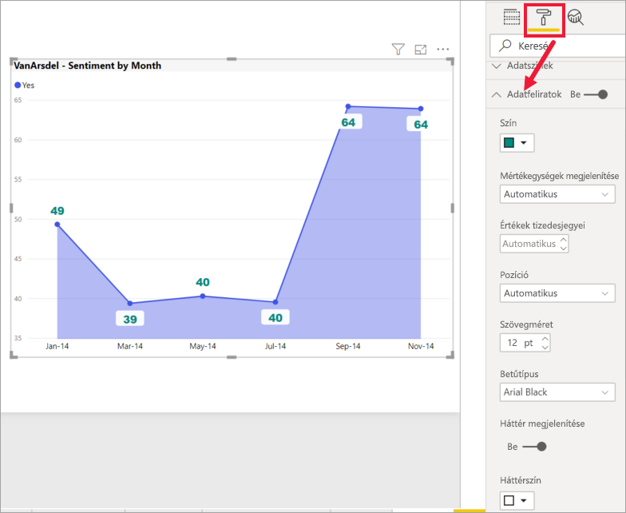

Kiválasztottuk a vizualizációt, hogy aktív legyen, és megnyitottuk a Formázás lapot.  Kiválasztottuk az **Adatfeliratok** lehetőséget, és bekapcsoltuk. Ezután megnöveltük a betűméretet 12-esre, a betűcsaládot Arial Blackre módosítottuk, a **Háttér megjelenítése** beállítást pedig fehér, 5%-os átlátszóság értékkel bekapcsoltuk.

Ez csak néhány példa az elérhető formázási lehetőségek közül. Nyisson meg egy jelentést Szerkesztési módban, és ismerkedjen meg a Formázási panellel, hogy gyönyörű és informatív vizualizációkat hozhasson létre.

## Következő lépések
További információkat a következő cikkekben talál:  

* [Tippek és trükkök a színformázáshoz a Power BI-ban](service-tips-and-tricks-for-color-formatting.md)  
* [Táblázatok feltételes formázása](../desktop-conditional-table-formatting.md)

