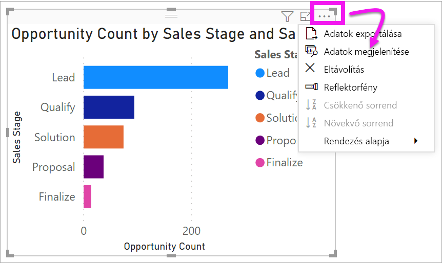
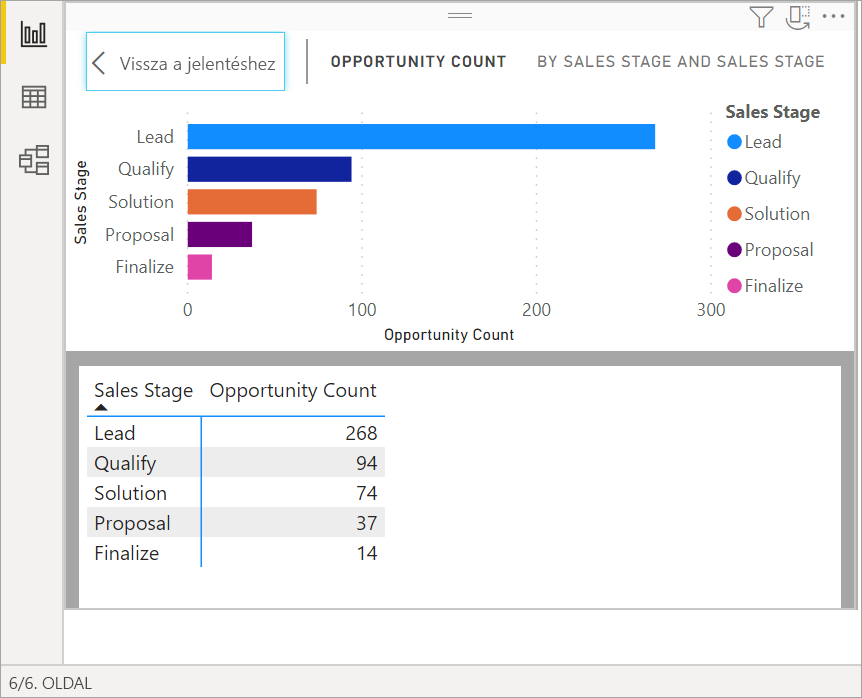
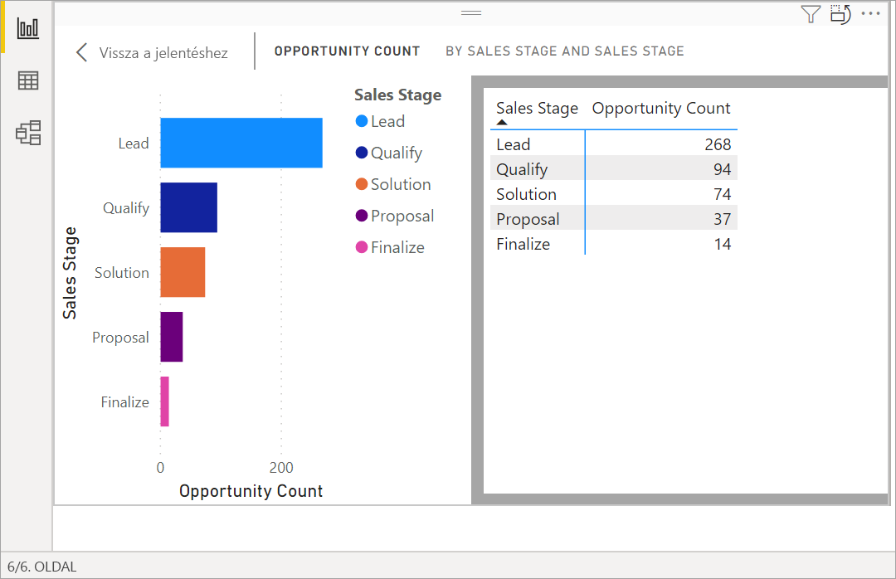
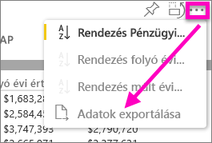
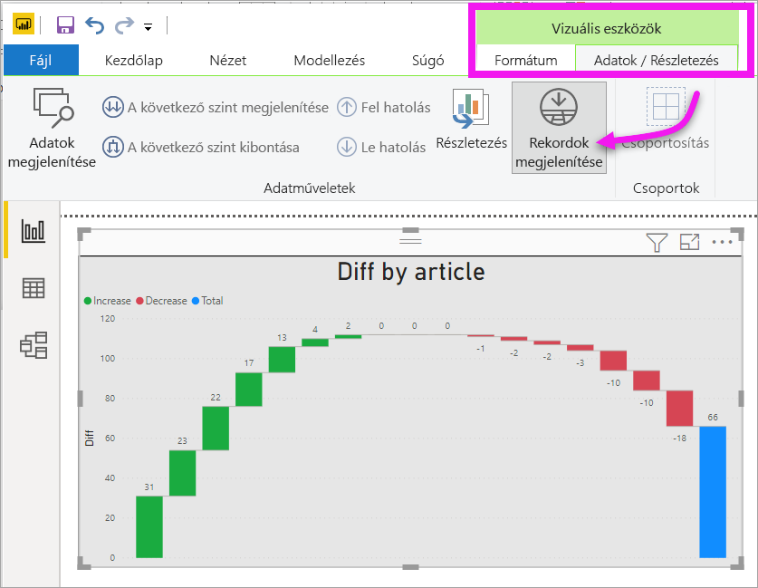
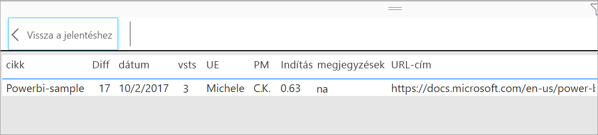

# Vizualizáció alapjául szolgáló adatok megjelenítése

## Adatok megjelenítése
A Power BI-vizualizációk az adatkészletekből származó adatokból jönnek létre. Ha látni szeretné a háttérfolyamatokat, a Power BI-jal *megjelenítheti* a vizualizáció létrehozásához használt adatokat. Amikor az **Adatok megjelenítése** elemet választja, a Power BI megjeleníti a vizualizáció alatt (vagy mellett) lévő adatokat.

A vizualizáció létrehozásához használt adatokat exportálhatja is .xlsx vagy .csv fájlként, és megtekintheti azokat az Excelben. További információt az [Adatok exportálása Power BI-vizualizációkból](power-bi-visualization-export-data.md) című szakaszban talál.

> [!NOTE]
> Az *Adatok megjelenítése* és az *Adatok exportálása* a Power BI szolgáltatásban és a Power BI Desktopban is elérhető. A Power BI Desktop azonban egy további részletességi szintet nyújt; a [*Rekordok megjelenítése* megjeleníti az adatkészletből származó tényleges sorokat](../desktop-see-data-see-records.md).
> 
> 

## Az *Adatok megjelenítése* funkció használata 
1. A Power BI Desktopban válasszon ki egy vizualizációt, hogy aktívvá tegye azt.

2. Válassza a **További műveletek** (...), majd az **Adatok megjelenítése** lehetőséget. 
    

3. Alapértelmezés szerint az adatok a vizualizáció alatt jelennek meg.
   
   

4. A tájolás módosításához válassza a függőleges elrendezést  a vizualizáció jobb felső sarkában.
   
   
5. Ha az adatokat .csv fájlba szeretné exportálni, válassza a három pontot, majd az **Adatok exportálása** elemet.
   
    
   
    Az adatok Excelbe való exportálásáról további információt az [Adatok exportálása Power BI-vizualizációkból](power-bi-visualization-export-data.md) című szakaszban talál.
6. Az adatok elrejtéséhez kapcsolja ki a **Tallózás** > **Adatok megjelenítése** beállítást.

## A Rekordok megjelenítése funkció használata
A vizualizációk egy-egy adatrekordja is a középpontba állítható, és részletesen megvizsgálhatók az alapjául szolgáló mögöttes adatok. 

1. A **Rekordok megtekintése** funkció használatához válasszon ki egy vizualizációt, hogy aktívvá tegye azt. 

2. Az asztali szalagon válassza ki a **Vizuális eszközök** > **Adatok / Részletezés** > **Rekordok megjelenítése** lapot. 

    

3. Válasszon ki egy adatpontot vagy -sort a vizualizációban. Ebben a példában balról a negyedik oszlopot választottuk ki. A Power BI megjeleníti az ehhez az adatponthoz tartozó adatkészletrekordot.

    

4. Válassza a **Vissza a jelentéshez** lehetőséget az asztali jelentésvászonhoz való visszatéréshez. 

## Szempontok és hibaelhárítás

- Ha a szalag **Rekordok megjelenítése** gombja le van tiltva és ki van szürkítve, az azt jelenti, hogy a kiválasztott vizualizáció nem támogatja a Rekordok megjelenítése funkciót.
- A Rekordok megjelenítése nézetben az adatok nem módosíthatók és nem menthetők vissza a jelentésbe.
- A Rekordok megjelenítése nem használható, ha a vizualizáció számított mértéket használ.
- A Rekordok megjelenítése nem használható, ha élő többdimenziós (multidimensional, MD) modellt használ.  

## További lépések
[Adatok exportálása Power BI-vizualizációkból](power-bi-visualization-export-data.md)    

Több kérdése van? [Kérdezze meg a Power BI közösségét](https://community.powerbi.com/)

