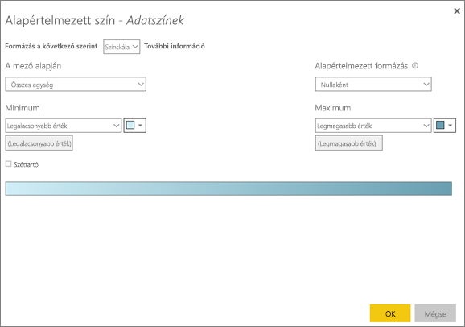

# Tippek és trükkök a színformázáshoz a Power BI-ban
A Power BI sokféle lehetőséget kínál, amelyekkel egyedivé tehetők az irányítópultok és a jelentések. Ez a cikk néhány olyan ötletet fejt ki részletesen, amelyek segítségével meggyőzőbb, érdekesebb és az Ön igényeinek jobban megfelelő Power BI-vizualizációkat készíthet.

A következő tippeket kínáljuk Önnek. Van egy másik remek ötlete? Nagyszerű! Küldje el nekünk, és talán hozzáadjuk ehhez a listához.

* Egy adatpont színének módosítása
* Diagram színeinek meghatározása egy numerikus érték alapján
* Adatpontok színének meghatározása egy mező értéke alapján
* A színskála összeállításának testre szabása
* Széttartó színskálák használata
* Művelet visszavonása a Power BI-ban

Módosítások elvégzéséhez szerkesztenie kell a jelentést. Nyissa meg a jelentést, majd válassza a **Jelentés szerkesztése** lehetőséget a felső menüben, a következő képhez hasonlóan.

Amikor a jelentésvászon jobb oldalán megjelenik a **Szűrők** és **Vizualizációk** panel, megkezdheti a testre szabást. Ha a panel nem látható, a jobb felső sarokban található nyíllal nyitható meg.

## Egy adatpont színének módosítása
Előfordul, hogy egy adott adatpontot szeretne kiemelni. Ez lehet egy újonnan bevezetett termék eladott mennyisége, vagy egy javuló minőségi mutató egy új program elindítása után. A Power BI-ban kiemelhet egy választott adatpontot a színe módosításával.

Az alábbi vizualizáció egységeket rangsorol a termékszegmens szerint. 

Tegyük fel, hogy a **Kényelem** szegmens színes kiemelésével meg szeretné mutatni, hogy milyen jól teljesít az új szegmens. A lépések a következők:

Bontsa ki az **Adatszínek** szakaszt, és kapcsolja be a csúszkát **Az összes megjelenítése** lehetőséghez. Így a vizualizáció összes adatelemének színe megjelenik. A kurzort az adatpontok fölé helyezve engedélyezett a görgetés, tehát az adatpontok bármelyikét módosíthatja.

Állítsa a **Kényelem** színét narancssárgára. 

Miután választott, a **Kényelem** adatpont szép narancssárga, és kétségtelenül szembeszökő színt vesz fel.

A Power BI akkor is megjegyzi a választását és narancssárgán jeleníti meg a **Kényelmet**, ha Ön megváltoztatja, majd visszaváltoztatja a vizualizáció típusát.

Egynél több, sőt akár az összes adatelem adatpontjának színe is megváltoztatható. A vizualizáció a vállalati színeket is tükrözheti. 

A színekkel sok mindent megtehet. A következő bekezdések a színátmenetekkel foglalkoznak.

## Diagram színeinek meghatározása egy numerikus érték alapján
Egy diagramnak gyakran előnyére válik a színek dinamikus meghatározása egy mező numerikus értéke alapján. Ezen a módon az oszlopok magasságát megadó érték mellett egy másikat is megjeleníthet, így két értéket szemléltethet egy diagramon. Használhatja a lehetőséget egy bizonyos érték feletti (vagy alatti) adatpontok kiemelésére – például alacsony jövedelmezőségű területek kimutatására.

A következő szakaszok különböző módszereket mutatnak be a színek numerikus érték alapján történő meghatározására.

## Adatpontok színének meghatározása egy érték alapján
Ha érték alapján szeretné módosítani a színt, nyissa meg a Formázás panelt, majd válassza a **Feltételes formázás** lehetőséget.  

Az Alapértelmezett színek panel legördülő menüjében adja meg a feltételesen formázni kívánt mezőket. Ebben a példában a **Sales fact** > **Total Units** mezőt választottuk, amelyhez a **legalacsonyabb értéknek** a világoskéket, **legmagasabb értéknek** pedig a sötétkéket adtuk meg. 

A vizualizáció színét egy vizualizáción kívüli mezővel is formázhatja. A következő ábrán a **%Market Share SPLY YTDP** (Piaci részesedés a tavalyi év azonos időszakában, az év elejétől számítva (%)) mező szolgál erre. 

Mint látható, bár mind a **Productivity**, mind az **Extreme** egységei több eladást eredményeztek (amit a magasabb oszlop jelez), a **Moderation** nagyobb **%Market Share SPLY YTD** értékkel rendelkezik (amit az oszlop színtelítettségéből láthatunk).

## A színskála összeállításának testre szabása
Az értékek és a színek egymáshoz rendelése is módosítható. A következő ábrán a **legkisebb** és a **legnagyobb** értékhez választott két szín a narancs, illetve a zöld.

Figyelje meg az első képen, hogy a diagram oszlopai a sávon ábrázolt színátmenetet tükrözik. A legmagasabb érték zöld, a legalacsonyabb narancsszínű, a közöttük lévők pedig a skála zöld és narancs közötti árnyalatait viselik.

Most próbáljon meg numerikus értéket adni a **Minimum** és **Maximum** mezőknek. Állítsa a **Minimum** értékét 3 500-ra, a **Maximum** értékét pedig 6 000-re.

Ezekkel az értékekkel a színátmenet már nem alkalmazható a diagramnak a **Minimum** alatti vagy **Maximum** feletti értékeire. A **Maximum** értéknél magasabb oszlopok színe zöld, a **Minimum** alattiaké piros.

## Széttartó színskálák használata
Előfordul, hogy az adatok természetes módon széttartó jellegűek. Egy hőmérsékleti skálának például természetes középpontja a fagypont, egy jövedelmezőségi érték természetes középpontja a nulla.

Széttartó színskálák használatához válassza a **Széttartó** lehetőséget. A **Széttartó** beállítással újabb paletta jelenik meg **Középérték** néven, ahogyan az alábbi képen látható.

Amíg a **Széttartó** beállítás be van kapcsolva, a **Minimumhoz**, a **Maximumhoz** és a **Középértékhez** tartozó szín külön módosítható. A következő képen a **% Market Share SPLY YTD** **Középértékeként** 0,2 van megadva, ezért a 0,2-nél nagyobb értékek a zöld, az egynél kisebbek a piros árnyalataiban jelennek meg.

## Művelet visszavonása a Power BI-ban
Sok más Microsoft-szolgáltatáshoz és -szoftverhez hasonlóan a Power BI is egyszerű módot kínál az utolsó parancs visszavonására. Képzelje el például, hogy megváltoztatta egy adatpont vagy adatpont-sorozat színét és a vizualizáción megjelenő szín nem teszik Önnek. Majd pedig az eredeti színt szeretné visszaállítani, csakhogy már nem emlékszik rá!

Az utolsó művelet vagy műveletek **visszavonásához** csak egyvalamit kell tennie:

- Nyomja le a Ctrl+Z billentyűkombinációt

## Visszajelzés
Van egy tippje, amelyet szívesen megosztana másokkal? Kérjük, küldje el nekünk, és megvizsgáljuk, hozzáadhatjuk-e ehhez a listához.

>[!NOTE]
>A **Formátum** ikon választásával elérhető szín, tengely és kapcsolódó testreszabások a Power BI Desktopban is elérhetők.

## További lépések
[Bevezetés a színformázás és tengelytulajdonságok használatába](service-getting-started-with-color-formatting-and-axis-properties.md)

