# Power BI tartalom terjesztése külső vendég felhasználók számára Azure Active Directory B2B használatával

**Összefoglalás:** Ez egy technikai tanulmány, amely ismerteti, hogyan terjeszthetők a tartalmak a szervezeten kívüli felhasználók számára a Azure Active Directory vállalatközi (Azure AD B2B) integrációja segítségével.

**Írók:** Lukasz Pawlowski, Kasper de Jonge

**Technikai felülvizsgálók:** Adam Wilson, Sheng Liu, Qian Liang, Szergej Gundorov, Jacob Grimm, Adam Saxton, Maya Shenhav, Nimród Shalit, Elisabeth Olson

> [!NOTE]
> A tanulmányt a böngésző **Nyomtatás** > **Mentés PDF-ként** lehetőségével mentheti vagy kinyomtathatja.

## Bevezetés

A Power BI a szervezetek számára 360 fokos áttekintést nyújt az üzleti tevékenységekről, és lehetővé teszi, hogy a szervezetek mindenki számára lehetővé tegyék az intelligens döntéseket az adatkezeléssel. Ezen szervezetek közül sok erős és megbízható kapcsolattal rendelkezik külső partnerekkel, ügyfelekkel és alvállalkozókkal. Ezeknek a szervezeteknek biztonságos hozzáférést kell biztosítaniuk Power BI irányítópultokhoz és jelentésekhez a külső partnerek felhasználói számára.

A Power BI a [Azure Active Directory vállalatközi (Azure ad B2B)](https://docs.microsoft.com/azure/active-directory/b2b/what-is-b2b) szolgáltatással integrálható, hogy lehetővé tegye Power bi tartalom biztonságos terjesztését a szervezeten kívüli vendég felhasználók számára, miközben továbbra is fenntartja a vezérlést, és szabályozza a belső adathozzáférést.

Ez a tanulmány a Power BI Azure Active Directory B2B-vel való integrációjának megértéséhez szükséges összes adatot tartalmazza. Lefedi a leggyakoribb használati esetet, a beállítás, a licencelés és a sorok szintjének biztonságát.

> [!NOTE]
> Ebben a tanulmányban az Azure AD-t és az Azure AD B2B-t Azure Active Directory üzleti teendőket Azure Active Directory tekintjük át.

## Forgatókönyvek

A contoso egy autóipari gyártó, és számos különböző szállítóval dolgozik, akik a gyártási műveletek futtatásához szükséges összetevőket, anyagokat és szolgáltatásokat biztosítják. A contoso szeretné leegyszerűsíteni az ellátási lánc logisztikáját, és azt tervezi, hogy Power BI használatával figyeli az ellátási lánc fő teljesítménymutatóit. A contoso biztonságos és kezelhető módon szeretné megosztani a külső ellátási lánc partnereinek elemzését.

A contoso a Power BI és az Azure AD B2B-t használó külső felhasználók számára az alábbi tapasztalatokat tudja engedélyezni.

### Ad hoc/elemszintű megosztás

A contoso olyan szállítóval működik együtt, aki a contoso autók számára készít radiátorokat. Gyakran szükségük van a radiátorok megbízhatóságának optimalizálására a contoso összes autójában lévő adatok felhasználásával. A contoso elemzője Power BI használatával oszt meg egy radiátor megbízhatósági jelentést egy mérnökkel a szolgáltatónál. A mérnök egy e-mailt kap egy hivatkozással a jelentés megtekintéséhez.

A fentiekben leírtak szerint ezt az alkalmi megosztást az üzleti felhasználók igény szerint hajtják végre. A Power BI által a külső felhasználónak eljuttatott hivatkozás egy Azure AD B2B Meghívási hivatkozás. Amikor a külső felhasználó megnyitja a hivatkozást, a rendszer arra kéri, hogy csatlakozzon a contoso Azure AD-szervezetéhez vendég felhasználóként. A meghívás elfogadása után a hivatkozás megnyitja az adott jelentést vagy irányítópultot. A Azure Active Directory rendszergazda delegálja a külső felhasználók meghívását a szervezet számára, és kiválasztja, hogy mit tehetnek a felhasználók, ha elfogadják a meghívást a jelen dokumentum irányítás szakaszában leírtak szerint. A contoso-elemző csak akkor hívhatja meg a vendég felhasználót, mert az Azure AD-rendszergazda engedélyezte a művelet és a Power BI rendszergazda számára, hogy meghívja a felhasználókat, hogy megtekintsék a tartalmat a Power BI bérlői beállításaiban.

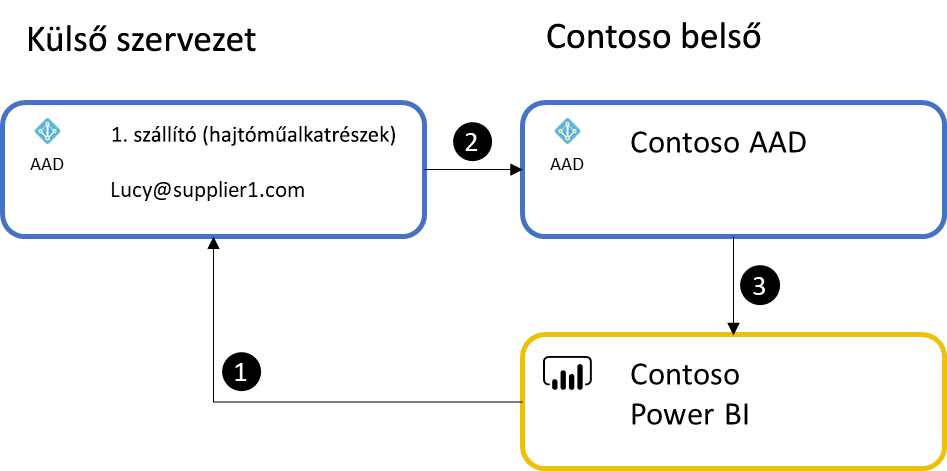

1. A folyamat egy contoso belső felhasználóval kezdődik, amely egy irányítópultot vagy egy jelentést külső felhasználóval oszt meg. Ha a külső felhasználó még nem volt vendég a contoso Azure AD-ben, meghívja őket. A rendszer e-mailt küld az e-mail-címére, amely tartalmazza a contoso Azure AD-beli meghívását
2. A címzett elfogadja a contoso Azure AD-beli meghívását, és vendég felhasználóként adja hozzá a contoso Azure AD-ben.
3. Ekkor a rendszer átirányítja a címzettet az Power BI irányítópultra, jelentésre vagy alkalmazásra, amely csak olvasható a felhasználó számára.

A folyamat alkalminak számít, mivel a contoso üzleti felhasználói a meghívási műveletet az üzleti célokra igény szerint végzik el. Minden megosztott elem egyetlen hivatkozás, amelyet a külső felhasználó elér a tartalom megtekintésére.

Miután a külső felhasználó meghívást kapott a contoso-erőforrások elérésére, a contoso Azure AD-ben létrehozhat egy árnyékmásolat-fiókot, és nem kell újból meghívnia őket.  Amikor első alkalommal próbálnak hozzáférni egy contoso-erőforráshoz, például egy Power BI irányítópulthoz, egy engedélyezési folyamaton mennek keresztül, amely beváltja a meghívót.  Ha nem fejezik be a beleegyezik, nem férhetnek hozzá a contoso egyik tartalmához sem.  Ha nem sikerül beváltani a meghívót az eredeti hivatkozással, az Azure AD-rendszergazda újra elküldheti a meghívót a beváltáshoz.

### Tervezett elemek megosztása

A contoso egy alvállalkozóval működik a radiátorok megbízhatóságának elemzéséhez. Az alvállalkozó 10 személyből álló csapattal rendelkezik, akiknek hozzáférésre van szüksége a contoso Power BI-környezetében lévő adatszolgáltatásokhoz. A contoso Azure AD rendszergazdája részt vesz az összes felhasználó meghívásában, valamint az alvállalkozói változások során felmerülő kiegészítések/változások kezelésében. Az Azure AD rendszergazdája létrehoz egy biztonsági csoportot az alvállalkozó összes alkalmazottja számára. A contoso alkalmazottai könnyedén kezelhetik a jelentésekhez való hozzáférést, és biztosítják, hogy minden szükséges alvállalkozó-munkatárs hozzáférhessen az összes szükséges jelentéshez, irányítópulthoz és Power BI alkalmazáshoz. Az Azure AD-rendszergazda a Meghívási folyamat teljes bevonását is elkerülheti, ha úgy dönt, hogy delegálja a Meghívási jogokat egy megbízható alkalmazottnak a contoso-ban vagy az alvállalkozónál, hogy biztosítsa az időben alkalmazott felügyeletet

Egyes szervezetek nagyobb mértékű irányítást igényelnek a külső felhasználók hozzáadásakor, egy külső szervezet vagy több külső szervezet számára is meghívja őket. Ezekben az esetekben a tervezett megosztás segítségével kezelhető a megosztás, a szervezeti házirendek betartatása, valamint a megbízható személyeknek a külső felhasználók meghívására és felügyeletére vonatkozó jogosultságok delegálása is. Az Azure AD B2B támogatja a tervezett meghívások közvetlen küldését [a Azure Portal egy informatikai rendszergazda](https://docs.microsoft.com/azure/active-directory/b2b/add-users-administrator)vagy [a PowerShell segítségével a meghívó kezelő API](https://docs.microsoft.com/azure/active-directory/b2b/customize-invitation-api) -val, ahol egy adott műveletben a felhasználók meghívhatók. A tervezett Meghívási módszer használatával a szervezet szabályozhatja, hogy kik hívhatják meg a felhasználókat és hogyan implementálják a jóváhagyási folyamatokat. A speciális Azure AD-funkciók, például a dinamikus csoportok megkönnyítik a biztonsági csoport tagságának automatikus fenntartását.

1. Az informatikai rendszergazda által a vendég felhasználónak manuálisan vagy a Azure Active Directory által biztosított API-n keresztül meghívó folyamat
2. A felhasználó elfogadja a meghívást a szervezet számára.
3. Miután a felhasználó elfogadta a meghívót, a Power BIban lévő felhasználó megoszthat egy jelentést vagy irányítópultot a külső felhasználóval vagy egy biztonsági csoporttal. Ugyanúgy, mint a rendszeres megosztáshoz, Power BI a külső felhasználó egy e-mailt kap az elemre mutató hivatkozást tartalmazó e-mailben.
4. Amikor a külső felhasználó hozzáfér a kapcsolathoz, a címtárban lévő hitelesítésük a contoso Azure AD-ba kerül, és a Power BI tartalmak elérésére szolgál.

### Power BI alkalmazások ad hoc vagy tervezett megosztása

A contoso olyan jelentéseket és irányítópultokat tartalmaz, amelyeket meg kell osztani egy vagy több szállítóval. Annak biztosítása érdekében, hogy az összes szükséges külső felhasználó hozzáférhessen a tartalomhoz, Power BI alkalmazásként van csomagolva. A külső felhasználók közvetlenül az alkalmazás-hozzáférési listához vagy biztonsági csoportokon keresztül adhatók hozzá. A contoso-beli valaki ezt követően elküldi az alkalmazás URL-címét az összes külső felhasználónak, például egy e-mailben. Amikor a külső felhasználók megnyitják a hivatkozást, egyetlen könnyen kezelhető élményben láthatják az összes tartalmat.

A Power BI alkalmazás használatával a contoso egyszerűen létrehozhat egy BI-portált a beszállítóinak. Egyetlen hozzáférési lista szabályozza az összes szükséges tartalom elérését, ami csökkenti a hulladék-ellenőrzés és az elemszintű engedélyek beállítását. Az Azure AD B2B biztonsági hozzáférést tart fenn a szállító natív identitásával, így a felhasználóknak nincs szükségük további bejelentkezési hitelesítő adatokra. Ha tervezett meghívást használ biztonsági csoportokkal, az alkalmazáshoz való hozzáférés-kezelést a projekt elforgatása vagy kijelentkezése egyszerűbbé vált. A biztonsági csoportokba való csatlakozás manuálisan vagy [dinamikus csoportok](https://docs.microsoft.com/azure/active-directory/b2b/use-dynamic-groups)használatával történik, így a szállító összes külső felhasználója automatikusan hozzá lesz adva a megfelelő biztonsági csoporthoz.

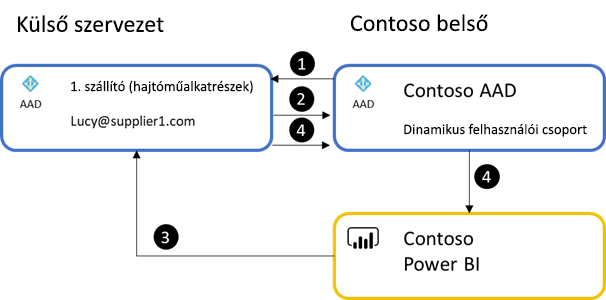

1. A folyamatot a felhasználó indítja el a contoso Azure AD-Szervezetének a Azure Portal vagy a PowerShell használatával
2. A felhasználó hozzáadhatók egy felhasználói csoporthoz az Azure AD-ben. Statikus vagy dinamikus felhasználói csoport is használható, de a dinamikus csoportok segítenek csökkenteni a manuális munkát.
3. A külső felhasználók hozzáférést kapnak a Power BI alkalmazáshoz a felhasználói csoporton keresztül. Az alkalmazás URL-címét közvetlenül a külső felhasználónak kell elküldeni, vagy olyan helyre kell helyezni, amelyhez hozzáféréssel rendelkeznek. Power BI a legjobb megoldás, ha e-mailt szeretne küldeni az alkalmazásnak a külső felhasználókra mutató hivatkozással, de ha olyan felhasználói csoportokat használ, amelyek tagsága megváltozhat, Power BI nem tud elküldeni a felhasználói csoportokon keresztül kezelt összes külső felhasználó számára.
4. Amikor a külső felhasználó hozzáfér a Power BI alkalmazás URL-címéhez, azokat a contoso Azure AD hitelesíti, az alkalmazás telepítve van a felhasználó számára, és a felhasználó láthatja az alkalmazáson belül található összes jelentést és irányítópultot.

Az alkalmazások olyan egyedi funkcióval is rendelkeznek, amely lehetővé teszi az alkalmazások számára, hogy automatikusan telepítse az alkalmazást a felhasználó számára, így a felhasználó bejelentkezésekor elérhetővé válik. Ez a funkció csak akkor települ automatikusan a contoso szervezetének részét képező külső felhasználók számára, amikor az alkalmazás közzététele vagy frissítése megtörtént. Így a legjobban a tervezett Meghívási megközelítéssel kell használni, és attól függ, hogy az alkalmazás közzététele vagy frissítése a contoso Azure AD-ba való hozzáadása után megtörtént-e. A külső felhasználók mindig az alkalmazás hivatkozását használva telepíthetik az alkalmazást.

### Megjegyzések és előfizetés a különböző szervezeteknél lévő tartalmakra

Ahogy a contoso továbbra is együttműködik alvállalkozókkal vagy szállítókkal, a külső mérnököknek szorosan kell dolgozniuk a contoso elemzői között. A Power BI számos együttműködési funkciót biztosít, amelyek segítségével a felhasználók kommunikálhatnak az általuk felhasználható tartalommal kapcsolatban. Az irányítópultok megjegyzései (és a hamarosan bejelentési megjegyzések) lehetővé teszik a felhasználók számára, hogy kérdéseket tegyenek fel az általuk megjelenő adatpontokról, és kommunikáljanak a jelentés szerzője

A külső vendég felhasználók jelenleg észrevételeket küldhetnek, és elolvashatják a válaszokat. A belső felhasználóktól eltérően azonban a vendég felhasználók nem @mentioned, és nem kapják meg az értesítéseket, amelyekhez Megjegyzés érkezett. A vendég felhasználók nem használhatják az előfizetések funkciót Power BIon belül az íráskor. Egy közelgő kiadásban ezek a korlátozások fel lesznek emelve, és a vendég felhasználó e-mailt kap, ha egy Megjegyzés @mentions őket, vagy ha egy előfizetést az e-mail-címre küld, amely a Power BI tartalmára mutató hivatkozást tartalmaz.

### Tartalom elérése a Power BI Mobile apps szolgáltatásban

Egy közelgő kiadásban, amikor a contoso felhasználói megosztanak jelentéseket vagy irányítópultokat a külső vendégekkel, Power BI e-mailt küld a vendégnek. Ha a vendég felhasználó megnyitja a jelentésre vagy az irányítópultra mutató hivatkozást a mobileszközön, akkor a tartalom a natív Power BI Mobile apps eszközön nyílik meg, ha telepítve vannak. A vendég felhasználó ezután megnyithatja a külső bérlőn a velük megosztott tartalmat, és visszatérhet a saját tartalmakhoz a saját bérlőtől.

> [!NOTE]
> A vendég felhasználó nem tudja megnyitni a Power BI Mobile alkalmazást, és azonnal navigáljon a külső bérlőhöz, a külső bérlő egy elemére mutató hivatkozással kell kezdődnie. A gyakori megkerülő megoldásokat a jelen dokumentum későbbi részében, a [fölérendelt szervezet Power bi a tartalomra mutató hivatkozások terjesztése](#distributing-links-to-content-in-the-parent-organizations-power-bi) című szakaszban találja.

### Power BI tartalom több szervezet általi szerkesztése és kezelése

A contoso és beszállítói és alvállalkozói egyre szorosabban működnek együtt. Gyakran az alvállalkozó elemzője további mérőszámokat vagy adatvizualizációkat igényel, amelyeket hozzá kell adni a contoso egy jelentéséhez. Az adatnak a contoso Power BI bérlőben kell lennie, de a külső felhasználóknak szerkeszteniük kell, új tartalmat kell létrehozniuk, és akár el is terjeszthetik a megfelelő személyeknek.

A Power BI olyan lehetőséget biztosít, amely lehetővé teszi a **külső vendég felhasználók számára a tartalmak szerkesztését és kezelését** a szervezeten belül. Alapértelmezés szerint a külső felhasználók csak olvasható, felhasználási célú felhasználói élményt nyújtanak. Ez az új beállítás azonban lehetővé teszi, hogy a Power BI rendszergazda kiválassza, hogy mely külső felhasználók szerkeszthetik és kezelhetik a tartalmakat a saját szervezetén belül. Az engedélyezést követően a külső felhasználó szerkesztheti a jelentéseket, az irányítópultokat, közzéteheti vagy frissítheti az alkalmazásokat, munkaterületeket dolgozhat, és csatlakozhat a használatra jogosult adatmennyiségekhez.

Ezt a forgatókönyvet részletesen ismertetjük a jelen dokumentum későbbi részében a külső felhasználók számára a tartalom szerkesztésére és kezelésére szolgáló Power BI.

## Szervezeti kapcsolatok a Power BI és az Azure AD B2B használatával

Ha Power BI összes felhasználója a szervezeten belül van, nincs szükség az Azure AD B2B használatára. Ha azonban két vagy több szervezet szeretne együttműködni az adatkezeléssel és az elemzéssel, Power BI az Azure AD B2B-támogatásának köszönhetően egyszerűen és költséghatékonyan valósítható meg.

Az alábbi jellemzően olyan szervezeti struktúrákat észleltek, amelyek kiválóan alkalmasak az Azure AD B2B stílusú, többszervezetes együttműködésre Power BIban. Az Azure AD B2B a legtöbb esetben jól működik, de bizonyos helyzetekben a dokumentum végén tárgyalt általános alternatív megközelítéseket érdemes figyelembe venni.

### 1\. eset: a szervezetek közötti közvetlen együttműködés

A contoso a szolgáltatóval való kapcsolata egy példa a szervezetek közötti közvetlen együttműködésre. Mivel a contoso és a szállítója viszonylag kevés felhasználóhoz férhet hozzá a fűtőtest megbízhatósági adataihoz, az Azure AD B2B-alapú külső megosztás használata ideális megoldás. Könnyen használható és egyszerűen kezelhető. Ez az általános példa a tanácsadási szolgáltatásokban, ahol a tanácsadónak szüksége lehet a szervezet tartalmának összeállítására.

Ez a megosztás általában az ad hoc használatával történik az elemek megosztásakor. Mivel azonban a csapatok egyre mélyebben növekednek vagy bővülnek, az egyes elemek megosztásának megközelítése az előnyben részesített módszer lesz a felügyeleti terhelés csökkentése érdekében. Emellett az Power BI alkalmazások alkalmi vagy tervezett megosztása, a tartalomhoz való feliratkozás és a tartalmakra való feliratkozás a különböző szervezetek között, a mobil alkalmazásokban elérhető tartalmakhoz való hozzáférés, valamint a Power BI tartalmak szervezeten belüli szerkesztése és kezelése is. Fontos, hogy ha mindkét szervezet felhasználója rendelkezik Power BI Pro licenccel a saját szervezetében, használhatja ezeket a Pro-licenceket egymás Power BI környezetében. Ez előnyös licencelést biztosít, mivel a meghívó szervezetnek nem kell fizetnie a külső felhasználók számára Power BI Pro licencért. Ezt a jelen dokumentum későbbi, a licencelési szakaszban részletesebben tárgyaljuk.

### 2\. eset: szülő és annak leányvállalatai vagy társvállalatai

Bizonyos szervezeti struktúrák összetettebbek, többek között a részben vagy teljes tulajdonban lévő leányvállalatok, a kapcsolt vállalatok vagy a felügyelt szolgáltatói kapcsolatok. Ezek a szervezetek olyan fölérendelt szervezettel rendelkeznek, mint például a Holding Company, de az alapul szolgáló szervezetek félig autonóm módon működnek, esetenként különböző regionális követelmények szerint. Ennek eredményeként minden szervezet rendelkezik saját Azure AD-környezettel és külön Power BI Bérlővel.

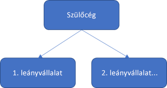

Ebben a struktúrában a fölérendelt szervezetnek jellemzően szabványosított bepillantást kell terjesztenie leányvállalataira. Ez a megosztás általában az alábbi ábrán látható módon ad hoc vagy tervezett megosztással történik Power BI alkalmazások megközelítésében, mivel lehetővé teszi a szabványosított mérvadó tartalom terjesztését széles közönség számára. A gyakorlatban a jelen dokumentumban korábban említett összes forgatókönyv kombinációját használja a rendszer.

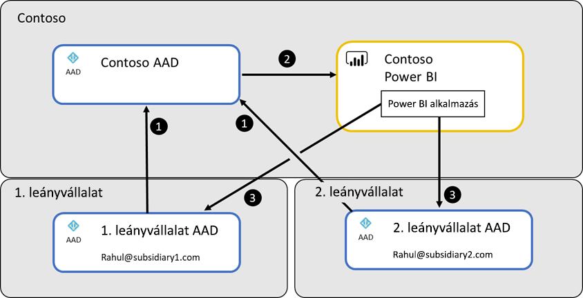

Ez a következő folyamatot követi:

1. Az egyes leányvállalatok felhasználói a contoso Azure AD-re várnak
2. Ezt követően a Power BI alkalmazás közzé lesz téve, hogy a felhasználók hozzáférhessenek a szükséges információhoz
3. Végül a felhasználók megnyitják az alkalmazást a jelentések megtekintésére megadott hivatkozáson keresztül.

Ennek a struktúrának a szervezetei számos fontos kihívást jelentenek:

- Tartalomra mutató hivatkozások terjesztése a fölérendelt szervezet Power BI
- A leányvállalatok számára a fölérendelt szervezet által üzemeltetett adatforrás elérésének engedélyezése

#### A fölérendelt szervezet Power BI tartalmára mutató hivatkozások terjesztése

A tartalomra mutató hivatkozások terjesztésére általában három módszert használunk. Az első és a legalapvetőbb az, hogy elküldi az alkalmazásra mutató hivatkozást a szükséges felhasználóknak, vagy egy olyan SharePoint Online-webhelyen helyezze el, amelyről megnyitható. A felhasználók ezután könyvjelzővel láthatják el a hivatkozást a böngészőben, hogy gyorsabban hozzáférhessenek a szükséges adatszolgáltatásokhoz.

A második módszer a Power BI tartalom képességének több szervezet általi szerkesztésére és kezelésére támaszkodik. A fölérendelt szervezet lehetővé teszi a leányvállalatok felhasználói számára, hogy hozzáférjenek a Power BIhoz, és szabályozzák, hogy mit érhetik el az engedélyekkel. Ez hozzáférést biztosít a Power BI kezdőlaphoz, ahol a leányvállalat felhasználója a fölérendelt szervezet bérlője számára megosztott tartalom teljes listáját látja. Ezután a fölérendelt szervezetek Power BI környezetének URL-címét a rendszer a leányvállalatok felhasználói számára adja meg.

Az utolsó megközelítés egy Power BI alkalmazást használ a Power BI bérlőn belül minden egyes leányvállalat számára. A Power BI alkalmazás tartalmaz egy irányítópultot, amelynek [csempéi a külső hivatkozás lehetőséggel vannak konfigurálva](https://docs.microsoft.com/power-bi/service-dashboard-edit-tile#hyperlink). Amikor a felhasználó megnyomja a csempét, a rendszer a fölérendelt szervezet Power BI a megfelelő jelentést, irányítópultot vagy alkalmazást veszi át. Ennek a megközelítésnek a előnye, hogy az alkalmazás automatikusan telepíthető a leányvállalat összes felhasználója számára, és minden alkalommal elérhető számukra, amikor bejelentkeznek a saját Power BI környezetbe. Ennek a megközelítésnek az előnye, hogy jól működik a Power BI Mobile apps szolgáltatással, amely natív módon nyithatja meg a hivatkozást. Ezt a második megközelítéssel is egyesítheti Power BI környezetek közötti könnyebb váltás érdekében.

#### A leányvállalatok számára a fölérendelt szervezet által üzemeltetett adatforrások elérésének engedélyezése

A leányvállalatokhoz tartozó elemzőknek gyakran saját elemzést kell létrehozniuk a fölérendelt szervezet által szolgáltatott adataik használatával. Ebben az esetben a rendszer általában a Felhőbeli adatforrásokat használja a probléma megoldásához.

Az első megközelítés [Azure Analysis Servicest](https://docs.microsoft.com/azure/analysis-services/analysis-services-overview) használ egy nagyvállalati szintű adattárház létrehozásához, amely az elemzők igényeit szolgálja ki a szülő és a leányvállalatai számára, ahogy az alábbi képen is látható. A contoso képes az adattárolásra, és olyan képességeket használni, mint a sorok szintjének biztonsága, hogy az egyes leányvállalatok felhasználói hozzáférhessenek csak az adatszolgáltatáshoz. Az elemzők az adattárházat Power BI Desktopon keresztül érhetik el, és az eredményül kapott elemzéseket a megfelelő Power BI bérlők számára teszik közzé.

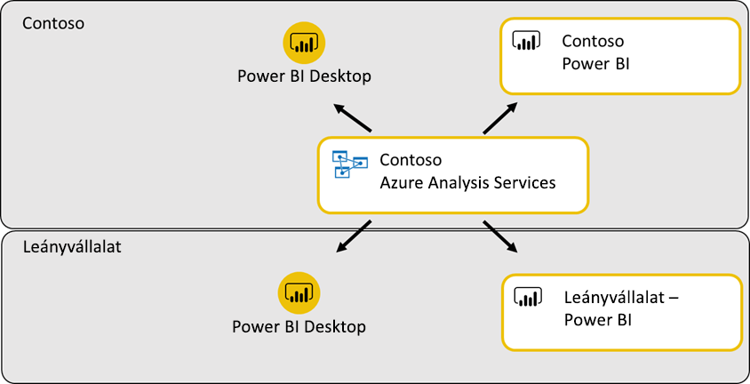

A második módszer [Azure SQL Databaset](https://azure.microsoft.com/services/sql-database/) használ egy, a kapcsolattal rendelkező adattárház létrehozásához az adathozzáférés biztosításához. Ez a Azure Analysis Services megközelítéshez hasonlóan működik, bár bizonyos funkciók, mint például a sor szintű biztonság, nehezebb lehet a leányvállalatok között üzembe helyezni és karbantartani.

A kifinomultabb megközelítések is lehetségesek, de a fentiek messze a leggyakoribbak.

### 3\. eset: megosztott környezet partnerek között

A contoso a versenytársakkal közösen építheti össze az autót egy megosztott szerelvényben, de a járművet a különböző márkák vagy különböző régiókban is eloszthatja. Ehhez széleskörű együttműködésre és az adatok, az intelligencia és az elemzések szervezeten belüli közös tulajdonlására van szükség. Ez a struktúra gyakori a tanácsadói szolgáltatások iparágában is, ahol a tanácsadók csapata projekt-alapú elemzéseket végezhet az ügyfelek számára.

A gyakorlatban ezek a szerkezetek az alábbi ábrán látható módon összetettek, és a személyzet fenntartását igénylik. Ennek a struktúrának a hatékonysága érdekében a Power BI tartalom képességének a szervezeten belüli szerkesztésére és kezelésére támaszkodik, mivel lehetővé teszi a szervezetek számára, hogy a megfelelő Power BI bérlők számára megvásárolt Power BI Pro licenceket újra felhasználhassa.

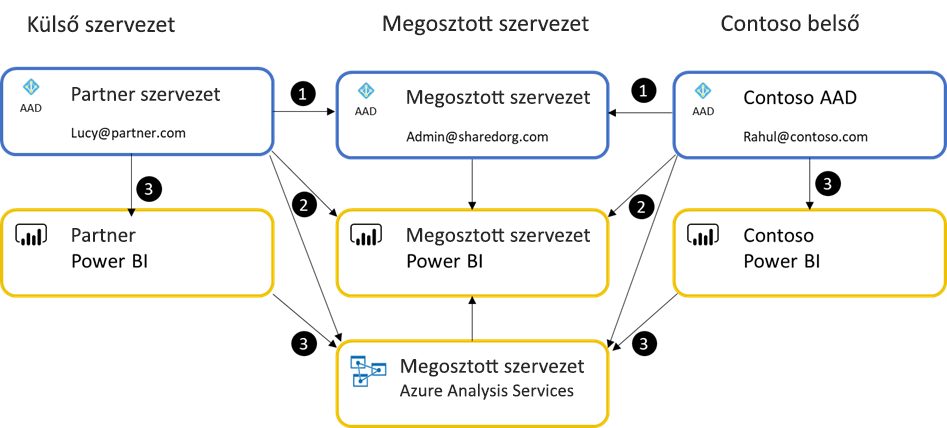

Megosztott Power BI bérlő létrehozásához létre kell hoznia egy Azure Active Directory, és legalább egy Power BI Pro felhasználói fiókot meg kell vásárolnia az adott Active Directoryban lévő felhasználó számára. Ez a felhasználó meghívja a szükséges felhasználókat a megosztott szervezet számára. Fontos, hogy ebben az esetben a contoso felhasználói a megosztott szervezet Power BIján belül működnek,

A folyamat a következő:

1. A megosztott szervezet új Azure Active Directory jön létre, és a rendszer legalább egy felhasználói fiókot hoz létre az új szervezeten belül. A felhasználónak Power BI Pro licenccel kell rendelkeznie.
2. Ez a felhasználó ezután létrehozza a Power BI bérlőt, és meghívja a contoso és a partner szervezet számára szükséges felhasználókat. A felhasználó az olyan megosztott adategységeket is létrehozza, mint a Azure Analysis Services. A contoso és a partner felhasználói hozzáférhetnek a megosztott szervezet Power BI vendég felhasználóként. Ha a tartalom szerkesztésével és kezelésével Power BI a külső felhasználók használhatják a Power BI kezdőlapot, munkaterületeket használhatnak, feltölthetnek vagy szerkeszthetnek tartalmakat és jelentéseket oszthatnak meg. Az összes megosztott eszközt általában a megosztott szervezet tárolja és éri el.
3. Attól függően, hogy a felek hogyan fogadják el az együttműködést, minden szervezet számára lehetséges, hogy a megosztott adattárház-eszközök használatával saját tulajdonú adataikat és elemzéseket alakítanak ki. A belső Power BI bérlőik használatával terjeszthetik a saját belső felhasználói számára.

### 4\. eset: elosztás több száz vagy több ezer külső partner számára

Míg a contoso létrehozta a fűtőtest megbízhatósági jelentését az egyik szolgáltatóhoz, a contoso már szabványosított jelentéseket kíván létrehozni több száz szállító számára. Ez lehetővé teszi a contoso számára, hogy az összes szállító számára elérhetővé tegye a javításokat vagy a gyártási hibák javításához szükséges elemzéseket.

Ha egy szervezetnek szabványosított adatmennyiséget és bepillantást kell terjesztenie számos külső felhasználóra/szervezetre, akkor a Power BI alkalmazások alkalmi vagy tervezett megosztását használhatja a BI-portál gyors és kiterjedt fejlesztési költségek nélküli létrehozásához. A portál Power BI alkalmazással történő összeállításának folyamata a következő esettanulmányban található: BI-portál létrehozása Power BI + Azure AD B2B – lépésenkénti útmutató a jelen dokumentum későbbi részében.

Ebben az esetben gyakori változata az, amikor egy szervezet megpróbálja megosztani az eredményeket a fogyasztókkal, különösen akkor, ha az Azure B2C-t a Power BI segítségével szeretné használni. Power BI nem támogatja natív módon az Azure B2C-t. Ha ebben az esetben a beállításokat értékeli, érdemes lehet a 2. alternatív megoldás használatát használni a jelen dokumentum későbbi részében, a közös alternatív megközelítésekben.

## Esettanulmány: BI-portál létrehozása Power BI + Azure AD B2B-vel – lépésenkénti útmutató

Power BI az Azure AD B2B-vel való integrációja zökkenőmentes, zavartalan hozzáférést biztosít a vendég felhasználóknak a BI-portálhoz való biztonságos hozzáférés biztosításához. A contoso a következő három lépéssel állítható be:

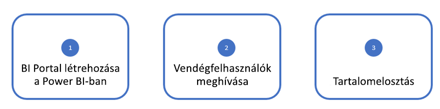

1. BI Portal létrehozása a Power BI-ban

    A contoso első feladata a BI-portál létrehozása Power BIban. A contoso BI-portál olyan, szándékosan készített irányítópultokat és jelentéseket tartalmaz, amelyek számos belső és vendég számára elérhetővé válnak. Ennek a Power BI az ajánlott módja, ha Power BI alkalmazást hoz létre. További információ a [Power bi alkalmazásokról](https://powerbi.microsoft.com/blog/distribute-to-large-audiences-with-power-bi-apps/).

- A contoso BI csapata létrehoz egy munkaterületet Power BI

    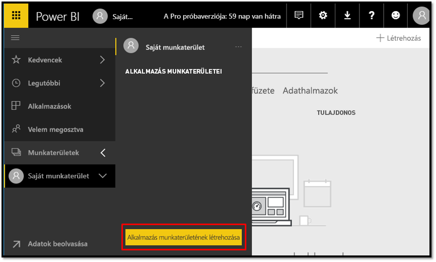
    

- Más szerzők hozzáadása a munkaterülethez

    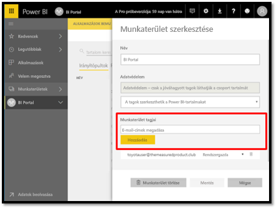

- A tartalom a munkaterületen belül jön létre

    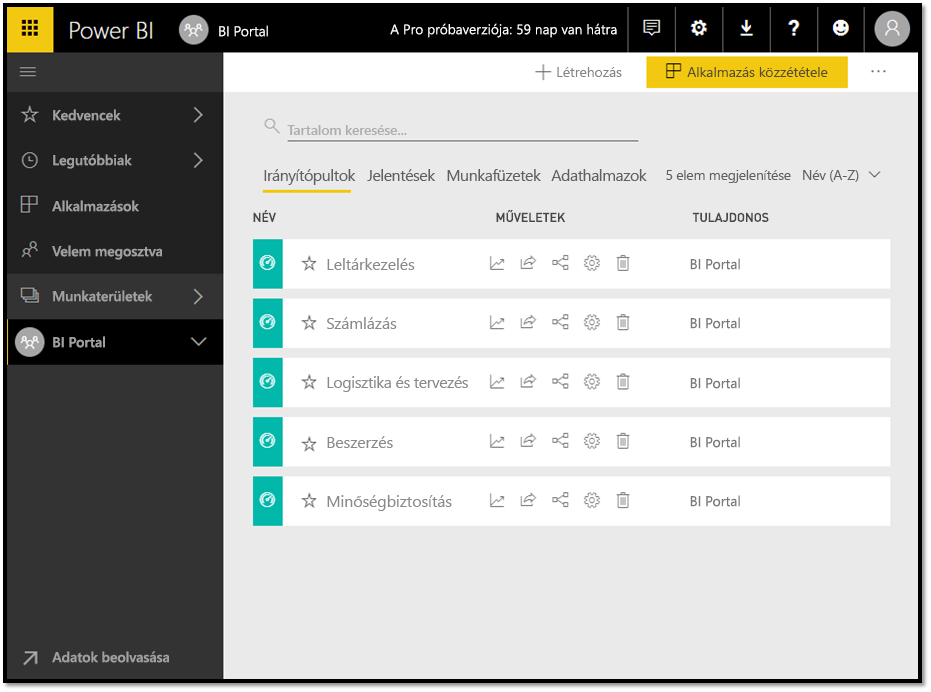

    Most, hogy a tartalom egy munkaterületen lett létrehozva, a contoso készen áll arra, hogy meghívja a partner szervezeteinek vendég felhasználókat a tartalom felhasználásához.

2. Vendégfelhasználók meghívása

    A contoso két módon hívhatja meg a vendég felhasználókat a BI-portálra Power BIban:

    * Tervezett meghívók
    * Ad hoc meghívók

    **Tervezett meghívók**

    Ebben a megközelítésben a contoso előre meghívja a vendég felhasználókat az Azure AD-be, majd elosztja Power BI tartalmat. A contoso meghívja a vendég felhasználókat a Azure Portal vagy a PowerShell használatával. Az alábbi lépéseket követve meghívhatja a vendég felhasználókat a Azure Portal:

    - A contoso Azure AD rendszergazdája megkeresi a **Azure Portal > Azure Active Directory > felhasználók és csoportok > minden felhasználó > új vendég felhasználó**

    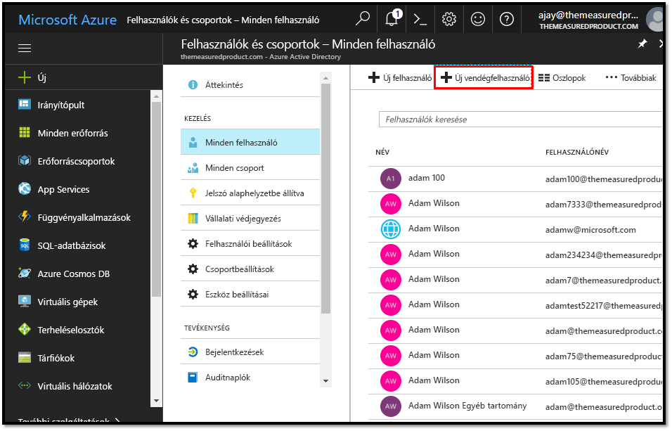

    - Adjon hozzá egy meghívót a vendég felhasználói számára, és kattintson a meghívás gombra.

    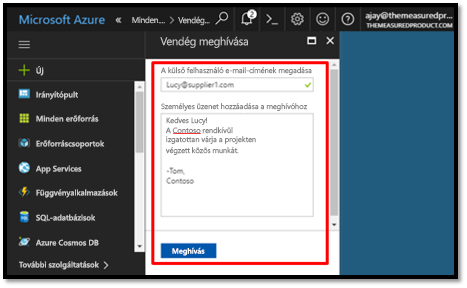

    > [!NOTE]
    > Ha meg szeretné hívni a vendég felhasználókat a Azure Portalból, rendszergazdának kell lennie a bérlő Azure Active Directory.

    Ha a contoso sok vendég felhasználót szeretne meghívni, akkor a PowerShell használatával. A contoso Azure AD-rendszergazdája egy CSV-fájlban tárolja az összes vendég felhasználó e-mail-címét. Az alábbiakban [Azure Active Directory B2B együttműködési kód és PowerShell-minták](https://docs.microsoft.com/azure/active-directory/b2b/code-samples) és utasítások láthatók.

    A meghívást követően a vendég felhasználói e-mailt kapnak a meghívó hivatkozással.

    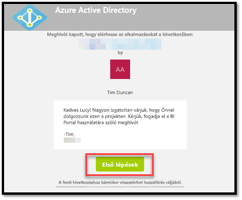

    Ha a vendég felhasználói a hivatkozásra kattintanak, hozzáférhetnek a contoso Azure AD-bérlőben található tartalmakhoz.

    > [!NOTE]
    > A meghívó e-mailek elrendezését az Azure AD branding szolgáltatás használatával módosíthatja az [itt](https://docs.microsoft.com/azure/active-directory/active-directory-b2b-invitation-email)leírtak szerint.

    **Ad hoc meghívók**

    Mi a teendő, ha a contoso nem ismeri az összes vendég felhasználót, aki meg szeretné hívni az idő előtt? Mi a teendő, ha az a contoso, aki létrehozta a BI Portalt, szeretné terjeszteni a tartalmat a vendég felhasználói számára? Ezt a forgatókönyvet Power BI ad-hoc meghívásokkal is támogatjuk.

    Az elemző csak a külső felhasználókat adhatja hozzá az alkalmazás hozzáférési listájához, amikor közzéteszik azt. A vendég felhasználói meghívót kapnak, és elfogadják azt, a rendszer automatikusan átirányítja őket a Power BI tartalmára.

    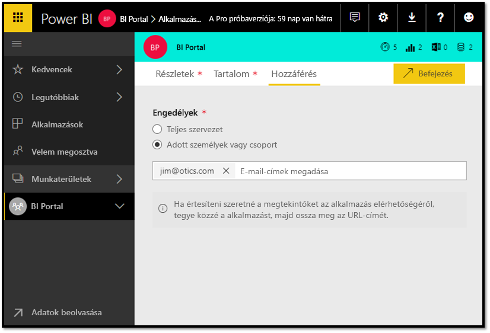

    > [!NOTE]
    > A meghívásra csak akkor van szükség, amikor egy külső felhasználó első alkalommal meghívja a szervezetét.

3. Tartalomelosztás

    Most, hogy a contoso BI csapata létrehozta a BI-portált, és meghívott vendég felhasználókat, eloszthatják a portált a végfelhasználók számára, hogy hozzáférést biztosítanak a vendégeknek az alkalmazáshoz, és közzétehetik azt. Power BI automatikusan elvégzi a contoso-bérlőhöz korábban hozzáadott vendég felhasználók nevét. Ezen a ponton a többi felhasználótól származó alkalmi meghívások is hozzáadhatók.

    > [!NOTE]
    > Ha biztonsági csoportok használatával kezeli az alkalmazáshoz való hozzáférést a külső felhasználók számára, használja a tervezett Meghívási módszert, és ossza meg az alkalmazás hivatkozását közvetlenül minden olyan külső felhasználóval, akinek hozzá kell férnie. Ellenkező esetben előfordulhat, hogy a külső felhasználó nem tudja telepíteni vagy megtekinteni a tartalmat az alkalmazáson belülről. _

    A vendég felhasználói e-mailt kapnak az alkalmazásra mutató hivatkozással.

    

    Ha erre a hivatkozásra kattint, a rendszer a vendég felhasználókat a saját szervezete identitásával történő hitelesítésre kéri.

    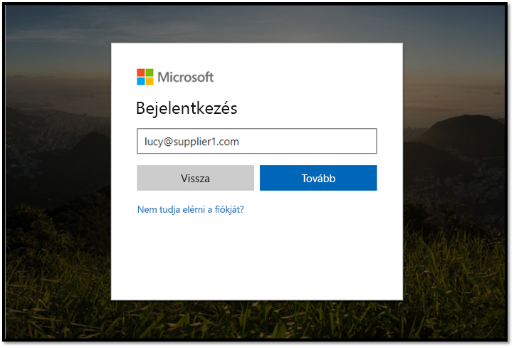

    A sikeres hitelesítés után a rendszer átirányítja a contoso BI-alkalmazására.

    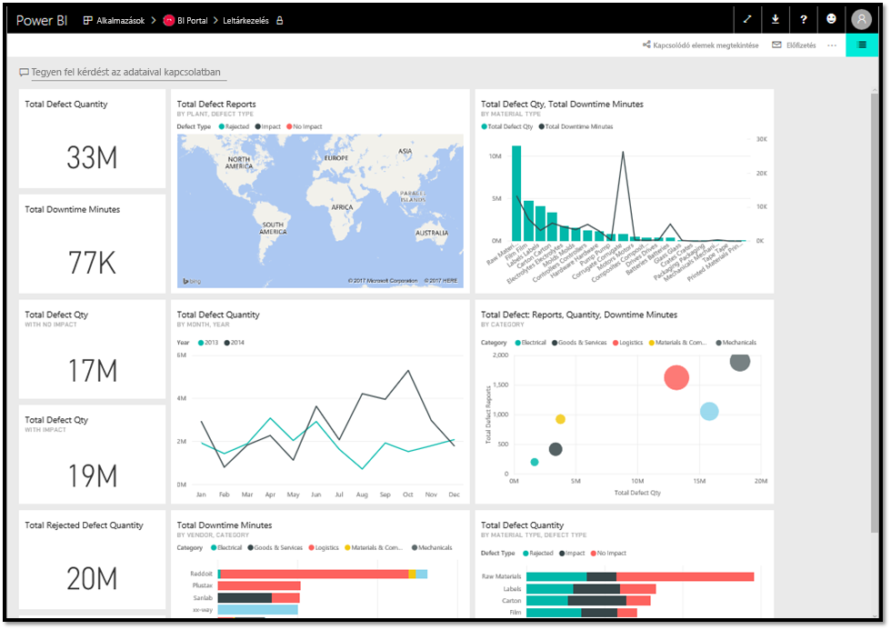

    A vendég felhasználók ezt követően az e-mailben szereplő hivatkozásra kattintva vagy a hivatkozás könyvjelzővel érhetik el a contoso alkalmazást. A contoso azt is megkönnyíti a vendég felhasználók számára, hogy hozzáadja ezt a hivatkozást a meglévő extranetes portálra, amelyet a vendég felhasználó már használ.

4. Következő lépések

    A contoso a Power BI alkalmazás és az Azure AD B2B használatával gyorsan létrehozhat egy BI-portált a beszállítók számára, kód nélküli módon. Ez nagymértékben leegyszerűsíti a szabványosított elemzések terjesztését az összes szükséges szolgáltatóhoz.

    A példa azt mutatta, hogy egy közös jelentés hogyan terjeszthető ki a szállítók között, Power BI sokkal tovább mehetnek. Annak biztosítása érdekében, hogy az egyes partnerek csak a magukra vonatkozó adatokat lássák, egyszerűen hozzáadhatók a jelentésekhez és az adatmodellekhez. A jelen dokumentum későbbi részében a külső partnerek adatbiztonsága című szakasz ezt a folyamatot ismerteti részletesen.

    Az egyes jelentéseket és irányítópultokat gyakran be kell ágyazni egy meglévő portálra. Ez a példában látható számos módszer újrafelhasználását is lehetővé teszi. Ezekben az esetekben azonban egyszerűbb lehet jelentések vagy irányítópultok beágyazása közvetlenül egy munkaterületről. A biztonsági engedély meghívásához és a felhasználók megköveteléséhez való hozzárendeléséhez szükséges folyamat változatlan marad.

## A motorháztető alatt: hogyan tud hozzáférni a Supplier1 a Power BI-tartalmakhoz a contoso bérlője felől?

Most, hogy láttuk, hogy a contoso hogyan tudja zökkenőmentesen terjeszteni Power BI tartalmat a partnerszervezetek vendégei számára, tekintsük át, hogyan működik ez a motorháztető alatt.

Amikor a contoso meghívott [lucy@supplier1.com](mailto:lucy@supplier1.com) a könyvtárába, az Azure ad létrehoz egy hivatkozást a [Lucy@supplier1.com](mailto:Lucy@supplier1.com) és a contoso Azure ad bérlője között. Ez a hivatkozás lehetővé teszi, hogy az Azure AD tudja, hogy Lucy@supplier1.com hozzáférhet a contoso-bérlő tartalmához.

Amikor a Lucy megpróbál hozzáférni a contoso Power BI alkalmazásához, az Azure AD ellenőrzi, hogy a Lucy hozzáférhet-e a contoso-bérlőhöz, majd Power BI egy tokent, amely azt jelzi, hogy a Lucy hitelesítve van a contoso-bérlő tartalmának eléréséhez. Power BI ezt a tokent használja az engedélyezéshez, és győződjön meg arról, hogy a Lucy hozzáfér a contoso Power BI alkalmazásához.

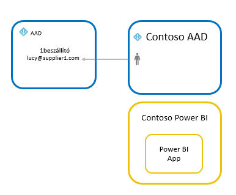

Power BI az Azure AD B2B-vel való integráció minden üzleti e-mail-címmel működik. Ha a felhasználó nem rendelkezik Azure AD-identitással, a rendszer kérheti, hogy hozzon létre egyet. A következő képen a részletes folyamat látható:

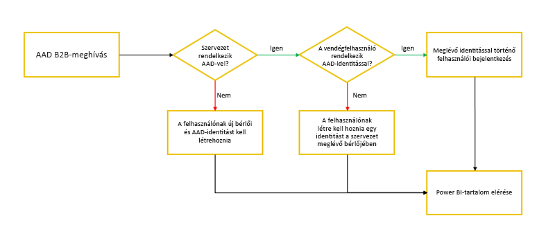

Fontos tisztában lenni azzal, hogy az Azure AD-fiókot a külső fél Azure AD-ban fogja használni vagy létrehozni, így a Lucy a saját felhasználónevét és jelszavát fogja használni, és a hitelesítő adataik automatikusan abbahagyják más bérlők működését, ha Lucy elhagyja a vállalatot, amikor a szervezetük az Azure AD-t is használja.

## Licencelés

A contoso három módszer egyikét választhatja a beszállítók és a partnerszervezetek számára, hogy hozzáférjenek Power BI tartalmakhoz.

> [!NOTE]
> _Az Azure ad B2B's ingyenes szintje elegendő a Power bi Azure ad B2B-vel való használatához. Bizonyos speciális Azure AD B2B-funkciók, például a dinamikus csoportok további licencelést igényelnek. További információkért tekintse meg az Azure ad B2B dokumentációját:_ [ _https://docs.microsoft.com/azure/active-directory/b2b/licensing-guidance_ ](https://docs.microsoft.com/azure/active-directory/b2b/licensing-guidance)

### 1\. módszer: a contoso a Power BI Premiumt használja

Ezzel a módszerrel a contoso megvásárolja Power BI Premium kapacitását, és hozzárendeli a BI-portál tartalmát ehhez a kapacitáshoz. Ez lehetővé teszi, hogy a partner szervezetek vendégei a contoso Power BI alkalmazásához Power BI licenc nélkül férhessenek hozzá.

A külső felhasználókra a használatnak csak az "ingyenes" felhasználók számára felkínált, Power BI a Power BI Premiumon belüli tartalmak felhasználására vonatkozó tapasztalatok vonatkoznak.

A contoso más Power BI prémium szintű képességeket is igénybe vehet az alkalmazásaihoz, mint például a megnövekedett frissítési arányok, a dedikált kapacitás és a nagyméretű modellek mérete.

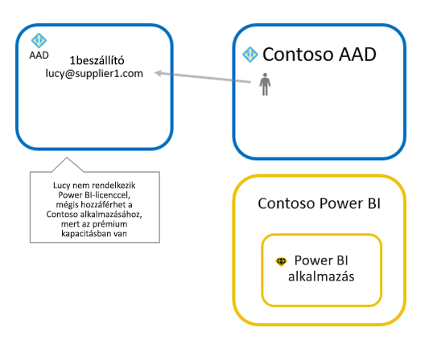

### 2\. módszer: a contoso Power BI Pro licenceket rendel a vendég felhasználóihoz

Ezzel a módszerrel a contoso Pro-licenceket oszt ki a partner szervezeteinek vendégei számára – ezt a contoso Microsoft 365 felügyeleti központból teheti meg. Ez lehetővé teszi, hogy a partner szervezetek vendégei hozzáférjenek a contoso Power BI alkalmazásához anélkül, hogy licencet kellene megvásárolniuk. Ez olyan külső felhasználókkal is megosztható, akiknek a szervezete még nem fogadta el Power BI.

> [!NOTE]
> A contoso Pro-licence csak akkor érvényes a vendég felhasználóra, ha a contoso-bérlőn lévő tartalomhoz férnek hozzá. A Pro-licencek lehetővé teszik a hozzáférését olyan tartalmakhoz, amelyek nem Power BI Premium kapacitással rendelkeznek. A Pro licenccel rendelkező külső felhasználók azonban alapértelmezés szerint csak a fogyasztási élményre korlátozódnak. Ez a dokumentum későbbi részében, a _külső felhasználók engedélyezése a tartalom szerkesztésére és kezelésére a Power bi_ című szakaszban ismertetett módszerrel módosítható.

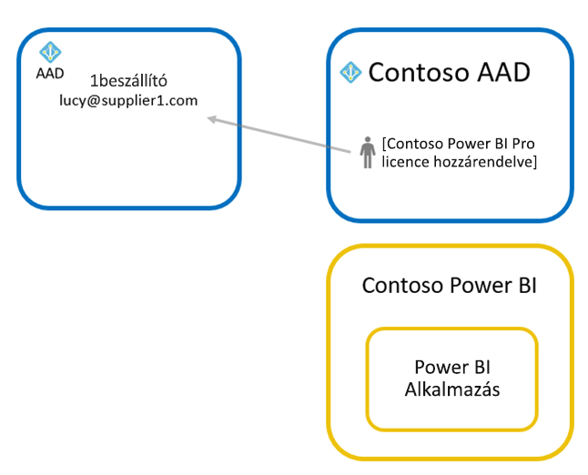

### 3\. megközelítés: a vendég felhasználói saját Power BI Pro licencet

Ezzel a módszerrel az 1. szállító egy Power BI Pro-licencet rendel a Lucy-hoz. Ezután hozzáférhetnek a contoso Power BI alkalmazásához ezzel a licenccel. Mivel a Lucy a saját szervezetének saját céges licencét használja egy külső Power BI-környezethez való hozzáféréskor, ezt a módszert más néven a _saját licenc_ használata (BYOL) is nevezik. Ha mindkét szervezet Power BI használ, ez előnyös licencelést kínál a teljes elemzési megoldáshoz, és a licencek terhelését a külső felhasználók számára is csökkentheti.

> [!NOTE]
> Az 1. szolgáltató által a Lucy számára megadott Pro-licenc minden olyan Power BI bérlőre vonatkozik, ahol a Lucy egy vendég felhasználó. A Pro-licencek lehetővé teszik a hozzáférését olyan tartalmakhoz, amelyek nem Power BI Premium kapacitással rendelkeznek. A Pro licenccel rendelkező külső felhasználók azonban alapértelmezés szerint csak a fogyasztási élményre korlátozódnak. Ez a dokumentum későbbi részében, a _külső felhasználók engedélyezése a tartalom szerkesztésére és kezelésére a Power bi_ szakaszban leírt módon módosítható.

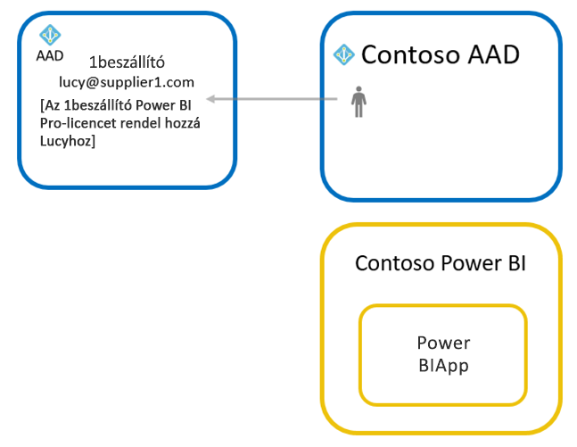

## Adatbiztonság külső partnereknek

Ha több külső szolgáltatóval dolgozik, a Contosonak biztosítania kell, hogy az egyes szállítók csak a saját termékeire vonatkozó információkat lássák. A felhasználó-alapú biztonsági és a dinamikus sorok szintjének biztonsága megkönnyíti a Power BI.

### Felhasználó-alapú biztonság

Power BI egyik leghatékonyabb funkciója a sor szintű biztonság. Ez a funkció lehetővé teszi, hogy a contoso egyetlen jelentést és adatkészletet hozzon létre, de az egyes felhasználókra is alkalmazza a különböző biztonsági szabályokat. Részletes magyarázatot a [soros szintű biztonság (RLS)](https://powerbi.microsoft.com/documentation/powerbi-admin-rls/)című témakörben talál.

Power BI az Azure AD B2B-vel való integrációja lehetővé teszi, hogy a contoso a contoso bérlőnek való meghívása után kirendeljen egy sor szintű biztonsági szabályt a vendég felhasználóinak. Ahogy korábban láttuk, a contoso a tervezett vagy ad hoc meghívások segítségével is hozzáadhat vendég felhasználókat. Ha a contoso szeretné kikényszeríteni a sor szintű biztonságot, javasoljuk, hogy a tervezett meghívások használatával adja hozzá a vendég felhasználókat az idő előtt, és rendelje hozzá őket a biztonsági szerepkörökhöz a tartalom megosztása előtt. Ha a contoso Ehelyett ad-hoc meghívást használ, előfordulhat, hogy egy rövid ideig, ahol a vendég felhasználói nem fognak tudni semmilyen információt.

> [!NOTE]
> Ez a késleltetés az RLS által védett adatoknak az ad-hoc meghívások használatakor történő elérésekor az informatikai csapatnak nyújt támogatást, mivel a felhasználók a kapott e-mail-megosztási hivatkozás megnyitásakor üres vagy hibás kereséseket vagy irányítópultokat látnak. Ezért erősen ajánlott a tervezett meghívások használata ebben a forgatókönyvben. * *

Lássunk egy példát.

Ahogy azt korábban említettük, a contoso a világ különböző pontjain található, és biztosítani szeretné, hogy a szállítói szervezetek felhasználói bepillantást nyerjenek az adatokból a saját területéről.  A contoso felhasználói azonban hozzáférhetnek az összes adattal. Számos különböző jelentés létrehozása helyett a contoso egyetlen jelentést hoz létre, és a felhasználó által megtekintett alapján szűri az adatmennyiséget.

Annak biztosítása érdekében, hogy a contoso képes legyen a kapcsolaton alapuló adatszűrésre, két szerepkör jön létre Power BI Desktopban. Az egyik a "Europe" SalesTerritory és egy másikat a "Észak-Amerika" számára.

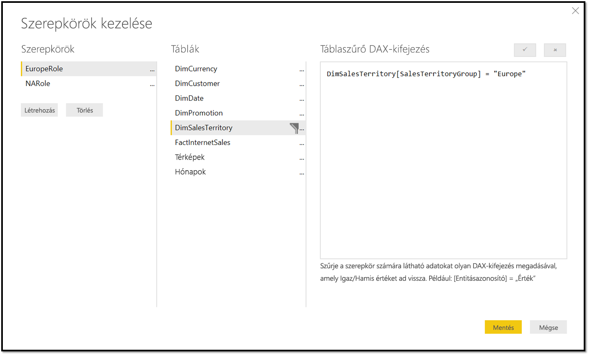

Ha a jelentésben szerepkörök vannak meghatározva, a felhasználónak hozzá kell rendelnie egy adott szerepkört, hogy hozzáférjen az összes adathoz. A szerepkörök hozzárendelése a Power BI szolgáltatáson belül történik ( **Adatkészletek > biztonság** )

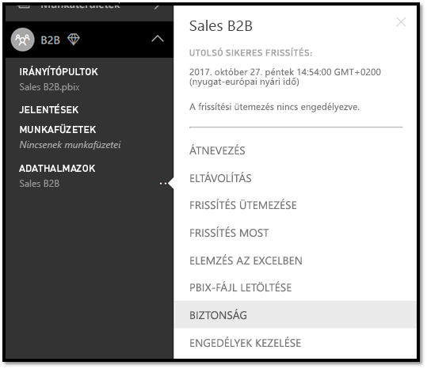

Ekkor megnyílik egy oldal, ahol a contoso BI csapata láthatja a két létrehozott szerepkört.  Mostantól a contoso BI csapata is hozzárendelhet felhasználókat a szerepkörökhöz.

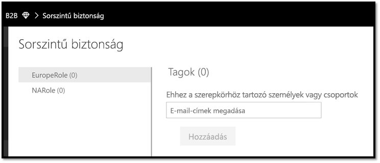

A példában a contoso egy olyan felhasználót ad hozzá egy partneri szervezethez, amely a (z) "[adam@themeasuredproduct.com](mailto:adam@themeasuredproduct.com)" e-mail-címmel rendelkezik az Európa szerepkörhöz:

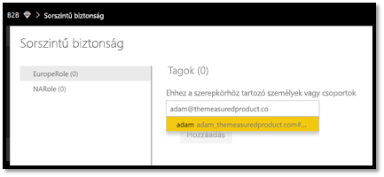

Ha az Azure AD feloldja ezt az információt, a contoso az ablakban megjelenik a felvenni kívánt név:

Most, amikor a felhasználó megnyitta a velük megosztott alkalmazást, csak az Európából származó adatokkal rendelkező jelentést látja:

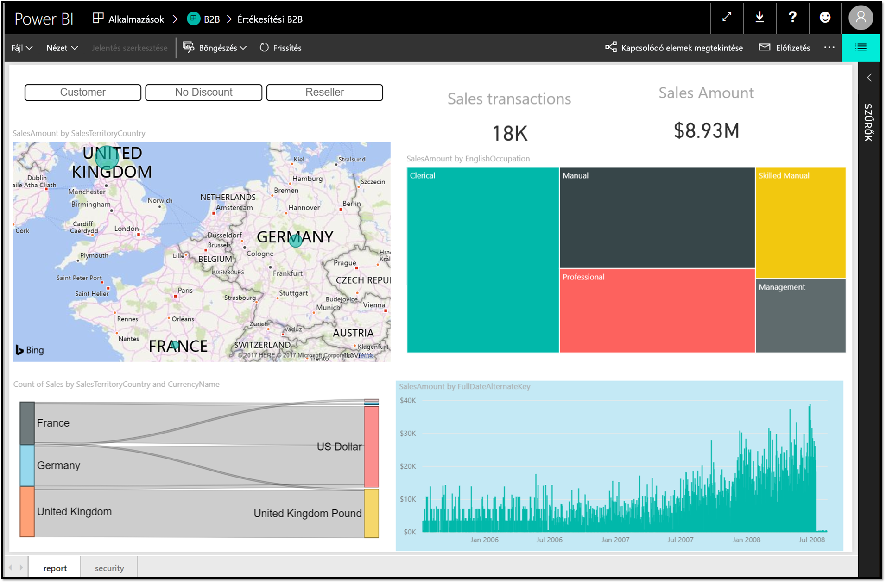

### Dinamikus sor szintű biztonság

Egy másik érdekes téma, hogy megtudhatja, hogyan működik az Azure AD B2B a dinamikus sorok szintjének biztonsága (RLS).

A dinamikus sorok szintjének biztonsága úgy működik, hogy a modellben lévő, a Power BIhoz csatlakozó személy felhasználóneve alapján szűri az adattípust. Ahelyett, hogy több szerepkört adna hozzá a felhasználói csoportokhoz, meg kell határoznia a modellben lévő felhasználókat. Itt részletesen ismertetjük a mintát. A Kasper de Jong részletesen leírja az [Power bi Desktop dinamikus biztonsági Cheat Sheet](https://www.kasperonbi.com/power-bi-desktop-dynamic-security-cheat-sheet/)-ben [és ebben a](https://msdn.microsoft.com/library/jj127437.aspx) tanulmányban, a sor szintű biztonság összes ízeit.

Lássunk egy kis példát – a contoso egy egyszerű jelentést készít az értékesítésekről csoportok szerint:

Most ezt a jelentést két vendég felhasználóval és egy belső felhasználóval kell megosztani – a belső felhasználó mindent megtekinthet, de a vendég felhasználók csak azokat a csoportokat láthatják, amelyekhez hozzáféréssel rendelkeznek. Ez azt jelenti, hogy csak a vendég felhasználóinak kell szűrniük az adathalmazt. Az információk megfelelő szűréséhez a contoso a tanulmányi és a blogbejegyzésben leírtak szerint a dinamikus RLS-mintát használja. Ez azt jelenti, hogy a contoso magához adja a felhasználóneveket:

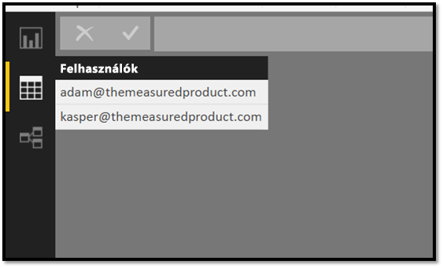

Ezt követően a contoso létrehozza a megfelelő adatmodellt, amely megfelelően szűri az adattípusokat a megfelelő kapcsolatokkal:

Ha a bejelentkezett felhasználó alapján automatikusan szeretné szűrni az adatszűrést, a Contosonak létre kell hoznia egy olyan szerepkört, amely a csatlakozáshoz használt felhasználónak megfelel. Ebben az esetben a contoso két szerepkört hoz létre – az első a "securityrole", amely a felhasználók táblát a Power BIba bejelentkezett felhasználó aktuális felhasználónevével szűri (ez még az Azure AD B2B vendég felhasználói számára is működik).

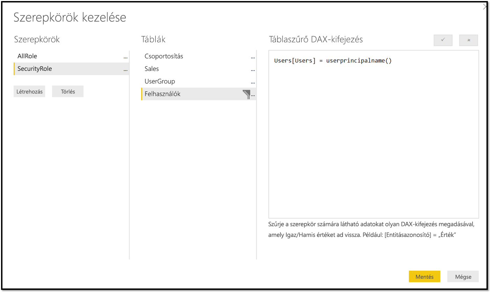

A contoso egy másik "AllRole" is létrehoz a belső felhasználók számára, akik mindent megtekinthetnek – ez a szerepkör nem rendelkezik biztonsági predikátummal.

Miután feltölthette a Power BI asztali fájlt a szolgáltatásba, a contoso a "SecurityRole" és a belső felhasználókhoz is hozzárendelheti a "AllRole"

Most, amikor a vendég felhasználói megnyitják a jelentést, csak az A csoportból származó értékesítéseket látják:

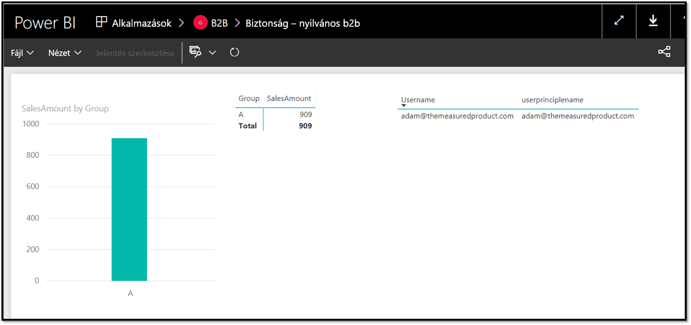

A jobb oldali mátrixban megtekintheti a USERNAME () és a USERPRINCIPALNAME () függvény eredményét, és a vendég felhasználói e-mail-címét is visszaküldheti.

Most a belső felhasználó megkapja az összes információt:

Amint láthatja, a dinamikus RLS a belső vagy a vendég felhasználóval is működik.

> [!NOTE]
> Ez a forgatókönyv akkor is működik, ha a Azure Analysis Services modelljét használja. Az Azure Analysis Service általában ugyanahhoz az Azure AD-hez csatlakozik, mint az Power BI – ebben az esetben az Azure AD B2B-en keresztül meghívott vendég felhasználókat is tudja Azure Analysis Services.

## Csatlakozás helyszíni adatforrásokhoz

A Power BI lehetővé teszi a contoso számára, hogy olyan helyszíni adatforrásokat használjanak, mint például [SQL Server Analysis Services](https://powerbi.microsoft.com/documentation/powerbi-gateway-enterprise-manage-ssas/) vagy [SQL Server](https://powerbi.microsoft.com/documentation/powerbi-gateway-kerberos-for-sso-pbi-to-on-premises-data/) közvetlenül a helyszíni [adatátjárónak](https://powerbi.microsoft.com/documentation/powerbi-gateway-onprem/)köszönhetően. Az adatforrásokhoz is be lehet jelentkezni ugyanazzal a hitelesítő adatokkal, mint a Power BI használatával.

> [!NOTE]
> Amikor átjárót telepít a Power BI bérlőhöz való csatlakozáshoz, a bérlőn belül létrehozott felhasználót kell használnia. A külső felhasználók nem telepíthetnek átjárót, és nem csatlakoztathatók a bérlőhöz. _

A külső felhasználók esetében ez bonyolultabb lehet, mivel a külső felhasználók általában nem ismerik a helyszíni AD-t. A Power BI megkerülő megoldásként lehetővé teszi a contoso-rendszergazdák számára, hogy a külső felhasználóneveket a belső felhasználónevek szerint képezze le az [adatforrás kezelése – Analysis Services](https://powerbi.microsoft.com/documentation/powerbi-gateway-enterprise-manage-ssas/)című cikkben leírtak szerint. Például a [lucy@supplier1.com](mailto:lucy@supplier1.com) a [lucy\_supplier1\_com #EXT@contoso.comhoz ](mailto:lucy_supplier1_com)képezhető le.

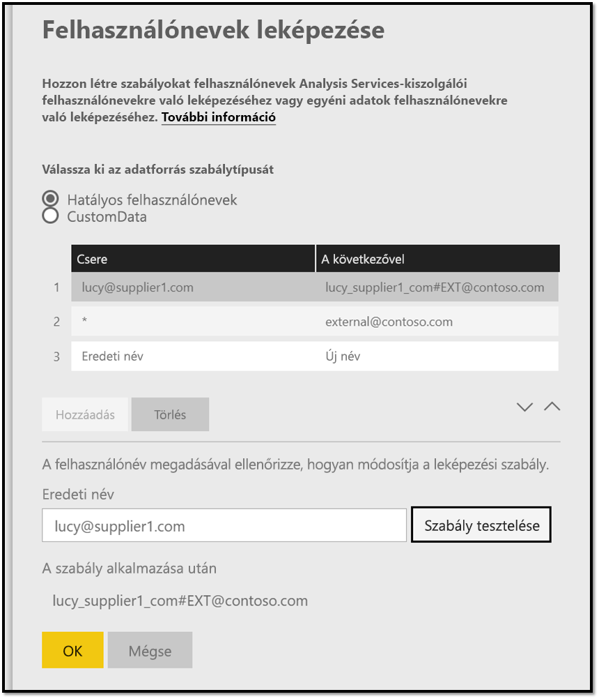

Ez a módszer akkor megfelelő, ha a contoso csak néhány felhasználóval rendelkezik, vagy ha a contoso az összes külső felhasználót egyetlen belső fiókhoz rendeli. Az összetettebb forgatókönyvek esetében, ahol minden felhasználónak saját hitelesítő adataira van szüksége, az [adatforrások kezelése – Analysis Services](https://powerbi.microsoft.com/documentation/powerbi-gateway-enterprise-manage-ssas/)című témakörben leírtak szerint egy fejlettebb módszer, amely [Egyéni ad-attribútumokat](https://technet.microsoft.com/library/cc961737.aspx) használ a leképezés végrehajtásához. Ez lehetővé tenné, hogy a contoso rendszergazdája Definiáljon egy leképezést az Azure AD-ben lévő összes felhasználóhoz (a külső B2B-felhasználók is).  Ezek az attribútumok a parancsfájlok vagy a kód használatával állíthatók be az AD-objektummodell segítségével, így a contoso teljes mértékben automatizálhatja a leképezést a meghíváskor vagy ütemezett lépésszám esetén.

## A külső felhasználók számára lehetővé teszi a tartalmak szerkesztését és kezelését Power BI belül

A contoso lehetővé teszi, hogy a külső felhasználók a szervezeten belül járuljanak hozzá a tartalomhoz a Power BI tartalom szakaszának a szervezeten belüli szerkesztése és kezelése című részben leírtaknak megfelelően.

> [!NOTE]
> A szervezet Power BIján belüli tartalmak szerkesztéséhez és kezeléséhez a felhasználónak a saját munkaterületén kívül egy Power BI Pro licenccel kell rendelkeznie. A felhasználók a jelen dokumentum _licencek_ című szakaszában leírtak szerint igényelhetnek Pro-licenceket.

A Power BI felügyeleti portál **lehetővé teszi a külső vendég felhasználók számára a tartalmak szerkesztését és kezelését a** bérlői beállításokban a szervezet beállításában. Alapértelmezés szerint a beállítás letiltva értékre van állítva, ami azt jelenti, hogy a külső felhasználók alapértelmezés szerint korlátozott olvasási élményt kapnak. A beállítás az Azure AD-ben vendégként beállított UserType rendelkező felhasználókra vonatkozik. Az alábbi táblázat az UserType és a beállítások konfigurálásának módját mutatja be a felhasználók viselkedése terén.

| **Felhasználói típus az Azure AD-ben** | **A külső vendég felhasználói számára a tartalom módosításának és kezelésének engedélyezése** | **Viselkedés** |
| --- | --- | --- |
| Vendég | A felhasználó számára Letiltva (alapértelmezett) | Csak cikkenként való használat nézet. A csak olvasási hozzáférést biztosít a jelentésekhez, az irányítópultokhoz és az alkalmazásokhoz, ha a vendég felhasználó számára elküldhető URL-cím alapján van megtekintve. Power BI Mobile alkalmazások csak olvasható nézetet biztosítanak a vendég felhasználó számára. |
| Vendég | Engedélyezve a felhasználó számára | A külső felhasználó hozzáférést kap a teljes Power BI felülethez, bár bizonyos funkciók nem érhetők el. A külső felhasználónak be kell jelentkeznie Power BI a Power BI szolgáltatás URL-címével, amely tartalmazza a bérlői adatokat. A felhasználó megkapja a kezdőlapot, a saját munkaterületet, és az engedélyek alapján megkeresheti, megtekintheti és létrehozhatja a tartalmat.    Power BI Mobile alkalmazások csak olvasható nézetet biztosítanak a vendég felhasználó számára. |

> [!NOTE]
> A külső felhasználók az Azure AD-ben is UserType-tag értékre állíthatók. A Power BI jelenleg nem támogatott.

A Power BI felügyeleti portálon a beállítás az alábbi képen látható.

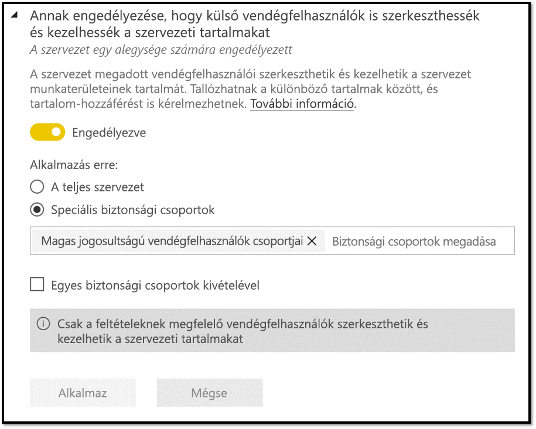

A vendég felhasználók a csak olvasási jogosultsággal rendelkező alapértelmezett élményt kapják meg, amely szerkesztheti és kezelheti a tartalmakat. Az alapértelmezett érték le van tiltva, ami azt jelenti, hogy az összes vendég felhasználó rendelkezik a csak olvasási élménysel. A Power BI rendszergazda engedélyezheti a szervezet összes felhasználójának vagy az Azure AD-ben meghatározott biztonsági csoportoknak a beállítását. Az alábbi ábrán a contoso Power BI rendszergazdája létrehozott egy biztonsági csoportot az Azure AD-ben annak kezeléséhez, hogy mely külső felhasználók szerkeszthetik és kezelhetik a tartalmat a contoso-bérlőben.

Annak érdekében, hogy a felhasználók bejelentkezzenek a Power BIba, adja meg a bérlői URL-címet. A bérlői URL-cím megkereséséhez kövesse az alábbi lépéseket.

1. A Power BI szolgáltatás felső menüjében válassza a Súgó ( **?** ), majd **a Power bi**.
2. Keresse meg a **bérlői URL-cím**melletti értéket. Ez a bérlői URL-cím, amelyet megoszthat a vendég felhasználókkal.

    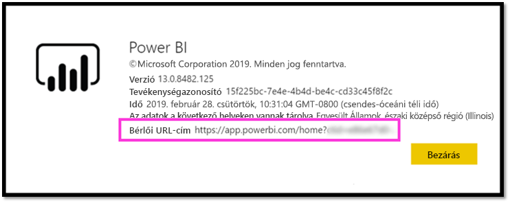

Ha a külső vendég felhasználók számára engedélyezi a tartalom szerkesztését és kezelését a szervezeten belül, a megadott vendég felhasználók hozzáférhetnek a szervezet Power BIhoz, és minden olyan tartalmat megtekinthetnek, amelyhez engedéllyel rendelkeznek. Hozzáférhetnek a kezdőlaphoz, böngészhetnek és hozzájárulhatnak a tartalmakhoz a munkaterületekhez, alkalmazásokat telepíthetnek, ahol a hozzáférési listán találhatók, és rendelkeznek saját munkaterülettel. Létrehozhatnak olyan munkaterületeket, illetve ezek rendszergazdái lehetnek, amelyek az új munkaterületi felületet alkalmazzák.

> [!NOTE]
> Ha ezt a beállítást használja, tekintse át a jelen dokumentum irányítási szakaszát, mivel az alapértelmezett Azure AD-beállítások megakadályozzák, hogy a vendég felhasználók bizonyos funkciókat, például az emberek választóit használják, ami kisebb felhasználói élményt eredményezhet. * *

Azok a vendégek, akik engedélyezik a külső vendég felhasználók számára a tartalmak szerkesztését és kezelését a szervezet bérlői beállításában, bizonyos élmények nem érhetők el. A jelentések frissítéséhez vagy közzétételéhez a vendég felhasználóknak a Power BI szolgáltatás webes felhasználói felületet kell használniuk, beleértve az adatok lekérése Power BI Desktop fájlok feltöltését. A következő műveletek nem támogatottak:

- Közvetlen közzététel a Power BI Desktopból a Power BI szolgáltatásba
- A vendégfelhasználók nem csatlakozhatnak a Power BI szolgáltatás szolgáltatói adatkészleteihez a Power BI Desktoppal
- Office 365-csoportokhoz kötött klasszikus munkaterületek: a vendég felhasználó nem hozhat létre, illetve nem lehet a munkaterületek rendszergazdái. Csak tagok lehetnek.
- Az ad-hoc meghívások nem támogatottak a munkaterületek hozzáférési listáiban
- A vendégfelhasználók számára nem támogatott a Power BI Publisher for Excel
- A vendégfelhasználók nem telepíthetik a Power BI Gateway szolgáltatást, és nem csatlakoztathatják az Ön szervezetéhez
- A vendégfelhasználók nem telepíthetnek alkalmazásokat, és nem tehetnek közzé tartalmakat a teljes szervezet számára
- A vendégfelhasználók nem használhatnak, hozhatnak létre, frissíthetnek vagy telepíthetnek szervezeti tartalomcsomagokat
- A vendégfelhasználók nem használhatják az Elemzés az Excelben funkciót
- A vendég felhasználók nem @mentioned a megjegyzésekben (ez a funkció egy közelgő kiadásban lesz hozzáadva)
- A vendég felhasználók nem használhatják az előfizetéseket (ez a funkció egy közelgő kiadásban lesz hozzáadva)
- Azon vendégfelhasználóknak, akik ezt a funkciót veszik igénybe, munkahelyi vagy iskolai fiókkal kell rendelkezniük. A személyes fiókokat használó vendégek a bejelentkezési korlátozások miatt több korlátozást tapasztalnak.

## Irányítás

### További Azure AD-beállítások, amelyek hatással vannak az Azure AD B2B-vel kapcsolatos Power BI élményekre

Az Azure AD B2B-megosztás használatakor a Azure Active Directory rendszergazdája a külső felhasználó felületének aspektusait vezérli. Ezeket a rendszer a külső együttműködési beállítások lapon, a bérlő Azure Active Directory beállításain belül szabályozza.

A beállítások részletei itt érhetők el:

[https://docs.microsoft.com/azure/active-directory/b2b/delegate-invitations](https://docs.microsoft.com/azure/active-directory/b2b/delegate-invitations)

> [!NOTE]
> Alapértelmezés szerint a vendég felhasználói engedélyek korlátozottak, ezért az Igen értékre van állítva, így a Power BIon belül a vendég felhasználói csak korlátozott számú tapasztalattal rendelkeznek, különösen azokat a megosztásokat, ahol a felhasználók nem dolgozhatnak a felhasználókkal. Fontos, hogy az Azure AD-rendszergazda használatával a nem értékre állítsa azt, ahogy az alább látható, így biztosítva a megfelelő élményt. * *

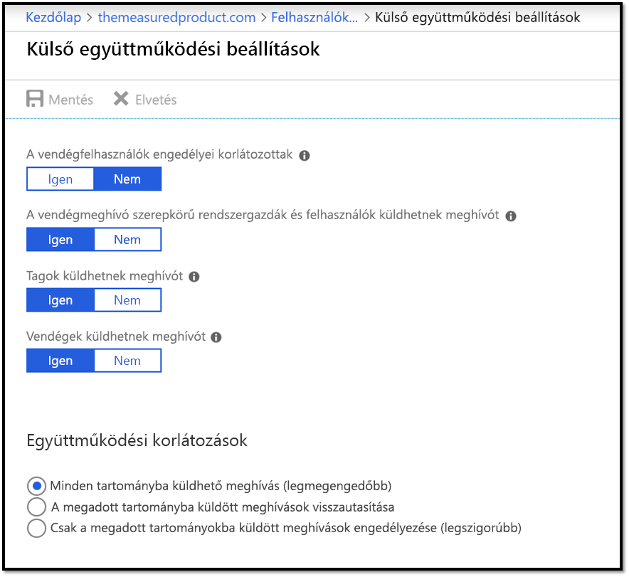

### Vendég által meghívó vezérlése

Power BI rendszergazdák a Power BI felügyeleti portálon meglátogatva vezérelhetik a külső megosztást, csak a Power BI. A bérlői rendszergazdák azonban különböző Azure AD-házirendekkel is vezérelhetik a külső megosztást.  Ezek a házirendek lehetővé teszik a bérlői rendszergazdák számára, hogy

- Meghívások kikapcsolása a végfelhasználók számára
- Csak a vendég meghívó szerepkörben található rendszergazdák és felhasználók hívhatják meg
- Rendszergazdák, a vendég meghívó szerepkör, és a tagok meghívhatják
- Minden felhasználó, a vendégeket is meghívhatja

Ezekről a házirendekről további információt a [Azure Active Directory B2B-együttműködésre vonatkozó meghívók delegálása](https://docs.microsoft.com/azure/active-directory/active-directory-b2b-delegate-invitations)című cikk nyújt.

A külső felhasználók összes Power BI műveletét a [naplózási portálon is naplózza](https://powerbi.microsoft.com/documentation/powerbi-admin-auditing/).

### Feltételes hozzáférési szabályzatok vendég felhasználók számára

A contoso feltételes hozzáférési szabályzatokat tud kikényszeríteni a contoso-bérlő tartalmait elérő vendég felhasználók számára. A [feltételes hozzáféréssel kapcsolatos részletes utasítások a B2B együttműködés felhasználói](https://docs.microsoft.com/azure/active-directory/active-directory-b2b-mfa-instructions)számára című témakörben találhatók.

## Gyakori alternatív módszerek

Habár az Azure AD B2B megkönnyíti az adatmegosztást és a jelentéseket a szervezetek között, számos más megközelítés is használatos, és bizonyos esetekben jobb lehet.

### 1\. alternatív lehetőség: duplikált identitások létrehozása a partnerek felhasználói számára

Ezzel a beállítással a contoso az alábbi ábrán látható módon manuálisan hozza létre az egyes partnerekhez tartozó, duplikált identitásokat a contoso-Bérlőben. Ezután Power BIon belül a contoso megoszthatja a megfelelő jelentéseket, irányítópultokat vagy alkalmazásokat a hozzárendelt identitásokkal.

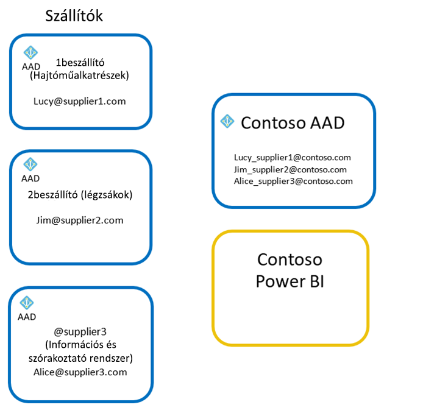

Az alternatív megoldás kiválasztásának okai:

- Mivel a felhasználó identitását a szervezet szabályozza, a kapcsolódó szolgáltatások, például az e-mailek, a SharePoint stb. is a szervezeten belüli felügyelet alá tartoznak. A rendszergazdák alaphelyzetbe állíthatják a jelszavakat, letilthatják a fiókokhoz való hozzáférést vagy a szolgáltatások naplózási tevékenységeit.
- Azok a felhasználók, akik a saját üzleti fiókjaikat használják, gyakran korlátozzák bizonyos szolgáltatások elérését, ezért szervezeti fiókra lehet szükség.
- Egyes szolgáltatások csak a szervezet Felhasználóin működnek. Előfordulhat például, hogy az Intune-nal nem lehet a külső felhasználók személyes/mobil eszközein lévő tartalmat felügyelni az Azure B2B használatával.

Az alternatíva kiválasztásának okai:

- A partnerszervezetek felhasználóinak két hitelesítő adatot kell megemlékezniük – az egyiket a saját szervezettől származó tartalmak elérésére, a másikat pedig a contoso-tartalmak elérésére. Ez a vendég felhasználói gondot okoz, és számos vendég felhasználó nem tévesztendő össze ezt a felhasználói élményt.
- A contoso-nak felhasználónkénti licenceket kell megvásárolnia és hozzárendelnie ezekhez a felhasználókhoz. Ha a felhasználónak e-mailt kell kapnia, vagy Office-alkalmazásokat kell használnia, a megfelelő licencekre van szükségük, beleértve a Power BI Pro a tartalom szerkesztésére és megosztására Power BIban.
- A contoso érdemes lehet szigorúbb engedélyezési és irányítási házirendeket kikényszeríteni a külső felhasználók számára a belső felhasználókhoz képest. Ennek eléréséhez a contoso-nak belső nómenklatúrát kell létrehoznia a külső felhasználók számára, és az összes contoso-felhasználónak ki kell tanítania erről a nómenklatúráról.
- Ha a felhasználó elhagyja a szervezetét, továbbra is hozzáférhetnek a contoso erőforrásaihoz, amíg a contoso rendszergazdája manuálisan nem törli a fiókját
- A contoso rendszergazdáinak kezelniük kell a vendég identitását, beleértve a létrehozást, a jelszó alaphelyzetbe állítását stb.

### 2\. alternatív lehetőség: egyéni Power BI Embedded alkalmazás létrehozása egyéni hitelesítés használatával

A contoso egy másik lehetősége, hogy saját egyéni beágyazott Power BI alkalmazást hozzon létre egyéni hitelesítéssel (["alkalmazás tulajdonosai adatkezeléssel"](https://docs.microsoft.com/power-bi/developer/embed-sample-for-customers)). Habár számos szervezet nem rendelkezik olyan idővel vagy erőforrásokkal, amelyekkel egyéni alkalmazást hozhat létre a külső partnereknek Power BI tartalom terjesztéséhez, néhány szervezet számára ez a legjobb megoldás, és komoly figyelmet érdemel.

A szervezetek gyakran rendelkeznek olyan meglévő partneri portálokkal, amelyek központosítják a partnerek összes szervezeti erőforrásához való hozzáférést, elkülönítik a belső szervezeti erőforrások elkülönítését, és hatékony élményeket biztosítanak a partnerek számára számos partner támogatásához és az egyes felhasználók.

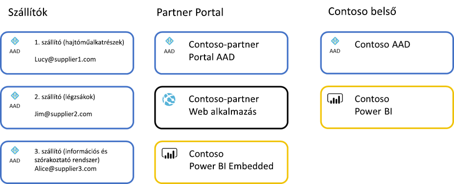

A fenti példában az egyes szállítók felhasználói bejelentkeznek a contoso partner portálra, amely a HRE-t használja identitás-szolgáltatóként. A HRE B2B, az Azure B2C, a natív identitások vagy a összevonása tetszőleges számú más identitás-szolgáltatóval használható. A felhasználónak be kell jelentkeznie, és hozzá kell férnie az Azure Web App vagy hasonló infrastruktúra használatával létrehozott partneri portálhoz.

A webalkalmazáson belül Power BI a jelentések Power BI Embedded telepítésből vannak beágyazva. A webalkalmazás egyszerűbbé teszi a jelentések és a kapcsolódó szolgáltatások elérését egy egységes felhasználói felületen, amelynek célja, hogy megkönnyítse a szállítók számára a contoso használatát. Ez a portál környezete el lesz különítve a contoso belső HRE és a contoso belső Power BI környezetével, így biztosítva, hogy a szállítók nem férhetnek hozzá ezekhez az erőforrásokhoz. Az adatmennyiséget általában külön partneri adattárházban tároljuk, így biztosítva az adatelkülönítést is. Ez az elkülönítés előnyökkel jár, mivel korlátozza, hogy a külső felhasználók hányan férhetnek hozzá a szervezet adataihoz, és korlátozza a külső felhasználók számára elérhetővé tehető adatmegosztást, és korlátozza a külső felhasználókkal való véletlen megosztást.

A Power BI Embedded használatával a portál előnyös licencelést használhat, az alkalmazás jogkivonatát vagy az Azure-modellben vásárolt főfelhasználót és prémium kapacitást, ami leegyszerűsíti a licencek végfelhasználók számára történő hozzárendelésével kapcsolatos problémákat, és a várt használati. A portál átfogó, magasabb színvonalú és konzisztens élményt nyújt, mivel a partnerek egyetlen, az összes partner igényeinek megfelelő, egyetlen portálhoz férnek hozzá. Végül, mivel a Power BI Embedded-alapú megoldások általában több-bérlőnek lettek kialakítva, megkönnyítik a partnerszervezetek elkülönítését.

Az alternatív megoldás kiválasztásának okai:

- Könnyebben kezelhető, mivel a partnerszervezetek száma növekszik. Mivel a partnereket egy másik, a contoso belső HRE könyvtárból elkülönített könyvtárhoz adja hozzá, leegyszerűsíti az irányítási feladatokat, és segít megelőzni a belső adatok véletlen megosztását a külső felhasználók számára.
- A tipikus partneri portálok kiválóan márkás élményt biztosítanak a partnerek közötti konzisztens tapasztalatokkal és a tipikus partnerek igényeivel. A contoso ezért az összes szükséges szolgáltatás egyetlen portálra történő integrálásával jobb általános felhasználói élményt biztosíthat a partnereknek.
- A speciális forgatókönyvek licencelési költségei, például a Power BI Embeddedon belüli tartalom szerkesztése az Azure által megvásárolt Power BI Premium, és nem igényli Power BI Pro licencek hozzárendelését ezekhez a felhasználókhoz.
- Nagyobb elkülönítést biztosít a partnerek között, ha több-bérlős megoldást terveztek.
- A partner portál gyakran tartalmaz más eszközöket a partnereknek Power BI jelentéseken, irányítópultokon és alkalmazásokon kívül.

Az alternatíva kiválasztásának okai:

- Egy ilyen portál létrehozásához, működtetéséhez és karbantartásához jelentős erőfeszítés szükséges ahhoz, hogy az erőforrások és az idő jelentős mennyiségű befektetéssel működjön.
- A megoldáshoz való idő sokkal hosszabb, mint a B2B-megosztás, mivel a körültekintő tervezés és a végrehajtás több workstreams szükséges.
- Ha kisebb számú partnerre van szüksége, az ehhez az alternatívához szükséges erőfeszítés valószínűleg túl nagy ahhoz, hogy igazolni lehessen.
- Az ad-hoc megosztással való együttműködés a szervezete által tapasztalt elsődleges forgatókönyv.
- A jelentések és az irányítópultok minden partner esetében eltérőek. Ez az alternatíva a közvetlen megosztást követően a partnerekkel folytatott felügyeleti terhelést is bevezeti.

## Gyakori kérdések

**A contoso egy automatikusan beváltott meghívót küldhet, így a felhasználó csak "készen áll"? Vagy a felhasználónak mindig a beváltási URL-címre kell kattintania?**

A végfelhasználónak mindig a beleegyező felhasználói élményre kell kattintania ahhoz, hogy hozzáférhessen a tartalomhoz.

Ha sok vendég felhasználót szeretne meghívni, javasoljuk, hogy ezt az alapszintű Azure AD-rendszergazdákkal delegálja úgy, hogy [hozzáad egy felhasználót az erőforrás-szervezet vendég meghívójának szerepköréhez](https://docs.microsoft.com/azure/active-directory/active-directory-b2b-add-guest-to-role). Ez a felhasználó a partner szervezet más felhasználóit is meghívhatja a bejelentkezési felhasználói felület, a PowerShell-parancsfájlok vagy az API-k használatával. Ez csökkenti az adminisztrációs terheket az Azure AD-rendszergazdák számára, hogy meghívja a partner szervezet felhasználói számára a meghívást vagy az újbóli elküldéseket.

**A contoso kényszerítheti a többtényezős hitelesítést a vendég felhasználók számára, ha partnerei nem rendelkeznek többtényezős hitelesítéssel?**

Igen. További információ: [feltételes hozzáférés vállalatközi együttműködéssel rendelkező felhasználók](https://docs.microsoft.com/azure/active-directory/active-directory-b2b-mfa-instructions)számára.

**Hogyan működik a VÁLLALATKÖZI együttműködés, ha a meghívott partner összevonást használ a saját helyszíni hitelesítés hozzáadásához?**

Ha a partner rendelkezik a helyszíni hitelesítési infrastruktúrához összevont Azure AD-Bérlővel, a helyszíni egyszeri bejelentkezés (SSO) automatikusan elérhető. Ha a partner nem rendelkezik Azure AD-Bérlővel, létrehozhat egy Azure AD-fiókot új felhasználók számára.

**Meghívhatom a vendég felhasználókat a fogyasztói e-mail-fiókokkal?**

Power BI támogatja a vendég felhasználói e-mail-fiókokkal való meghívását. Ide tartoznak a tartományok, például a hotmail.com, a outlook.com és a gmail.com. Ezek a felhasználók azonban korlátozásokat tapasztalhatnak a munkahelyi vagy iskolai fiókkal rendelkező felhasználóknál.
