# Power BI Premium kapacitások üzembe helyezése és kezelése

**Összefoglalás:** A Power BI Premium konzisztens teljesítményt nyújt, támogatja a nagyméretű adatmennyiségeket, és egy egységesített önkiszolgáló és nagyvállalati BI-platform rugalmasságát biztosítja a szervezet minden tagja számára. Ezt a 300-es szintű technikai tanulmányt kifejezetten Power BI-rendszergazdák, valamint a tartalmi szerzők és kiadók írták. Ennek célja, hogy segítsen megérteni a Power BI Premium rejlő lehetőségeket, valamint azt, hogy miként lehet megtervezni, üzembe helyezni, figyelni és elhárítani a méretezhető megoldásokat.

**Szerző** [Peter Myers](https://www.linkedin.com/in/peterjsmyers) (Adatplatform MVP és független BI Expert bitenkénti-megoldásokkal)

**Műszaki véleményezők:** Adam Saxton, Akshai Mirchandani, kereskedelmi, David-beli, Josh Caplan, Michael Blythe, Nimród Shalit, Olivier Matrat, SWAT Gupta

**A következőkre vonatkozik:** Power BI szolgáltatás, Power BI Premium és az Azure Power BI Embedded kapacitása

> [!NOTE]
> A tanulmányt a böngésző **Nyomtatás** > **Mentés PDF-ként** lehetőségével mentheti vagy kinyomtathatja.

## A Power BI bemutatása

A Power BI egy üzleti elemzési szolgáltatás, amely gyors és tájékozott döntéseket tevő elemzéseket tesz lehetővé. A 2015-as kiadás óta gyorsan elérhetővé vált egy népszerű szolgáltatás, amely a legkevesebb szervezet számára kínál megoldásokat a legnagyobb vállalatoknak.

Két módon érhető el: Felhőalapú szolgáltatásként és **Power bi jelentéskészítő kiszolgáló**nevű helyszíni jelentéskészítési megoldásként. \[[1](#endnote-01)\]

A Power bi felhőalapú szolgáltatásként (SaaS) \[ [2](#endnote-02)\]. Olyan szolgáltatásokat és alkalmazásokat képvisel, amelyek lehetővé teszik, hogy a szervezetek fejlesszenek, telepítsék, kezeljék és megosszák a vállalatuk monitorozási megoldásait.

Nem a tanulmány célja, hogy átfogó leírást nyújtson a Power BI szolgáltatás. Ehelyett a Power BI Premium tárgyára vonatkozó témakörökre koncentrál. Az Power BIával kapcsolatos általános információkért tekintse meg az átfogó [Power bi dokumentációját](service-admin-premium-multi-geo.md). Ha részletesebb tájékoztatást szeretne arról, hogy Power BI szolgáltatás a nagyvállalati környezetek nagy teljesítményű üzembe helyezésének megvalósítására összpontosítson, tekintse meg a [Power bi vállalati üzembe helyezési](https://aka.ms/pbienterprisedeploy) tanulmány átfogó megtervezése című témakört.

Ebben a tanulmány tárgyában ez a szakasz bemutatja és leírja a kapacitásokat, Power BI a tartalomtípusokat, a modell tárolási módjait és licencelését. A témakörök megismerése elengedhetetlen a Power BI Premium sikeres üzembe helyezéséhez és kezeléséhez.

### Kapacitások

A kapacitások egy alapszintű Power bi koncepció, amely a Power bi-tartalmak üzemeltetéséhez és továbbításához használt erőforrás-készletet (tárhely, processzor és memória) jelenti. A kapacitások megosztottak vagy dedikáltak. A **megosztott kapacitás** megoszlik más Microsoft-ügyfelekkel, míg a **dedikált kapacitás** teljes mértékben elkötelezett egyetlen ügyfél számára. A dedikált kapacitások a [prémium](#premium-capacities) szintű kapacitások témakörben jelennek meg.

A megosztott kapacitásban a munkaterhelések más ügyfelekkel megosztott számítási erőforrásokon futnak. Mivel a kapacitásnak meg kell osztania az erőforrásokat, korlátozásokra van szükség a "Fair Play" biztosításához, mint például a modell maximális mérete (1 GB) és a napi frissítési gyakoriság (naponta nyolc alkalommal).

### Munkaterületek

Power BI munkaterületek a kapacitáson belül találhatók, és biztonsági, együttműködési és üzembe helyezési tárolókat jelentenek. Minden Power BI-felhasználó rendelkezik **Saját munkaterülettel**. Az együttműködéshez és a fejlesztéshez további munkaterületek is létrehozhatók, ezeket **Alkalmazás-munkaterületeknek** nevezzük. Alapértelmezés szerint a munkaterületek – beleértve a személyes munkaterületeket is – a megosztott kapacitásban jönnek létre.

### Power BI tartalomtípusok

Power BI Premium témakörök bevezetéséhez fontos, hogy a Power BI architektúra alapos megvitatására legyen szó, beleértve az alapvető tartalomtípusokat is.

A rendszer minden Power BI tartalmat tárol és kezel a munkaterületeken, amelyek Power BI tartalmak tárolói. Minden Power BI felhasználó saját személyes munkaterülettel rendelkezik, de az általános ajánlott eljárás az alkalmazás-munkaterületek létrehozása. Az alkalmazás-munkaterületek lehetővé teszik a tartalmak közös tulajdonlását, valamint a tartalommal való együttműködés lehetőségét. Emellett lehetővé teszik a tartalom előkészítését és terjesztését a széles közönség számára alkalmazásokként.

A következő Power BI tartalmat tárolja a munkaterületek:

- Adatfolyamok
- Adathalmazok
- Munkafüzetek
- Jelentések
- Irányítópultok

#### Adatfolyamok

Power BI adatfolyamok a különböző forrásokból származó adatok egyesítését segítik. Ezeket a modellekben felkészített és előkészített adatként is figyelembe vehetik, de nem használhatók közvetlenül a jelentéskészítés forrásaként. Kihasználják a Microsoft adatösszekötők széles gyűjteményét, amely lehetővé teszi a helyszíni és a felhőalapú adatforrásokból származó adatok betöltését.

Az adatfolyamok csak alkalmazás-munkaterületeken hozhatók létre és kezelhetők, és a közös adatmodellben (CDM) található entitásként tárolódnak Azure Data Lake Storage Gen2. Általában rendszeres időközönként frissülnek a naprakész adatok tárolására szolgáló ütemezett frissítések.

További információkért tekintse meg az [önkiszolgáló adatok előkészítését Power bi (előzetes verzió)](service-dataflows-overview.md) dokumentumban.

#### Adathalmazok

Power BI adatkészletek adatforrást jelentenek a jelentéskészítéshez és a vizualizációhoz. Számos típusú adatkészletet hoztak létre:

- Csatlakozás egy meglévő adatmodellhez, amely nem Power BIi kapacitásban van tárolva
- Modellt tartalmazó Power BI Desktop-fájl feltöltése
- Excel-munkafüzet (egy vagy több Excel-táblázatot és/vagy munkafüzet-adatmodellt tartalmazó) feltöltése, vagy vesszővel tagolt (CSV) fájl feltöltése
- A Power BI szolgáltatás használata leküldéses, streaming vagy hibrid adatfolyam-adatkészletek létrehozásához

A \[ 3.\]adatfolyam-adatkészletek kivételével az adatkészlet olyan adatmodellt képvisel, amely a Analysis Services érett modellezési technológiáit használja.

Vegye figyelembe, hogy a dokumentációban előfordul, hogy a terminológiai adatkészletek és modellek felcserélhetők. Általában egy Power BI szolgáltatás nézőpontból egy adatkészletnek nevezzük, és  egy fejlesztési perspektívából **modellnek**nevezzük. Ennek a tanulmánynak a kontextusában ugyanezt a dolgot értjük.

##### Külsőleg üzemeltetett modellek

A külsőleg üzemeltetett modellhez való csatlakozás magában foglalja a  helyszíni adatátjáró telepítését SQL Server Analysis Serviceshoz való csatlakozáshoz, függetlenül attól, hogy a helyszíni vagy a virtuális gép által üzemeltetett infrastruktúra-szolgáltatás (IaaS). Azure Analysis Services nem igényel átjárót. Ez a forgatókönyv gyakran logikus, ha meglévő modell-beruházások léteznek, jellemzően a vállalati adattárház (EDW) részét képezik. Lehetővé teszi, hogy a Power BI **élő kapcsolatokat** (LC) végezzenek Analysis Services, és ezt az adatengedélyek érvényesítésével hajtsa végre az Power bi jelentés felhasználójának identitásával. SQL Server Analysis Services esetében a többdimenziós modellek (kockák) és a táblázatos modellek is támogatottak. Ahogy az az alábbi ábrán is látható, egy élő kapcsolódási adatkészlet lekérdezéseket továbbít a külsőleg üzemeltetett modellekhez.

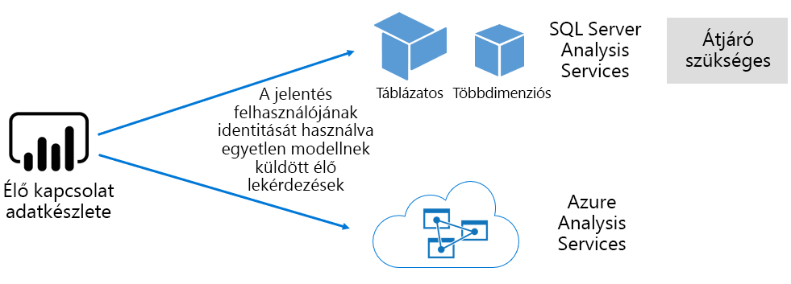

##### Power BI Desktop által fejlesztett modellek

Power BI Desktop – Power BI fejlesztésre szánt ügyfélalkalmazás olyan modell fejlesztésére használható, amely gyakorlatilag egy Analysis Services táblázatos modell. A modellek a adatfolyamok-ből származó adatok importálásával fejleszthetők, amely aztán más adatforrásokkal is integrálható. Habár a modellezési lehetőségek megvalósításának sajátosságai kívül esnek a tanulmány hatókörén, fontos tisztában lennie azzal, hogy három különböző típust vagy módot kell kifejleszteni a Power BI Desktop használatával. Ezek a módok határozzák meg, hogy az adatimportálás a modellbe történik-e, vagy az adatforrásban marad-e. A három mód a következők: Importálás, DirectQuery és összetett. Az egyes üzemmódok teljes körű megvitatását a [modell tárolási módjai](#model-storage-modes) című témakör ismerteti.

A Power BI Desktopban fejlesztett külsőleg üzemeltetett modellek és modellek kikényszerítik a soros szintű biztonságot (RLS), hogy korlátozzák az egyes felhasználók számára lekérhető adatforrásokat. Az értékesítők biztonsági csoporthoz rendelt felhasználók például csak azokat az értékesítési régió (k) jelentéseit tekinthetik meg, amelyekhez hozzá vannak rendelve. Az RLS-szerepkörök lehetnek dinamikusak vagy statikusak. A **dinamikus szerepkörök** szűrése a jelentés felhasználója szerint, míg a **statikus szerepkörök** ugyanazt a szűrőt alkalmazzák a szerepkörhöz rendelt összes felhasználónál.

##### Excel-munkafüzet modelljei

Az Excel-munkafüzetek vagy CSV-fájlok alapján létrehozott adatkészletek létrehozása a modell automatikus létrehozását eredményezi. Az Excel-táblázatok és CSV-adatmodellek importálása a modell-táblázatok létrehozásához történik, míg az Excel-munkafüzetek adatmodelljének áttelepítését Power BI modell létrehozásához. A rendszer minden esetben importálja a fájlokat a modellbe.

Ezeket a különbségeket a modelleket jelölő Power BI adatkészletek esetében lehet elvégezni:

- Azokat a Power BI szolgáltatás üzemelteti, vagy a szolgáltatás kívülről Analysis Services
- Tárolhatják az importált adatokat, vagy kiadhatnak átadó lekérdezési kérelmeket az alapul szolgáló adatforrásokhoz, vagy a kettő kombinációját

Az alábbiakban a modelleket reprezentáló Power BI adatkészletekkel kapcsolatos fontos tudnivalók összegzése látható:

- SQL Server Analysis Services üzemeltetett modellekhez az LC-lekérdezések elvégzéséhez átjáró szükséges
- Az adatimportálást Power BI üzemeltetett modellek
  - Teljes mértékben be kell tölteni a memóriába, hogy le lehessen kérdezni
  - A frissítés megkövetelése az adatkezeléshez, és az átjárókat is be kell vonni, ha az adatforrás nem érhető el közvetlenül az interneten keresztül
- A DirectQuery-(DQ-) tárolási módot használó, Power BI által üzemeltetett modelleknek kapcsolódniuk kell a forrásadatok eléréséhez. A modell lekérése után Power BI a lekérdezéseket a forrásadatok számára a jelenlegi adatforrások lekéréséhez. Ebben a módban átjáróknak kell szerepelniük, ha a forrásadatok nem érhetők el közvetlenül az interneten keresztül.
- A modellek kikényszerítik az RLS-szabályokat, a szűrők betartatásával bizonyos felhasználók számára az adathozzáférés korlátozását

Power BI Premium sikeres üzembe helyezéséhez és kezeléséhez fontos megérteni, hogy a modellek hol vannak tárolva, a tárolási mód, az átjárókkal kapcsolatos függőségek, az importált adatmennyiség és a frissítés típusa és gyakorisága. Ezek mind jelentős hatással lehetnek a Power BI Premium erőforrásokra. Emellett a modell maga is megtervezhető, beleértve az adatok előkészítésével kapcsolatos lekérdezéseket és számításokat is.

Fontos tisztában lenni azzal is, hogy Power BI által üzemeltetett importálási modellek a Power BI szolgáltatás egy felhasználója szerint frissíthetik vagy igény szerint indíthatják azt.

Az optimalizált modellek megtervezése a [modellek optimalizálása](#optimizing-models) című témakör későbbi részében található.

#### Munkafüzetek

Power bi a munkafüzetek egy Power bi Content Type \[ [4](#endnote-04)\]. Ezek az Excel-munkafüzetek, amelyeket feltöltöttek a Power BI szolgáltatásba, és nem tévesztendő össze az adatkészleteket (modelleket) létrehozó feltöltött Excel-munkafüzetekkel. A munkafüzet tartalmának típusa a munkafüzethez való kapcsolódás, amely a Power BI szolgáltatás tölthető fel, vagy a OneDrive vagy a SharePoint Online Felhőbeli tárolójában maradhat.

Fontos tisztában lenni azzal, hogy ez a tartalomtípus nem érhető el adatforrásként Power BI adatvizualizációk számára. Ehelyett az Excel online használatával munkafüzetként is megnyitható a Power BI szolgáltatásban. Ennek a tartalomtípusnak a fő célja, hogy lehetővé tegye a régi Excel-munkafüzet jelentéseinek elérhetővé tételét a Power BI szolgáltatáson belülről, és lehetővé teszi az adatvizualizációk rögzítését Power BI irányítópultokon.

További információkért tekintse meg az [adatok lekérése Excel-munkafüzetből](service-excel-workbook-files.md) című dokumentumot.

#### Jelentések

Két típusú jelentés létezik: Power BI jelentések és többoldalas jelentések.

**Power bi a jelentések** interaktív adatvizualizációs funkciókat biztosítanak, amelyek csak egyetlen adatkészlethez csatlakoznak. A jelentések gyakran úgy vannak kialakítva, hogy ösztönözzék a felhasználók részvételét, így lehetővé teszik a funkciók rendkívüli körének használatát, beleértve a szűrést, a szeletelést, a szűrést és a kiemelést, a fúrást, a lefúrást, a Q & A természetes nyelvi kérdések, fókuszálás, oldal navigáció, reflektorfény, könyvjelzők megtekintése és sok más.

A tanulmány kontextusában fontos tisztában lenni azzal, hogy a Power BI architektúra, Power BI a jelentések tervezése és a felhasználói interakciók milyen hatással lehetnek a Power BI szolgáltatás erőforrásokra:

- Az importálási modellek alapján történő betöltéshez és az azokkal való interakcióhoz a modellt teljes mértékben be kell tölteni a memóriába (függetlenül attól, hogy az Power BI szolgáltatás vagy külsőleg van-e tárolva)
- Minden jelentés vizualizáció a modell lekérdezésével lekérdezi az Adatlekérdezési lekérdezést.
- Általában a Filter és a szeletelő interakciója magában foglalja a modell lekérdezését. Például a szeletelők kijelölésének módosítása – alapértelmezés szerint – az egyes vizualizációk újbóli betöltését igénylik \[az [5](#endnote-05) . oldalon\]
- Power BI a jelentések nem garantálják az aktuális adatmegjelenítést, és szükség lehet arra, hogy a felhasználó frissítse a jelentést a jelentés oldalának és a vizualizációinak újratöltéséhez
- A felhasználók felhasználhatják a Q & természetes nyelvi funkcióját, hogy kérdéseket tegyenek fel, amelyek lehetővé teszik a Power BI jelentés kialakítását, és az adatkészlet egy Power BI által üzemeltetett adatimportálási modellt vagy egy LC-adathalmazt jelöl, amely lehetővé teszi a Q & A

A többoldalas **jelentések** lehetővé teszik SQL Server Reporting Services (SSRS) jelentések (\*. rdl formátum) közzétételét és megjelenítését. Ahogy a nevük is sugallja, a többoldalas jelentéseket általában akkor kell használni, ha a követelmények megkövetelik, hogy egy rögzített papírméretre kell nyomtatni, vagy ha vannak olyan változók, amelyeknek teljesen ki kell bontania az adathalmazokat. Például többoldalas megjelenítésre tervezett számla (vizualizáción belüli görgetés helyett) és nyomtatás.

A két támogatott Jelentéstípusok a jelentések szerzői számára választhatók, így a követelmények és a kívánt felhasználás alapján választhatják ki a típust. A Power BI jelentések általában olyan interaktív élmények, amelyek lehetővé teszik a felhasználó számára az adatok feltárását és elemzését, míg a többoldalas jelentések a paraméterek által vezérelt lapelrendezések számára alkalmasabbak.

A jelentés típusától függetlenül, a rugalmas jelentések betöltésének és az adatfrissítéseknek (a szűrők vagy paraméterek változásakor) elengedhetetlen a megbízható és jól teljesítő felhasználói élmény megvalósítása.

#### Irányítópultok

Power BI irányítópultok célja a figyelési tapasztalatok továbbítása, és fogalmilag nagyon különböznek a Power BI jelentésekből. Az irányítópultok úgy vannak kialakítva, hogy egyetlen ablaktáblán jelenjenek meg az értékek és az adatvizualizációk csempén való megjelenítéséhez. Az irányítópultok általában kevesebb interakciós tapasztalatot kínálnak, mint Power BI jelentésekhez, és egyes irányítópult-kialakítások nem várnak interakciót. Például egy felügyelet nélküli irányítópultot, amely egy nem érintőképernyős képernyőn jelenik meg egy kiszolgáló helyiségben. Egy másik jelentős különbség az, hogy az irányítópultok olyan csempéket is tartalmazhatnak, amelyek több adatkészletből származó adatokat is tartalmaznak, míg egy Power BI jelentés csak egyetlen adatkészleten alapulhat.

Fontos tisztában lenni azzal, hogy egy irányítópultot úgy terveztek, hogy a lehető leggyorsabban betöltsön és a legfrissebb (a Power BI szolgáltatásnak nevezett) adatértékek kifejezzék. Ezt a gyorsítótárazási csempe lekérdezési eredményeivel érheti el, és minden egyes irányítópultnál ezt teszi. Valójában ezt minden olyan felhasználónak el kell végeznie, akinek van hozzáférése a dinamikus RLS-t kényszerítő modelleken alapuló irányítópulthoz.

A Power BI szolgáltatás automatikusan frissíti az irányítópult-lekérdezés gyorsítótárait a Power BI által üzemeltetett importálási modellek frissítését követően. Az LC és a DQ modellek esetében az adatkészlet tulajdonosa egy bizonyos fokú ellenőrzés alatt áll, hogy a Power BI szolgáltatás milyen gyakran frissíti a gyorsítótárat, amely 15 percenként, vagy ritkán, akár hetente egyszer is konfigurálható. Vegye figyelembe, hogy az LC-lekérdezés gyorsítótár-frissítései először a modell metaadatainak lekérdezésével határozzák meg, hogy a modell frissítése a legutóbbi gyorsítótár-frissítés óta megtörtént-e, és nem folytatja a gyorsítótár frissítését, ha a frissítés azóta nem történt meg. Ez az ellenőrzési mód nem lehetséges a DQ modellek esetében, ezért a gyorsítótár frissítései a forrásadatok megváltozása után történnek.

A DQ és LC modellek alapján az irányítópult-lekérdezési gyorsítótár frissítései jelentősen befolyásolhatják mind a Power BI szolgáltatás erőforrásait, mind a külső adatforrásokat. Vegyünk egy 20 csempét tartalmazó irányítópultot, amely egy Azure Analysis Services modellen alapul, amely kikényszeríti a dinamikus RLS-t, és minden órában frissül, és hogy ez az irányítópult 100 felhasználókkal van megosztva. Ha az adatkészlet óránkénti frissítésre van konfigurálva, ez legalább 2000 (20 x 100) LC-lekérdezést eredményezhet. Ez óriási terhelést jelenthet a Power BI szolgáltatás és a külső adatforrások számára, és a rendelkezésre álló erőforrásokra vonatkozó korlátokat is meghaladhatja. A kapacitási erőforrások és a korlátok a [Kapacitási csomópontok](#capacity-nodes) témakörben olvashatók.

A felhasználók különböző módokon kezelhetik az irányítópultokat, amelyek Power BI szolgáltatás erőforrásokat igényelnek. Pontosabban a következőket tehetik meg:

- Az irányítópultok csempéi frissítésének indítása, amely az összes kapcsolódó Power BI üzemeltetett adatimportálási modell igény szerinti frissítését eredményezheti
- A Q & természetes nyelvi funkciójának használata a kérdések megtételéhez (az irányítópult kialakításának biztosítása lehetővé teszi, hogy az adatkészlet egy Power BI által üzemeltetett adatimportálási modell vagy egy LC-adatkészlet, amely lehetővé teszi a Q & A-t)
- A gyors elemzések funkció használatával Power BIheti az alapul szolgáló adatkészletből származó elemzéseket, és válaszolhat azokra a vizualizációkkal, amelyek megjelenítik és leírják őket (ami azt mutatja, hogy a csempe egy Power BI által üzemeltetett adatimportálási modellt használó adatkészleten alapul)
- Konfigurálja a riasztásokat az irányítópult-csempén, amely megköveteli, hogy a Power BI szolgáltatás összehasonlítsa a küszöbértékeket a csempék értékeinek – valószínűleg az óránkénti gyakorisággal –, és a felhasználók értesítése, ha túllépi a küszöbértékeket (feltéve, hogy a csempe egyetlen numerikus értéket jelenít meg, és Power BI által üzemeltetett adatimportálási modell adatkészlete)

### Modell tárolási módjai

Ne felejtse el, hogy Power BI Desktop lehetővé teszi a modell fejlesztését a három mód egyikében. Fontos tisztában lenni az egyes adatmodellek tárolási módjának indoklásával és a Power BI szolgáltatás erőforrásokkal kapcsolatos lehetséges hatásokkal. Ez a szakasz mindhárom módot ismerteti. Ezeket a tanulmányokban a modellek optimalizálása témakör későbbi részében részletesebben ismertetjük.

#### Importálási mód

Az importálási mód a modellek fejlesztéséhez használt leggyakoribb mód a memóriában történő lekérdezéshez kapcsolódó rendkívül gyors teljesítmény, a modellezések számára elérhető tervezési rugalmasság, valamint az adott Power BI szolgáltatás képességek (Q & A, gyors elemzések stb.). Új Power BI Desktop-megoldás létrehozásakor ez az alapértelmezett mód.

Fontos tisztában lenni azzal, hogy az importált adatmennyiség mindig lemezre van tárolva, és a memóriába való teljes betöltésének lekérdezése vagy frissítése szükséges. A memóriában az importálási modellek villámgyors gyors lekérdezési eredményeket érnek el. Azt is fontos megjegyezni, hogy az importálási modellnek nincs olyan fogalma, amely részben betöltődik a memóriába.

A frissítéskor az adatok tömörítése és optimalizálása, majd lemezre történő tárolása a VertiPaq-tároló motorja által történik. A lemezről a memóriába való betöltéskor megtekinthető a 10x-es tömörítés, ezért ésszerű, hogy a 10 GB-nyi adatforrás körülbelül 1 GB méretűre tömöríthető legyen. A lemezen lévő tárterület mérete 20%-os csökkentést érhet el. \[[6](#endnote-06)\]

A tervezési rugalmasság három módon érhető el. Az adatmodellező a következőket teheti:

- Adatok integrálása több adatforrásból származó adatok gyorsítótárazásával – az adatforrás típusától és formátumtól függetlenül
- Az adatelőkészítési lekérdezések létrehozásakor használja a Power Query Formula nyelvének teljes készletét (nem hivatalosan M) függvényt.
- A teljes adatelemzési kifejezések (DAX) funkcióinak kihasználása a modell üzleti logikával való fejlesztésekor, számított oszlopokkal, számított táblázatokkal és mértékekkel megvalósítva

Ahogy az az alábbi ábrán is látható, az importálási modell tetszőleges számú támogatott adatforrás-típusból képes integrálni az adatok mennyiségét.

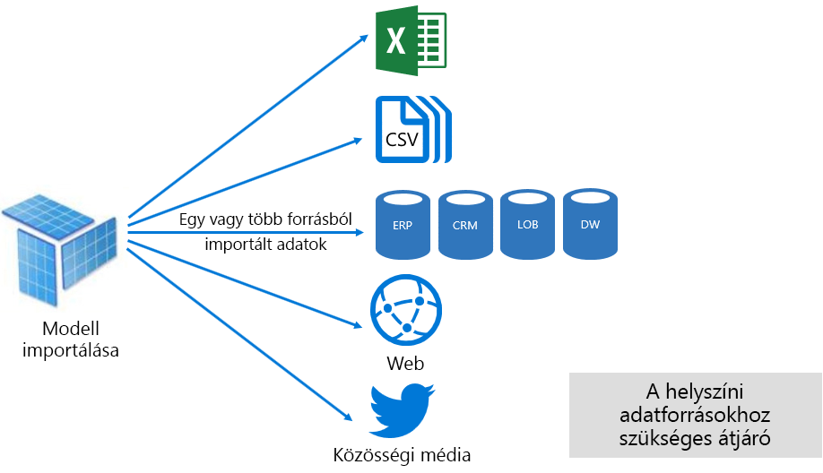

Ugyanakkor az importálási modellekhez kapcsolódó kényszerített előnyök is fennállnak:

- Ahhoz, hogy Power BI le tudja kérdezni a modellt, a teljes modellt be kell tölteni a memóriába, ami nyomást gyakorolhat a rendelkezésre álló erőforrásokra a modellek számának és méretének növekedésével
- A modell adatai csak a legújabb frissítésnek megfelelőek, így az importálási modelleket lehetőleg ütemezett alapon kell frissíteni.
- A teljes frissítés eltávolítja az összes tábla összes adatát, és újratölti azt az adatforrásból. Ez nagyon költséges lehet a Power BI szolgáltatás és az adatforrás (ok) hoz tartozó idő és erőforrások tekintetében. Power BI támogatja a növekményes frissítést, amely elkerülheti a teljes táblák csonkítása és újratöltését, és ez a [Power bi által üzemeltetett modellek optimalizálása](#optimizing-power-bi-hosted-models) témakörben látható.

Power BI szolgáltatás erőforrás szempontjából az importálási modellek a következőket igénylik:

- Elegendő memória a modell betöltéséhez a lekérdezés vagy a frissítés során
- Erőforrások és további memória-erőforrások feldolgozása az adatfrissítéshez

#### DirectQuery mód

Az DirectQuery (DQ) módban fejlesztett modellek nem importálnak adattípust. Ehelyett csak olyan metaadatokat tartalmaznak, amelyekkel a lekérdezés az alapul szolgáló adatforrásra vonatkozó natív lekérdezésekkel kapcsolatos problémákat okoz.

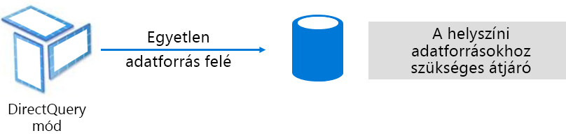

A DQ-modellek fejlesztésének két fő oka van. Az első ok az, ha az adatmennyiség túl nagy – még akkor is, ha az adatcsökkentési módszereket alkalmazták – a modellbe vagy a gyakorlatilag frissítésbe való betöltésre. A második ok az, amikor a jelentéseknek és az irányítópultoknak "közel valós idejű" adatra van szükségük, ami azt jelenti, hogy az ütemezett frissítési korlátokon belül is megvalósítható (napi 48 alkalommal egy dedikált kapacitás esetén).

A DQ-modellekkel kapcsolatos előnyök többek között a következők:

- Az importálási modell méretének korlátai nem érvényesek.
- A modellekhez nem szükséges frissítés
- A jelentés felhasználói láthatják a legfrissebb adataikat a jelentések szűrőinek és szeletelők használatakor, és frissíthetik a teljes jelentést az aktuális információk lekéréséhez.
- Az irányítópult-csempék a DQ modellek alapján automatikusan frissülnek a 15 percenkénti gyakorisággal

A DQ-modellekkel kapcsolatban azonban számos hátránya és korlátozás vonatkozik:

- A modellnek egyetlen támogatott adatforráson kell alapulnia, ezért minden adatintegrációnak már el kell jutnia az adatforrásban. A támogatott adatforrások a kapcsolatok és az analitikus rendszerek, és számos népszerű adattár \[\]támogatásával rendelkeznek. 
- A teljesítmény lassú, potenciálisan negatív hatással lehet a Power BI szolgáltatásra (a lekérdezések nagyon nagy CPU-igényesek lehetnek) és az adatforráson (amely nem optimalizálható analitikus lekérdezésekhez)
- Power Query lekérdezések nem lehetnek túlságosan összetettek, és legfeljebb M kifejezésre és függvényre alkalmazhatók, amelyek áttelepíthetők az adatforrás által értelmezhető natív lekérdezésekre.
- A DAX-függvények azokra korlátozódnak, amelyek áttelepíthetők az adatforrás által értelmezett natív lekérdezésekre, és nem támogatottak a számított táblák vagy a beépített időintelligencia-képességek.
- Alapértelmezés szerint a több mint 1 000 000 sor lekérését igénylő lekérdezési lekérdezések sikertelenek lesznek
- A több vizualizációt tartalmazó jelentések és irányítópultok inkonzisztens eredményeket jelenítenek meg, különösen akkor, ha az adatforrás változékony
- A Q & A és A gyors elemzések nem támogatott

Egy Power BI szolgáltatás erőforrás perspektívából a DQ modellek a következőket igénylik:

- Minimális memória a modell betöltéséhez (csak metaadatok) a lekérdezéskor
- Időnként jelentős processzor-erőforrások az adatforrásba küldött lekérdezések létrehozásához és feldolgozásához

További információkért tekintse meg a [közvetlen lekérdezés használata Power bi Desktop](desktop-use-directquery.md) dokumentumban.

#### Összetett mód

Az összetett módban fejlesztett modellek lehetővé teszik a tárolási mód konfigurálását az egyes modellek tábláihoz. Ezért az importálási és DQ táblák együttes használatát is támogatja. Emellett támogatja a számított táblákat (a DAX-ben definiált) és több DQ-adatforrást is.

A Table Storage mód importálás, DirectQuery vagy Dual lehet. A kettős tárolási üzemmódként konfigurált tábla mind az importálási, mind a DirectQuery, ami lehetővé teszi a Power BI szolgáltatás számára, hogy a lekérdezésen alapuló leghatékonyabb módot határozza meg lekérdezési alapon.

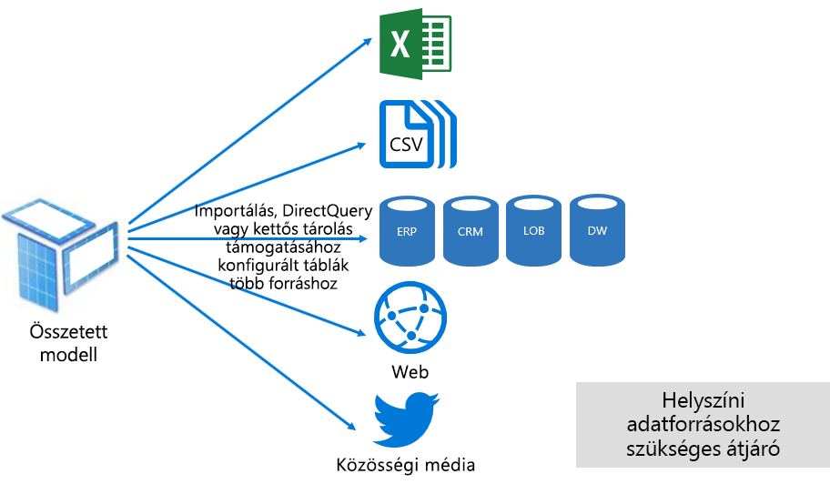

Az összetett modellek a legjobb importálási és DirectQuery módokat igyekeznek megvalósítani. Ha megfelelően van konfigurálva, a memóriában lévő modellek nagy lekérdezési teljesítményét kombinálhatja a közel valós idejű adatok adatforrásokból való lekérésének lehetőségével.

Az összetett modelleket fejlesztő adatmodellező adatmodellek valószínűleg a dimenzió típusú táblákat importálják importálási vagy kettős tárolási módban, valamint a tény típusú táblákat DirectQuery módban. Tegyük fel például, hogy egy modell egy termék dimenzió típusú táblával kettős módban, valamint egy értékesítési egyedkapcsolat típusú tábla DirectQuery módban. A Product tábla hatékonyan és gyorsan lekérdezhető a memóriából a jelentés szeletelő megjelenítéséhez. A Sales táblát ezután DirectQuery módban lehet lekérdezni a kapcsolódó termék táblához. Az utóbbi lekérdezés lehetővé teszi egyetlen hatékony natív lekérdezés létrehozását a termék-és értékesítési táblákhoz való csatlakozáshoz és a szeletelő értékei szerinti szűréshez.

Általánosságban elmondható, hogy az egyes modellek üzemmódokhoz kapcsolódó előnyök és hátrányok az összetett modellekben a Table Storage üzemmódra vonatkoznak.

További információkért tekintse meg az [összetett modellek használata Power bi Desktop](desktop-composite-models.md) dokumentumban.

### Licencelés

Power BI három licenccel rendelkezik:

- Power BI Free
- Power BI Pro
- Power BI Premium

A **Power bi ingyenes** licenc lehetővé teszi, hogy az egyén bejelentkezzen a Power bi szolgáltatásba, és a saját munkaterületén belül működjön együtt a modellek és jelentések közzétételével. Fontos megérteni, hogy a licenc használatával nem lehet megosztani Power BI tartalmakat. Ez a licenc, ahogy a neve is mutatja, ingyenes.

A **Power bi Pro** licenc lehetővé teszi, hogy az egyén az alkalmazás-munkaterületeken belül hozzon létre és működjön együtt, és Power bi tartalmat osszon meg és terjesszen. Az adatkészletek frissítését is megadhatják, hogy automatikusan tartsák naprakészen az adatokat, beleértve a helyszíni adatforrásokat is. Emellett az adatok hozzáférésének és használatának módját is naplózhatja és szabályozhatja. Erre a licencre azért van szükség, hogy megosztott tartalmat kapjon másoktól, kivéve, ha a felhasználó egy Power BI Premium dedikált kapacitáshoz van társítva.

A **Power bi Premium** licenc a bérlői szintű licenc, és a bevezetési [Power bi Premium](#introducing-power-bi-premium) szakaszban is tárgyaljuk.

A Power BI licenceléssel kapcsolatos további információkért tekintse meg a [Power bi díjszabását](https://powerbi.microsoft.com/pricing/) ismertető oldalt.

## Power BI Premium bemutatása

A Power BI Premium egységes önkiszolgáló és nagyvállalati BI platformot kínál, amely méretezhető, megbízható teljesítményt és kiszámítható költségeket biztosít. Ezt elsősorban úgy éri el, hogy dedikált erőforrásokat biztosít a szervezet Power BI szolgáltatásának futtatásához.

Emellett a Power BI Premium számos vállalati funkciót nyújt:

- Költséghatékony tartalom terjesztése, amely lehetővé teszi Power BI tartalom megosztását korlátlan Power BI ingyenes felhasználók számára, beleértve a külső felhasználókat is
- Nagyobb adatkészletek méretének \[támogatása [8](#endnote-08)\]
- A adatfolyamok és az adatkészletek magasabb frissítési sebessége (akár 48-szor naponta)
- Adatfolyamok és adatkészletek növekményes frissítése
- Adatfolyam csatolt entitások és átalakítások párhuzamos végrehajtása
- Oldalakra osztott jelentések
- Power BI jelentéskészítő kiszolgáló helyszíni jelentéskészítéshez
- Tartalom beágyazása az alkalmazásokban az alkalmazás felhasználói (Péter) nevében

Ezen funkciók közül sok kihasználható a hatékony és méretezhető nagyvállalati megoldások megvalósítása érdekében, és a [prémium szintű kapacitások optimalizálása](#optimizing-premium-capacities) című szakaszban olvashat.

### Előfizetések és licencelés

A Power BI Premium bérlői szintű Office 365-előfizetés, amely két SKU- (termékváltozat-) családban érhető el:

- **Em** SKU (EM1-EM3) a beágyazáshoz, amely az éves kötelezettségvállalás megkövetelése után havi díjat számol fel
- **P** SKU (P1-P3) a beágyazáshoz és a nagyvállalati funkciókhoz, a havi vagy az éves kötelezettségvállalás megkövetelése után, valamint a Power bi jelentéskészítő kiszolgáló helyszíni telepítéséhez szükséges licencet tartalmaz.

Alternatív módszer egy olyan Azure Power BI Embedded-Előfizetés vásárlása, amely egyetlen SKU-családdal rendelkezik: **Olyan** SKU (a1-A6), amely csak beágyazási és kapacitás-tesztelési célokat szolgál.

Az összes SKU-nak a v-magokat kell létrehoznia \[ [a kapacitások](#endnote-09)\]létrehozásához, de az em SKU-ket kisebb méretű beágyazásra korlátozzák. A tanulmány fókusza pedig a P SKU-ról szól, és a tárgyalt elemek nagy része szintén a SKU-ra vonatkozik.

A Premium-előfizetések termékváltozataival szemben az Azure-termékváltozatok nem igényelnek időbeli kötelezettségvállalást, és óránként vannak számlázva. Biztosítják a fel- és leméretezés, szüneteltetés, folytatás és törlés teljes rugalmasságát.

Az Azure Power BI Embedded nagyrészt a tanulmány hatókörén kívül esik, de a tesztelési módszerekkel foglalkozó témakörben tárgyaljuk a munkaterhelések teszteléséhez és méréséhez szükséges gyakorlati és gazdasági lehetőséget.

Az Azure SKU-ról további információt az [azure Power bi Embedded dokumentációjában](/azure/power-bi-embedded/)találhat.

Power BI Premium-előfizetéseket rendszergazdák szerezhetnek be a Microsoft 365 Felügyeleti központban. Konkrétan csak az Office 365 globális rendszergazdák vagy számlázási rendszergazdák vásárolhatnak SKU-t.

A vásárlást követően a bérlő megfelelő számú v-magot kap a kapacitásokhoz való hozzárendeléshez – ez az úgynevezett **v-Core készletezés**. Egy P3 termékváltozat megvásárlása például 32 virtuális magot biztosít a bérlőnek.

További információkért tekintse meg a [Power bi Premium-](service-admin-premium-purchase.md) dokumentum megvásárlását ismertető dokumentumot.

### Prémium szintű kapacitások

Ezzel szemben egy megosztott kapacitással, amelyben a számítási feladatok más ügyfelekkel megosztott számítási erőforrásokon futnak, a szervezet kizárólagos használatára **dedikált kapacitást** biztosít. Elkülönített számítási erőforrásokkal rendelkezik, amelyek megbízható és konzisztens teljesítményt biztosítanak a szolgáltatott tartalmak számára.

A tanulmány célja a prémium szintű **kapacitás** , ami azt jelenti, hogy az em vagy a P SKU-hoz van társítva.

#### Kapacitás-csomópontok

Az előfizetések és a licencelés témakörben leírtak szerint két Power BI Premium SKU-család létezik: EM és P. Az összes Power BI Premium SKU kapacitási csomópontként érhető el, és mindegyik a processzor, a memória és a tárterület által meghatározott mennyiségű erőforrást jelöl. Az erőforrásokon kívül minden SKU működési korláttal rendelkezik a másodpercenkénti DirectQuery (DQ) és az élő kapcsolat (LC) kapcsolatok számával és a párhuzamos modellek frissítéseivel.

A feldolgozást a háttér- és az előtérrendszer között egyenlően elosztott, adott számú virtuális mag valósítja meg.

A **háttérrendszeri virtuális magok** a Power BI alapfunkcióit, például a lekérdezések feldolgozását, a gyorsítótár kezelését, R-szolgáltatások futtatását, modellfrissítést, természetes nyelvi feldolgozást (Q&A) valamint a jelentések és képek megjelenítését végzik el. A háttérbeli v-magok olyan rögzített mennyiségű memóriát kapnak, amelyet elsődlegesen az aktív adatkészleteknek is nevezett modellek üzemeltetéséhez használnak.

A **frontend v-magok** felelősek a webszolgáltatás, az irányítópult és a jelentési dokumentumok kezelése, a hozzáférési jogosultságok kezelése, az ütemezés, az API-k, a feltöltések és a letöltések, valamint általában a felhasználói élményhez kapcsolódóan.

A tárterület 100 TB/kapacitás csomópontra van beállítva.

Az alábbi táblázat ismerteti az egyes prémium SKU-k erőforrásait és korlátait (és az azzal egyenértékű méretű SKU-t).

| Kapacitás-csomópontok | Összes virtuális mag | Háttérrendszeri virtuális magok | Memória (GB) | Előtérrendszeri virtuális magok | DQ/LC (/s) | Párhuzamosan végrehajtható modellfrissítések |
| --- | --- | --- | --- | --- | --- | --- |
| EM1/A1 | 1 | 0,5 | 2.5 | 0,5 | 3,75 | 1 |
| EM2/A2 | 2 | 1 | 5 | 1 | 7,5 | 2 |
| EM3/A3 | 4 | 2 | 10 | 2 | 15 | 3 |
| P1/A4 | 8 | 4 | 25 | 4 | 30 | 6 |
| P2/A5 | 16 | 8 | 50 | 8 | 60 | 12 |
| P3/A6 | 32 | 16 | 100 | 16 | 120 | 24 |
| | | | | | | |

#### Kapacitásbeli számítási feladatok

A kapacitás-munkaterületek a felhasználók számára elérhetővé tett szolgáltatások. Alapértelmezés szerint a prémium és az Azure-kapacitások csak a futó Power BI lekérdezésekhez társított adathalmaz-munkaterhelést támogatják, amely nem tiltható le.

A többoldalas jelentések, a adatfolyamok és az AI esetében további számítási feladatok is engedélyezhetők. Minden további munkaterheléshez a munkaterhelés által használható maximális memória (a teljes rendelkezésre álló memória százalékában) konfigurálására van szükség.

#### A kapacitások funkció

A Power BI szolgáltatás mindig a kapacitás-erőforrások legjobb kihasználására törekszik, miközben a kapacitásra vonatkozó korlátokat nem lépi túl.

A kapacitási műveletek interaktív vagy háttérként vannak osztályozva. Az interaktív műveletekhez tartoznak a képmegjelenítési kérések és a felhasználói beavatkozásra való reagálás (szűrés, Q&A-lekérdezés stb.). Általánosságban elmondható, hogy a modell-lekérdezések importálása a memória erőforrás-igényes, míg az LC/DQ-modellek lekérdezése CPU-igényes. A háttérbeli műveletekhez tartoznak az adatfolyamok és az importált modellek frissítései, valamint az irányítópult-lekérdezések gyorsítótárazása.

Fontos tisztában lenni azzal, hogy az interaktív műveletek mindig a háttérbeli műveletekhez vannak rangsorolva, így biztosítva a lehető legjobb felhasználói élményt. Ha nem áll rendelkezésre elégséges erőforrás, akkor a háttérbeli műveletek egy várakozási sorhoz lesznek adva, és csak erőforrások felszabadulása esetén lesznek feldolgozva. A háttérben futó műveleteket, például az adatkészletek frissítéseit és az AI-függvényeket a Power BI szolgáltatás folyamata leállíthatja, és hozzáadhatja egy várólistához.

Az importálási modelleket teljes egészében be kell tölteni a memóriába, hogy le lehessen kérdezni vagy frissíteni lehessen őket. A Power BI szolgáltatás kifinomult algoritmusok használatával kezeli a memóriát, így biztosítva a rendelkezésre álló memória maximális kihasználtságát, és a kapacitás túllépését is elérheti: Habár lehetőség van arra, hogy a kapacitás több importálási modellt is tároljon (akár 100 TB-os prémium szintű kapacitással), ha a kombinált lemezes tárterület meghaladja a támogatott memóriát (és további memóriát igényel a lekérdezéshez és a frissítéshez), akkor azok nem tölthetők be a memóriába egy időben.

Az importálási modellek ezért be lesznek töltve a memóriába, és a használat alapján törlődnek a memóriából. Az importálási modell betöltődik a lekérdezéskor (interaktív művelet), még nem a memóriában, vagy ha frissíteni kell (háttérben futó művelet).

A modellnek a memóriából való eltávolítását nevezik **kizárásnak** , és ez egy olyan művelet, amely Power bi a modellek méretétől függően gyorsan elvégezhető. Ha a kapacitásban nem lép fel memóriahiány, akkor a modellek egyszerűen be lesznek töltve a memóriába, és ott maradnak. \[[10 Ha azonban](#endnote-10) nem áll rendelkezésre elegendő memória a modell betöltéséhez, akkor a Power bi szolgáltatás először memóriát szabadít fel.\] Az elmúlt \[ [három percben](#endnote-11)\]nem használt modellek keresésével felszabadítja a memóriát, ha olyan modelleket észlel, amelyek inaktívak lesznek, majd kizárja őket. Ha nincsenek kiüríthető inaktív modellek, akkor a Power BI szolgáltatás a háttérbeli műveletekhez betöltött modellek kiürítésére törekszik. Ez magában foglalhatja a háttérbeli számítási feladatok kizárását, például az AI számítási feladatait. Az utolsó, a \[ [sikertelen kísérleteket](#endnote-11)\]követő 30 másodperc után az interaktív művelet sikertelen lesz. Ebben az esetben a jelentés felhasználója szabályosan értesítést kap a hibáról, és egy javaslattal hamarosan újra próbálkozik.

Fontos hangsúlyozni, hogy az adatkészlet kizárása normális és várt viselkedés. A célja a memória maximális kihasználása olyan modellek betöltésével és eltávolításával, amelyek együttes mérete meghaladja a rendelkezésre álló memóriáét. Ez szándékos, és teljesen átlátható a jelentésfelhasználók számára. A kiürítések magas számából nem feltétlenül következik, hogy a kapacitás nem rendelkezik elegendő erőforrással. Azonban aggodalomra adhat okot akkor, ha a lekérdezések vagy a frissítések válaszkészsége csökken a sok kiürítés miatt.

Az importálási modellek frissítése mindig a memóriában történik, mivel a modelleket be kell tölteni a memóriába, és a feldolgozáshoz további memóriára van szükség. Egy teljes frissítés a modell számára szükséges memória mintegy kétszeresét is felhasználhatja. Ez biztosítja, hogy a modell a feldolgozás során is lekérdezhető legyen (a lekérdezéseket a rendszer a meglévő modellbe küldi, amíg a frissítés befejeződik, és az új modell adatai elérhetők). Vegye figyelembe, hogy a Növekményes frissítés kevesebb memóriát igényel, és gyorsabb működést tesz lehetővé, így jelentősen csökkentheti a kapacitási erőforrások terhelését. A modellek frissítése CPU-igényes is lehet, különösen azoknál, amelyek összetett Power Query-transzformációkat vagy olyan számított táblákat/oszlopokat tartalmaznak, amelyek összetettek vagy nagy táblákon alapulnak.

Frissítések – hasonló lekérdezések – megkövetelheti a modell betöltését a memóriába. Ha nincs elég memória, a Power BI szolgáltatás megkísérli a nem aktív modellek kiürítését, és ha ez nem lehetséges (mert minden modell aktív), a frissítési feladat várakozási sorba kerül. A frissítések általában nagyon nagy CPU-igényesek, még inkább a lekérdezéseknél. Emiatt kapacitáskorlát van érvényben az egyidejű frissítések számára. Ez a háttérbeli virtuális magok számának másfélszerese, felfelé kerekítve. Túl sok egyidejű frissítés esetén egy ütemezett frissítés várakozási sorba lesz helyezve. Ilyen helyzetben a frissítés hosszabb idő alatt fejeződik be. Vegye figyelembe, hogy az igény szerinti frissítés (amelyet egy felhasználói kérelem vagy API-hívás indít el) háromszor \[\]újra próbálkozik, majd sikertelen lesz, ha még nem áll rendelkezésre elegendő erőforrás. 

## Power BI Premium kezelése

A Power BI Premium kezelése magában foglalja az előfizetések vásárlását, valamint a prémium szintű kapacitások létrehozását, kezelését és figyelését.

### Kapacitások létrehozása és kezelése

A **Power bi felügyeleti** portál **Capacity Settings (kapacitás beállításai** ) lapja megjeleníti a megvásárolt és elérhető v-magok számát (azaz a kapacitáshoz való hozzárendelést), és felsorolja a prémium szintű kapacitásokat. A lap lehetővé teszi, hogy az Office 365 globális rendszergazdái vagy Power BI szolgáltatás rendszergazdák prémium szintű kapacitást hozzanak létre az elérhető virtuális magokból, vagy módosíthatják a meglévő prémium kapacitásokat.

A prémium szintű kapacitás létrehozásakor a rendszergazdának meg kell határoznia a következőket:

- Kapacitás neve (a bérlőn belül egyedi)
- Kapacitás-rendszergazda (k)
- Kapacitás mérete
- Adattárolási \[régió [12](#endnote-12)\]

Legalább egy kapacitás-rendszergazdát hozzá kell rendelni. A kapacitás-rendszergazdaként hozzárendelt felhasználók a következőket tehetik:

- Munkaterületek kiosztása a kapacitáshoz
- Felhasználói engedélyek kezelése további kapacitás-rendszergazdák vagy hozzárendelési engedélyekkel rendelkező felhasználók hozzáadásához (a munkaterületek kapacitáshoz való hozzárendelésének engedélyezéséhez)
- A munkaterhelések kezelése, a többoldalas jelentések és a adatfolyamok számítási feladatok maximális memóriahasználat konfigurálása
- A kapacitás újraindítása, az összes művelet alaphelyzetbe állítása \[, ha a rendszertúlterhelés [13](#endnote-13)\]

A kapacitás-rendszergazdák nem férhetnek hozzá a munkaterület tartalmához (kivéve, ha explicit módon hozzárendelt munkaterület-engedélyeket), és nem férnek hozzá az összes Power BI felügyeleti területhez (hacsak nincs explicit módon hozzárendelve), például használati metrikákat, naplókat vagy bérlői beállításokat. Fontos, hogy a kapacitás-rendszergazdáknak nincs engedélye új kapacitások létrehozására vagy a meglévő kapacitások méretezésére. Emellett a kapacitásuk alapján vannak kiosztva, így biztosítva, hogy csak a hozzájuk rendelt kapacitásokat tudják megtekinteni és kezelni.

A kapacitás méretét ki kell választani az SKU-beállítások elérhető listájából, amelyet a készletben elérhető v-magok száma korlátoz. A készletből több olyan kapacitás is létrehozható, amely egy vagy több megvásárolt SKU-ból származhat. Például egy P3 SKU (32 v-magok) használatával három kapacitás hozható létre: egy P2 (16 v-mag) és két P1 (2 x 8 v-mag). A jobb teljesítmény és méretezés a kisebb méretű kapacitások létrehozásával érhető el, és ez a témakör a [prémium szintű kapacitások optimalizálása](#optimizing-premium-capacities) című szakaszban található. Az alábbi képen egy példa látható a fiktív contoso-szervezet számára, amely öt prémium szintű kapacitást (3 x P1 és 2 x P3) tartalmaz, amelyek mindegyike tartalmazza az alkalmazás-munkaterületeket és több munkaterületet a közös kapacitásban.

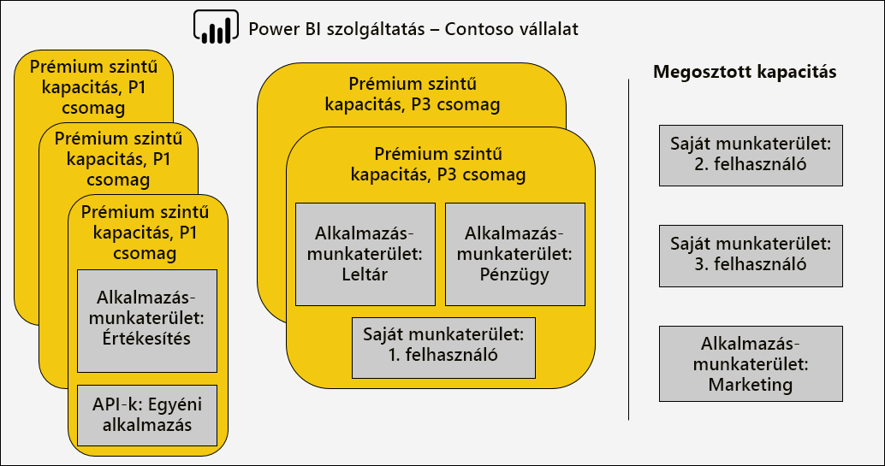

A prémium szintű kapacitás a Power BI bérlő otthoni régiójától eltérő régióhoz rendelhető, amely lehetővé teszi, hogy az adatközpontok (meghatározott földrajzi régiókban) Power BI a tartalom hol található. \[[12](#endnote-12)\]

Power BI szolgáltatás a rendszergazdák és az Office 365 globális rendszergazdák módosíthatják a prémium szintű kapacitást. Pontosabban a következőket tehetik meg:

- Módosítsa a kapacitás méretét az erőforrások vertikális felskálázásához vagy leskálázásához. Azonban nem lehet visszaminősíteni egy P SKU-t egy EM SKU-ra, vagy a frissítést fordítva.
- Kapacitás-rendszergazdák hozzáadása vagy eltávolítása
- Hozzárendelési engedélyekkel rendelkező felhasználók hozzáadása vagy eltávolítása
- További munkaterhelések hozzáadása vagy eltávolítása
- Régiók módosítása

Hozzárendelési engedélyek szükségesek ahhoz, hogy egy munkaterületet egy adott prémium szintű kapacitáshoz rendeljen. Az engedélyek a teljes szervezet, adott felhasználók vagy csoportok számára is megadhatók.

Alapértelmezés szerint a prémium szintű kapacitások támogatják a futó Power BI lekérdezésekhez társított munkaterheléseket. Emellett három további munkaterhelést is támogat: Többoldalas **jelentések**, **adatfolyamok**és **AI**. Minden munkaterheléshez meg kell adni a maximális memóriát (a teljes rendelkezésre álló memória százalékában), amelyet a munkaterhelés használhat. Fontos tisztában lenni azzal, hogy a maximális memória-kiosztások nagyobb mértékben befolyásolhatják a szolgáltatható aktív modellek számát és a frissítések sebességét.

A memória adatfolyamokhoz dinamikusan, lapszámozott jelentésekhez viszont statikusan van lefoglalva. A maximális memória statikus kiosztásának oka az, hogy a többoldalas jelentések a kapacitás biztonságos tárolóhelyén futnak. A többoldalas jelentések memóriájának beállításakor körültekintően kell eljárni, mivel ez csökkenti a rendelkezésre álló memóriát a modellek betöltéséhez.

|                     | EM3                      | P1                       | P2                      | P3                       |
|---------------------|--------------------------|--------------------------|-------------------------|--------------------------|
| Oldalakra osztott jelentések | – | Alapértelmezés szerint 20%; minimum 10% | Alapértelmezés szerint 20%; minimum 5% | Alapértelmezés szerint 20%; minimum 2,5% |
| Adatfolyamok | Alapértelmezés szerint 20%; minimum 8%  | Alapértelmezés szerint 20%; minimum 4%  | Alapértelmezés szerint 20%; minimum 2% | Alapértelmezés szerint 20%; minimum 1%  |
| Mesterséges intelligencia | – | 20% alapértelmezett; legalább 20%  | Alapértelmezés szerint 20%; minimum 10% | Alapértelmezés szerint 20%; minimum 5%  |
| | | | | |

A prémium szintű kapacitás törlése lehetséges, és nem eredményezi a munkaterület és a tartalom törlését. Ehelyett a hozzárendelt munkaterületeket áthelyezi a megosztott kapacitásba. Ha a prémium szintű kapacitás egy másik régióban lett létrehozva, a munkaterület a hazai régió megosztott kapacitására kerül.

### Munkaterületek kiosztása a kapacitásokhoz

A munkaterületek egy prémium szintű kapacitáshoz társíthatók a **Power bi felügyeleti**  **portálon** vagy egy alkalmazás-munkaterületen – a **munkaterület** ablaktáblán.

A kapacitás-rendszergazdák, valamint az Office 365 globális rendszergazdák vagy Power BI szolgáltatás rendszergazdák tömegesen rendelhetnek munkaterületeket a **Power bi felügyeleti**  **portálon**. A tömeges hozzárendelés a következőkre alkalmazható:

- **Munkaterületek felhasználók szerint** : A felhasználók tulajdonában lévő összes munkaterület, beleértve a személyes munkaterületeket is, a prémium szintű kapacitáshoz rendeli. Ez magában foglalja a munkaterületek újbóli hozzárendelését, ha azok már hozzá vannak rendelve egy másik prémium szintű kapacitáshoz. Emellett a felhasználók munkaterület-hozzárendelési engedélyeket is kapnak.

- **Adott munkaterületek**
- **A teljes szervezet** munkaterületei: Az összes munkaterület, beleértve a személyes munkaterületeket is, a prémium szintű kapacitáshoz van rendelve. Emellett minden aktuális és jövőbeli felhasználóhoz hozzá van rendelve a munkaterület-hozzárendelési engedélyek. \[[14](#endnote-14)\]

Egy munkaterületet a munkaterületet **tartalmazó ablaktábla használatával** adhat hozzá egy prémium szintű kapacitáshoz, amely a felhasználó számára a munkaterület-rendszergazda, valamint a hozzárendelési engedélyekkel rendelkezik.

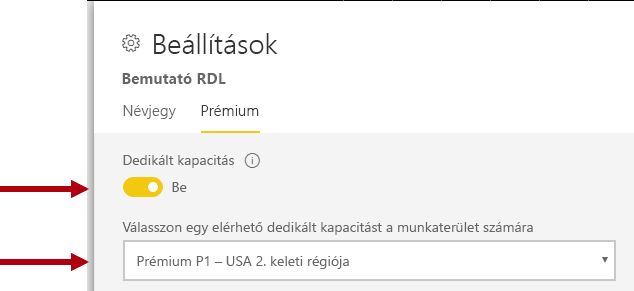

A munkaterület-rendszergazdák hozzárendelési engedély nélkül eltávolíthatják a munkaterületet a kapacitásból (megosztott kapacitásra). A munkaterületek dedikált kapacitásokból való eltávolítása hatékonyan visszakeresi a munkaterületet a megosztott kapacitásra. Vegye figyelembe, hogy a prémium kapacitású munkaterületek eltávolítása negatív következményekkel járhat, például a megosztott tartalom elérhetetlenné válása Power BI ingyenes licenccel rendelkező felhasználók számára, vagy az ütemezett frissítés felfüggesztése, ha túllépik a támogatott kedvezményeket megosztott kapacitások alapján.

A Power BI szolgáltatás egy prémium szintű kapacitáshoz rendelt munkaterületet könnyen azonosítható a Diamond ikon, amely a munkaterület nevét díszíti.

### Kapacitások figyelése

A prémium szintű kapacitások figyelése biztosítja a rendszergazdák számára a kapacitások végrehajtásának megértését. A kapacitást a [Power bi Premium Capacity metrika alkalmazás](service-admin-premium-monitor-capacity.md) vagy a [Power bi felügyeleti portál](service-admin-premium-monitor-portal.md)használatával lehet figyelni.

#### Metrikák értelmezése

A mérőszámokat úgy kell figyelni, hogy az erőforrás-használat és a munkaterhelés-tevékenységek alapismereteket hozzanak létre. Ha a kapacitás lassú, fontos tisztában lennie a figyelni kívánt mérőszámokkal, valamint az elvégezhető következtetésekkel.

Ideális esetben a lekérdezéseknek egy másodpercen belül kell elvégezniük, hogy a felhasználók jelentésére és a nagyobb lekérdezési teljesítményre való reagálásra alkalmas tapasztalatokat adja Általában kevésbé fontos, ha a háttérben futó folyamatok – beleértve a frissítéseket – hosszabb időt is igénybe vehetik.

Általánosságban elmondható, hogy a lassú jelentések egy túlmelegedési kapacitást jelezhetnek. Ha a jelentések nem töltődnek be, ez egy túlzottan fűtött kapacitás jelzése. Mindkét esetben a kiváltó ok számos tényezőhöz kapcsolható, többek között:

- A **sikertelen lekérdezések** egyértelműen jelzik a memória terhelését, és azt, hogy a modell nem tölthető be a memóriába. A Power BI szolgáltatás a hiba előtt 30 másodpercig kísérli meg betölteni a modell betöltését.

- A **túlzott lekérdezési várakozási idő** több okból is lehetséges:
  - A Power BI szolgáltatás szükséges a modell (ek) első kizárásához, majd a betöltéshez a lekérdezett modell betöltéséhez (ne felejtse el, hogy a nagyobb adatkészlet-kizárási arányok nem jelzik a kapacitási terhelést, kivéve, ha a hosszú lekérdezési várakozási idő a memória kiverését jelzi)
  - Modell betöltési ideje (különösen a várakozás a nagy méretű modellek memóriába való betöltésére)
  - Hosszú ideig futó lekérdezések
  - Túl sok LC\DQ-kapcsolat (meghaladja a kapacitási korlátokat)
  - CPU-telítettség
  - Összetett jelentések nagy számú vizualizációval egy oldalon (emlékeztetve arra, hogy minden vizualizáció egy lekérdezés)
- A **hosszú lekérdezések időtartama** azt jelezheti, hogy a modellek nem optimalizáltak, különösen akkor, ha több adathalmaz aktív a kapacitásban, és csak egy adatkészlet hosszú lekérdezési időtartamokat állít elő. Ez azt sugallja, hogy a kapacitás elég újraforrású, és hogy a szóban forgó adatkészletek optimálisak vagy csak lassúak. A hosszú ideig futó lekérdezések problémát okozhatnak, mivel letilthatják a más folyamatok által igényelt erőforrásokhoz való hozzáférést.
- A **hosszú frissítési várakozási idő vagy a mesterséges intelligencia-hívások várakozási ideje** a memóriát használó számos aktív modell miatt nem elegendő memóriát jelez, vagy ha egy problémás frissítés blokkolja a többi frissítést (a párhuzamos frissítési korlátokat meghaladja).

A metrikák használatának részletes ismertetését a [prémium szintű kapacitás optimalizálása](#optimizing-premium-capacities) szakasz következő részében találja.

## A prémium szintű kapacitások optimalizálása

Ha a prémium szintű kapacitással kapcsolatos problémák merülnek fel, a közös első módszer a már üzembe helyezett megoldások optimalizálása vagy finomhangolása az elfogadható válaszidő visszaállítása érdekében. A kényszerített ésszerűség a további prémium kapacitás megvásárlásának elkerülése, kivéve, ha ez indokolt lehet.

Ha további prémium szintű kapacitásra van szükség, két lehetőség közül választhat, amelyek a jelen szakasz későbbi részében jelennek meg:

- A prémium szintű kapacitás vertikális felskálázása
- Új prémium kapacitás hozzáadása

Végezetül, a tesztelési megközelítések és a prémium szintű kapacitás méretezése ezt a szakaszt fogja megkötni.

### Általános ajánlott eljárások

A legjobb kihasználtság és teljesítmény elérésére törekedve van néhány ajánlott eljárás, amely általános javaslatokként is elvégezhető. Ezek a következők:

- Alkalmazás-munkaterületek használata személyes munkaterületek helyett
- Üzleti szempontból kritikus és önkiszolgáló BI (SSBI) elkülönítése különböző kapacitásokra

  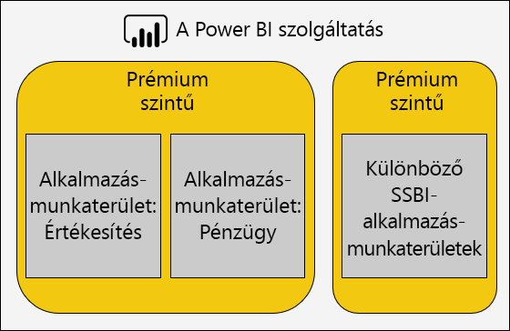

- Ha csak Power BI Pro felhasználókkal oszt meg tartalmat, előfordulhat, hogy a tartalmat nem kell dedikált kapacitásban tárolnia
- Használjon dedikált kapacitást, ha egy adott frissítési időt szeretne elérni, vagy ha konkrét funkciókra van szükség, például nagyméretű adathalmazok vagy többoldalas jelentések esetén

### Gyakori kérdések kezelése

Power BI Premium központi telepítések optimalizálása egy összetett témakör, amely a számítási feladatok követelményeinek, a rendelkezésre álló erőforrások és a hatékony használatnak a megértését foglalja magában.

Ebben a témakörben hét általános támogatási kérdés található, amely leírja a lehetséges problémákat és magyarázatokat, valamint az azok azonosításával és megoldásával kapcsolatos információkat.

#### Miért lassú a kapacitás, és mit tehetek?

Számos oka lehet a lassú prémium szintű kapacitásnak. Ebben a kérdésben további információkra van szükség a lassú működésének megismeréséhez. Lassú a jelentések betöltése? Vagy nem sikerül betölteni? A jelentésekben a vizualizációk lassan töltődnek be vagy frissülnek, amikor a felhasználók együttműködnek a jelentéssel? A frissítések a vártnál több időt vesznek igénybe, vagy korábban már tapasztaltak?

Miután megértette az okát, megkezdheti a vizsgálatát. A következő hat kérdésre adott válaszok segítenek a konkrétabb problémák megoldásában.

#### Milyen tartalmat használ a kapacitásom?

A **Power bi Premium kapacitás metrikái** alkalmazással szűrheti a kapacitást, és áttekintheti a munkaterület-tartalmak teljesítmény-mérőszámait. A prémium szintű kapacitáson belül tárolt összes tartalom esetében az elmúlt hét napban a teljesítmény-mérőszámok és az erőforrás-használat óránként ellenőrizhető. Ez gyakran az első lépés a prémium szintű kapacitás teljesítményével kapcsolatos általános aggályok elhárítása során.

A figyelni kívánt fő mérőszámok a következők:

- Átlagos CPU-és magas kihasználtsági szám
- Az átlagos memória és a magas kihasználtságok száma, valamint az egyes adatkészletek, a adatfolyamok és a többoldalas jelentések memóriájának használata
- Memóriában betöltött aktív adatkészletek
- Lekérdezések átlagos és maximális időtartama
- Lekérdezési várakozási idő átlagos ideje
- Adatkészletek és adatfolyam-frissítési idők átlagos száma
- Az AI-hívások átlagos ideje és várakozási ideje

Emellett a Power BI Premium kapacitás Metrikái alkalmazásban az aktív memória egy jelentéshez lefoglalt teljes memória mennyiségét jeleníti meg, amelyet nem lehet kizárni, mert az elmúlt három percben használatban van. A frissítési várakozási idő magas csúcsa nagy és/vagy aktív adatkészlettel is korrelálható.

A "Top 5 by Average időtartam" diagram kiemeli az első öt adatkészletet, a többoldalas jelentéseket, a adatfolyamok és a kapacitási erőforrásokat használó AI-hívásokat. Az első öt listán szereplő tartalom a vizsgálat és a lehetséges optimalizálás szempontjából jelöltek.

#### Miért lassú a jelentések?

Az alábbi táblázatokban láthatók a lehetséges problémák, valamint az azok azonosításának és kezelésének módjai.

##### Nincs elegendő kapacitási erőforrás

| Lehetséges magyarázatok | Az azonosítás módja | Megoldás |
| --- | --- | --- |
| Magas teljes aktív memória (a modellt nem lehet kizárni, mert az elmúlt három percben használatban van)   Több nagy tüskék a lekérdezési várakozási időpontokban   Több nagy tüskék a frissítés várakozási idején | Figyelje a memória mérőszámait \[ [18](#endnote-18)\], és a kiürítési számok [19](#endnote-19) \[\] | A modell méretének csökkentése vagy átalakítás DirectQuery módba – lásd a [modellek optimalizálása](#optimizing-models) témakört ebben a szakaszban   A kapacitás vertikális felskálázása   A tartalom kiosztása egy másik kapacitáshoz |

##### Nem hatékony jelentés-kialakítások

| Lehetséges magyarázatok | Az azonosítás módja | Megoldás |
| --- | --- | --- |
| A jelentés lapjai számos vizualizációt tartalmaznak (az interaktív szűrés egy vizualizáción legalább egy lekérdezést indíthat el)   A vizualizációk a szükségesnél több adattal kérdeznek le | Jelentések tervének áttekintése   Interjú jelentés a felhasználóknak, hogy megértsék, hogyan hatnak a jelentésekre   Adatkészlet lekérdezési metrikáinak \[figyelése [20](#endnote-20)\] | Jelentések újratervezése oldalanként kevesebb vizualizációval |

##### Adathalmaz lassú (különösen akkor, ha a jelentések korábban jól elvégezték)

| Lehetséges magyarázatok | Az azonosítás módja | Megoldás |
| --- | --- | --- |
| Egyre nagyobb mennyiségű importálási érték   Összetett vagy nem hatékony számítási logika, beleértve az RLS-szerepköröket   A modell nincs teljesen optimalizálva   (DQ/LC) Átjáró késése   Lassú DQ-forrás lekérdezési válaszideje | Modell kialakításának áttekintése   Átjáró-teljesítményszámlálók figyelése | Lásd a jelen szakasz [modellek optimalizálása](#optimizing-models) témakörét. |

##### Magas párhuzamos jelentéskészítés

| Lehetséges magyarázatok | Az azonosítás módja | Megoldás |
| --- | --- | --- |
| Nagy lekérdezési várakozási idő   CPU-telítettség   Túllépte a DQ/LC-kapcsolatok korlátait | A CPU-kihasználtság \[ [21](#endnote-21)\], a lekérdezési várakozási idő és a DQ/ \[LC kihasználtsága [22](#endnote-22) \] mérőszámok és lekérdezések időtartamának figyelése – ha az ingadozás a párhuzamossági problémákat jelez | A kapacitás vertikális felskálázása vagy a tartalom más kapacitáshoz rendelése   Jelentések újratervezése oldalanként kevesebb vizualizációval |

#### Miért nem töltődik be a jelentések?

Ha a jelentések nem töltődnek be, az egy legrosszabb ESET, és biztos lehet abban, hogy a kapacitás nem rendelkezik elegendő memóriával, és a szolgáltatás túlfűtött. Ez akkor fordulhat elő, ha az összes betöltött modell aktívan le van kérdezve, ezért nem zárható ki, és minden frissítési művelet szüneteltetve vagy késleltetve lett. A Power BI szolgáltatás 30 másodpercig kísérli meg betölteni az adatkészletet, és a felhasználó szabályosan értesítést kap a hibáról, és egy javaslattal hamarosan újra próbálkozik.

Jelenleg nincs mérőszám a jelentés betöltési hibáinak figyelésére. A probléma lehetséges okait a rendszermemória figyelésével, pontosabban a legmagasabb kihasználtsággal és a legnagyobb kihasználtsággal kapcsolatos időponttal derítheti fel. A magas adatkészlet-kizárások és a hosszú adatkészlet-frissítés átlagos várakozási ideje arra utalhat, hogy ez a probléma előfordul.

Ha ez csak nagyon ritkán fordul elő, akkor ez nem tekinthető prioritási problémanak. A jelentés felhasználói tájékoztatják, hogy a szolgáltatás foglalt, és rövid idő elteltével újra kell próbálkoznia. Ha ez túl gyakran fordul elő, a probléma feloldható a prémium kapacitás növelésével vagy a tartalom más kapacitáshoz való hozzárendelésével.

A kapacitás-rendszergazdák (és Power BI szolgáltatás rendszergazdák) a **lekérdezési hibák** metrikájának figyelésével határozzák meg, hogy mikor történnek. Emellett újraindíthatják a kapacitást, és alaphelyzetbe állíthatja az összes műveletet.

#### Miért nem kezdődnek az ütemezett frissítések?

Az ütemezett frissítés indítási időpontja nem garantált. Ne felejtse el, hogy a Power BI szolgáltatás mindig rangsorolja az interaktív műveleteket a háttérben futó műveletekben. A frissítés egy háttérbeli művelet, amely akkor fordulhat elő, ha két feltétel teljesül:

- Elegendő memória van
- A prémium szintű kapacitáshoz tartozó támogatott párhuzamos frissítések száma nem lépi túl

Ha a feltételek nem teljesülnek, a frissítés várólistára kerül, amíg a feltételek nem megfelelőek.

A teljes frissítéshez ne felejtse el, hogy legalább kétszer meg kell adnia az aktuális adatkészlet memóriájának méretét. Ha nem áll rendelkezésre elegendő memória, a frissítés nem kezdődhet el addig, amíg a modell kiürítése fel nem szabadítja a memóriát – ez azt jelenti, hogy késést okoz, amíg egy vagy több adathalmaz inaktívvá válik, és ki lehet zárni.

Ne felejtse el megállapítani, hogy a maximális párhuzamos frissítés támogatott száma 1,5 alkalommal van beállítva a háttérbeli v-magoknál, felkerekítve.

Az ütemezett frissítés sikertelen lesz, ha nem kezdődhet el, mielőtt a következő ütemezett frissítés megkezdődik. A felhasználói felületről manuálisan indított igény szerinti frissítés legfeljebb háromszor próbálkozik a művelet végrehajtása előtt.

A kapacitás-rendszergazdák (és a Power BI szolgáltatás rendszergazdák) megfigyelheti az **átlagos frissítési várakozási idő (perc)** mérőszámot az ütemezett idő és a művelet megkezdése közötti átlagos késés megállapításához.

Habár általában nem adminisztratív prioritás, az időigényes adatfrissítések befolyásolása érdekében győződjön meg arról, hogy elegendő memória áll rendelkezésre. Ez magában foglalhatja az adatkészletek a megfelelő erőforrásokkal való elkülönítését. Az ütközések minimalizálása érdekében az is lehetséges, hogy a rendszergazdák összehangolják az adatkészletek tulajdonosait az ütemezett adatfrissítési idők lépcsőzetes vagy csökkentése érdekében. Vegye figyelembe, hogy a rendszergazdák nem tudják megtekinteni a frissítési várólistát, vagy beolvasni az adatkészlet-ütemterveket.

#### Miért lassú a frissítés?

A frissítések lassúak lehetnek, vagy lassúnak tekinthetik (az előző gyakori kérdések esetében).

Ha a frissítés valójában lassú, számos oka lehet:

- Nem elegendő processzor (a frissítés nagyon nagy CPU-igényű lehet)
- Nincs elég memória, ami a frissítés szüneteltetését eredményezi (amelyhez a frissítés szükséges, amikor a feltételek kedvezőbbek az újraindításhoz)
- Nem kapacitási okok, beleértve az adatforrás-rendszerválaszadást, a hálózati késést, az érvénytelen engedélyeket vagy az átjáró átviteli sebességét
- Adatmennyiség – a Növekményes frissítés konfigurálásának jó oka az alább leírtak szerint

A kapacitás-rendszergazdák (és Power BI szolgáltatás rendszergazdák) megfigyelheti az **átlagos frissítési időtartam (perc)** metrikáját, hogy meghatározza az összehasonlítási időközt az idő múlásával, valamint a **várakozási idő átlagát (percben)** az átlagos késés megállapításához. az ütemezett idő és a művelet megkezdése közötti átlagos késések között.

A Növekményes frissítés jelentősen csökkentheti az Adatfrissítés időtartamát, különösen a nagyméretű modellek táblái esetében. A Növekményes frissítés négy előnnyel jár:

- **A frissítések gyorsabbak** : A tábla csak egy részhalmaza szükséges, ami csökkenti a processzor-és memóriahasználat használatát, és a párhuzamosság nagyobb lehet, ha több partíciót frissít.
- A frissítés **csak akkor történik meg, ha szükséges** : A növekményes frissítési szabályzatok úgy konfigurálhatók, hogy csak az adatváltozások esetén legyenek betöltve
- **A frissítések megbízhatóbbak** : Az illékony adatforrás-rendszerekhez való rövidebb ideig futó kapcsolatok kevésbé hajlamosak a leválasztásra
- A **modellek továbbra is a Trim** : A növekményes frissítési szabályzatok beállítható úgy, hogy a rendszer automatikusan eltávolítsa az előzményeket a lecsúszott időszakon túl

További információkért tekintse meg a [növekményes frissítést Power bi Premium](service-premium-incremental-refresh.md) dokumentumban.

#### Miért nem fejeződik be az Adatfrissítés?

Ha az Adatfrissítés megkezdődik, de a folyamat nem fejeződik be, akkor a következő okok miatt több oka is lehet:

- Nincs elég memória, még akkor is, ha csak egy modell van a prémium szintű kapacitásban, azaz a modell mérete nagyon nagy
- Nem kapacitási okok, beleértve az adatforrás-rendszerek leválasztását, az érvénytelen engedélyeket vagy az átjáró hibáját

A kapacitás-rendszergazdák (és Power BI szolgáltatás rendszergazdák) a **memória-metrika miatt** nem tudják figyelni a frissítési hibákat.

#### Miért nem sikerül az AI-hívások futtatása?

Az AI-hívások több okból is sikertelenek lehetnek. Az AI-munkaterhelések elindításához szükséges minimális memória 5 GB, de előfordulhat, hogy egyes bemeneti adatkészletek esetében ez nem elegendő. Például az automatizált Machine learning-modellek betanításához legalább kétszer kell lennie, és néha többször is a bemeneti adatkészlet méretét. Emellett egy AI-hívás is megszakad, ha a művelet elvégzése két óránál hosszabb időt vesz igénybe. A gépi tanulási modell olyan betanítási hívások esetén, amelyek két órán belül nem fejeződött be, a rendszer az adott két órában talált legjobb modellt adja vissza.  Az AI-hívásokat az interaktív kérések is megszakítják, amelyek elsőbbséget élveznek.

A rendszergazdáknak meg kell figyelniük a mesterséges intelligencia várakozási idejét a többi kérelemre vonatkozó elsőbbségi jelek miatt. A rendszergazdák azt is biztosíthatják, hogy elegendő memória álljon rendelkezésre az AI-munkaterheléshez a bemeneti adatméretekhez képest. Ez magában foglalhatja az AI-munkaterhelések elkülönítését olyan kapacitások számára, amelyek ismerete elegendő erőforrással rendelkezik. Emellett lehetséges, hogy a rendszergazdák összehangolják a adatfolyam-tulajdonosokkal, hogy az ütközések minimalizálása érdekében a adatfolyam-frissítési idők lépcsőzetes vagy alacsonyabb szintre csökkenjenek. Megjegyzés: nem lehetséges, hogy a rendszergazda megtekintse az AI-hívási várólistát.

### Modellek optimalizálása

Az optimális modell kialakítása elengedhetetlen a hatékony és méretezhető megoldás megvalósításához. Azonban ez a tanulmány a teljes körű vitát is tartalmazza. Ehelyett ez a szakasz kulcsfontosságú területeket biztosít a modellek optimalizálásához.

#### Power BI üzemeltetett modellek optimalizálása

A prémium szintű kapacitásban üzemeltetett modellek optimalizálása az adatforrás (ok) és a modell rétegeiben is elérhető.

Tekintse át az importálási modell optimalizálási lehetőségeit:

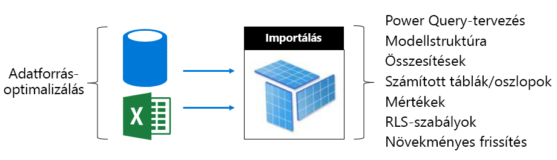

Az adatforrás rétegében:

- A kapcsolódó adatforrások optimalizálva lehetnek a lehető leggyorsabb frissítéshez az adatok előzetes integrálásával, a megfelelő indexek alkalmazásával, a növekményes frissítési időszakokhoz illeszkedő megvalósulni meghatározásával, valamint a számítások (a számított érték helyett) táblázatok és oszlopok modellezése) vagy számítási logika hozzáadása a nézetekhez
- A nem összehasonlítható adatforrások előre integrálhatók a kapcsolódó adattárakkal
- Győződjön meg arról, hogy az átjárók elegendő erőforrással rendelkeznek, lehetőleg dedikált gépeken, megfelelő hálózati sávszélességgel és az adatforrások közelében

A modell rétegében:

- Power Query lekérdezési tervek csökkenthetik vagy eltávolíthatják az összetett átalakításokat, különösen azokat, amelyek különböző adatforrásokat egyesítenek (az adattárházak ezt a kinyerési átalakítási fázisban érik el). Emellett a megfelelő adatforrások adatvédelmi szintjeinek megadásának biztosításával elkerülhető, hogy Power BI a teljes eredmények betöltését, hogy összevont eredményt hozzon létre a lekérdezések között.
- A modell szerkezete meghatározza a betöltendő adatmennyiséget, és közvetlen hatással van a modell méretére. A megoldás célja, hogy elkerülje a szükségtelen adatbevitelt az oszlopok eltávolításával, a sorok eltávolításával (különösen a régi adatmennyiséggel) vagy az összegzett információk betöltésével (a részletes információk betöltésének rovására). A jelentős mértékű csökkentés a nagy kardinális oszlopok (különösen szöveges oszlopok) eltávolításával érhető el, amelyek nem tárolják és nem tömörítik nagyon hatékonyan.
- A modell lekérdezési teljesítménye javítható egy egyirányú kapcsolat konfigurálásával, kivéve, ha a kétirányú szűrést nem kényszeríti a rendszer. A kétirányú szűrés helyett érdemes a CROSSFILTER függvényt is használni.
- Az összesítési táblázatok gyors lekérdezési válaszokat tudnak elérni az előre összefoglalt adatmennyiségek betöltésével, azonban ez növeli a modell méretét, és a frissítési időt is eredményezi. Általában az összesítési táblákat nagyon nagy modellekhez vagy összetett modellekhez kell foglalni.
- A számított táblák és oszlopok a modell méretének növelését és a hosszú frissítési idő megnövekedését eredményezik. Általánosságban elmondható, hogy egy kisebb tárterület-méret és gyorsabb frissítési idő érhető el, ha az adatok az adatforrásból származnak vagy számítanak. Ha ez nem lehetséges, Power Query egyéni oszlopok használatával javítható a tárolók tömörítése.
- Lehetséges, hogy a mértékek és az RLS-szabályok DAX-kifejezéseit is beállíthatja, például a logikát újraírni a költséges képletek elkerüléséhez
- A Növekményes frissítés jelentősen csökkentheti a frissítési időt, és megőrizheti a memóriát és a PROCESSZORt. A Növekményes frissítés úgy is konfigurálható, hogy eltávolítsa a korábbi adattárolási modell méretét.
- A modelleket két modellként lehet újratervezni, ha különböző és ütköző lekérdezési minták vannak. Például egyes jelentések magas szintű összesítéseket mutatnak az összes előzményben, és elérhetik a 24 órás késést. Más jelentések a mai adatokat érintik, és az egyes tranzakciókhoz részletesen hozzá kell férniük. Ahelyett, hogy egyetlen modellt tervezzen az összes jelentés kielégítéséhez, hozzon létre két, az egyes követelményekhez optimalizált modellt.

Tekintse át a DirectQuery-modell optimalizálási lehetőségeit. Mivel a modell az alapul szolgáló adatforrásra vonatkozó lekérdezési kérelmeket ad ki, kritikus fontosságú a rugalmas modellek lekérdezésének továbbítása.

 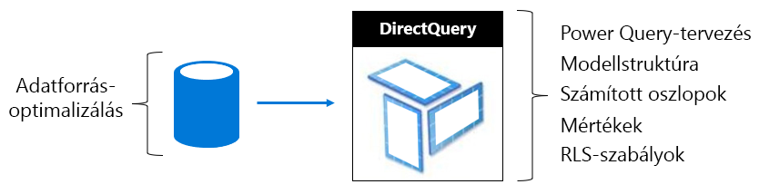

Az adatforrás rétegében:

- Az adatforrás optimalizálható úgy, hogy biztosítsa a lehető leggyorsabb lekérdezést az adatok előzetes integrálásával (amely nem lehetséges a modell rétegében), a megfelelő indexek alkalmazásával, a tábla partícióinak definiálásával, a megvalósulni összegzett adatokkal (indexelt nézetekkel), valamint a számítási mennyiség minimalizálása. A legjobb megoldás akkor érhető el, ha az átadó lekérdezéseknek csak szűrniük kell, és el kell végezniük az indexelt táblák vagy nézetek közötti belső illesztéseket.
- Győződjön meg arról, hogy az átjárók elegendő erőforrással rendelkeznek, lehetőleg dedikált gépeken, megfelelő hálózati sávszélességgel és az adatforrás közelében

A modell rétegében:

- Power Query a lekérdezési terveknek lehetőleg nem kell átalakításokat alkalmazniuk – máskülönben nem kell megtartania az átalakításokat abszolút minimumra
- A modell lekérdezési teljesítménye javítható egy egyirányú kapcsolat konfigurálásával, kivéve, ha a kétirányú szűrést nem kényszeríti a rendszer. Emellett a modell kapcsolatait úgy kell konfigurálni, hogy a hivatkozási integritás feltételezésére legyenek kényszerítve (ebben az esetben), és az adatforrás-lekérdezéseket hatékonyabb belső illesztések (a külső illesztések helyett) használatával fogják eredményezni.
- Ne hozzon létre Power Query lekérdezés egyéni oszlopait vagy a modell számított oszlopát – ha lehetséges, ezeket az adatforrásban kell megvalósulni.
- Lehetséges, hogy a mértékek és az RLS-szabályok DAX-kifejezéseit is beállíthatja, például a logikát újraírni a költséges képletek elkerüléséhez

Tekintse át az összetett modell optimalizálási lehetőségeit. Ne felejtse el, hogy az összetett modell lehetővé teszi az importálási és DirectQuery táblák együttes használatát.

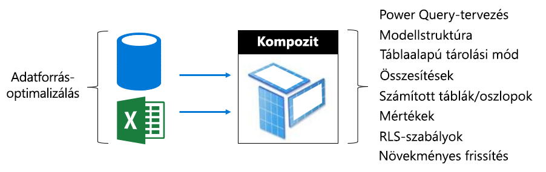

- Az importálási és DirectQuery modellekre vonatkozó optimalizálási témakörök általában az ezeket a tárolási módokat használó összetett modell-táblákra vonatkoznak.
- Általában úgy törekszünk, hogy kiegyensúlyozott kialakítást alakítsanak ki úgy, hogy a dimenzió típusú táblákat (az üzleti entitásokat jelképezve) kettős tárolási mód és egyedkapcsolat típusú táblák (gyakran nagy táblák, működési tényeket jelképező táblázatok) használatával DirectQuery tárolási módban. A kettős tárolási mód az importálási és a DirectQuery tárolási módot is jelenti, és ez lehetővé teszi az Power BI szolgáltatás számára, hogy meghatározza a leghatékonyabb tárolási módot, amelyet az átadó natív lekérdezésének létrehozásakor használ.
- Győződjön meg arról, hogy az átjárók elegendő erőforrással rendelkeznek, lehetőleg dedikált gépeken, megfelelő hálózati sávszélességgel és az adatforrások közelében
- Az importálási tárolási üzemmódként konfigurált összesítési táblázatok drámai lekérdezési teljesítménybeli fejlesztéseket nyújthatnak, ha a DirectQuery tárolási mód egyedkapcsolat-típusú tábláinak összegzésére használják. Ebben az esetben az összesítési táblázatok növelik a modell méretét és növelik a frissítési időt, és gyakran ez a gyorsabb lekérdezések elfogadható kompromisszuma.

#### Külsőleg üzemeltetett modellek optimalizálása

A [Power bi által üzemeltetett modellek optimalizálása](#optimizing-power-bi-hosted-models) témakörben tárgyalt számos optimalizálási lehetőség a Azure Analysis Services és a SQL Server Analysis Services fejlesztett modellekre is vonatkozik. A kivételek törlése olyan szolgáltatások, amelyek jelenleg nem támogatottak, beleértve az összetett modelleket és az összesítési táblákat.

A külsőleg üzemeltetett adatkészletek esetében a További szempontok a Power BI szolgáltatáshoz kapcsolódó adatbázis. Azure Analysis Services esetén ez azt jelenti, hogy az Azure-erőforrást ugyanabban a régióban hozza létre, mint a Power BI bérlőt (otthoni régió). A IaaS esetében ez azt jelenti, hogy a virtuális gépet ugyanabban a régióban üzemeltetik, és a helyszíni használatra az átjárók hatékony telepítésének biztosítását jelenti. SQL Server Analysis Services

Előfordulhat, hogy fontos megjegyezni, hogy Azure Analysis Services adatbázisokhoz és a táblázatos adatbázisokhoz SQL Server Analysis Services a modelleket teljes egészében be kell tölteni a memóriába, és a lekérdezés támogatásához mindig ott maradnak. A Power BI szolgáltatáshoz hasonlóan a frissítéshez elegendő memória szükséges a frissítéshez, ha a modellnek online állapotban kell maradnia. A Power BI szolgáltatástól eltérően nincs olyan fogalom, amely alapján a modellek a használattól függően automatikusan és elfogynak a memóriában. A Power BI Premium ezért hatékonyabb megoldást kínál a modell lekérdezésének maximalizálására az alacsonyabb memóriahasználat használatával.

### Kapacitástervezés

A prémium szintű kapacitás mérete határozza meg a rendelkezésre álló memória-és processzor-erőforrásokat és a kapacitásra vonatkozó korlátozásokat. A prémium szintű kapacitások száma is megfontolásos, mivel a több prémium szintű kapacitás létrehozása segíthet a munkaterhelések elkülönítésében. Vegye figyelembe, hogy a tárterület 100 TB-os kapacitású csomópont, és ez valószínűleg több, mint bármely munkaterhelés esetében elegendő.

A prémium szintű kapacitások méretének és számának meghatározása kihívást jelenthet, különösen az Ön által létrehozott kezdeti kapacitások esetében. A kapacitás méretezésének első lépése a napi használatot jelölő átlagos munkaterhelés megismerése. Fontos tisztában lenni azzal, hogy nem minden munkaterhelés egyenlő. Például – az egyidejű felhasználók egyetlen vizualizációt tartalmazó jelentés oldalának egyik végén a 100 egyidejű felhasználó egyszerűen elérhető. Még – a spektrum másik végén – a 100 egyidejű felhasználó fér hozzá a 100 különböző jelentésekhez, amelyek mindegyike 100 vizualizációkkal rendelkezik a jelentés oldalán.

A kapacitás-rendszergazdáknak ezért számos, a környezetre, a tartalomra és a várható használatra jellemző tényezőt kell figyelembe venniük. A kényszerített célkitűzés a kapacitás kihasználtságának maximalizálása a konzisztens lekérdezési időpontok, a várakozási idő és a kiürítési arányok megvalósítása mellett. A Megfontolandó tényezők a következők lehetnek:

- **Modell mérete és az adatok jellemzői** : Az importálási modelleket teljes mértékben be kell tölteni a memóriába a lekérdezések és a frissítés lehetővé tételéhez. Az LC/DQ adatkészletek jelentős processzor-időt és valószínűleg jelentős memóriát igényelhetnek az összetett mértékek vagy az RLS-szabályok kiértékeléséhez. A memória és a processzor mérete, valamint az LC/DQ lekérdezési sebességét a kapacitás mérete korlátozza.
- **Egyidejű aktív modellek** : A különböző importálási modellek egyidejű lekérdezése biztosítja a legjobb rugalmasságot és teljesítményt, amikor a memóriában maradnak. Elegendő memóriának kell lennie az összes nagymértékben lekérdezett modell üzemeltetéséhez, és további memóriával kell rendelkeznie a frissítéshez.
- **Importálási modell frissítése** : A frissítési típus (teljes vagy növekményes), az Power Query lekérdezések és a számított tábla/oszlop logikai értékének hossza és összetettsége hatással lehet a memóriára és különösen a processzor használatára. Az egyidejű frissítést a kapacitás mérete (1,5 x háttér-v-magok, felkerekített) korlátozza.
- **Egyidejű lekérdezések** : Számos egyidejű lekérdezés nem válaszoló jelentést eredményezhet, ha a processzor vagy az LC/DQ kapcsolatok túllépik a kapacitási korlátot. Ez különösen igaz a több vizualizációt tartalmazó jelentés lapjaira.
- **Adatfolyamok, többoldalas jelentések és AI függvények** : A kapacitás beállítható úgy, hogy támogassa a adatfolyamok, a többoldalas jelentéseket és a mesterséges intelligencia-függvényeket, és mindegyikhez konfigurálható maximális kapacitási arányt igényel. A memória dinamikusan van kiosztva a adatfolyamok, de statikusan van lefoglalva a többoldalas jelentésekhez és az AI-munkaterhelésekhez.

Ezen tényezők mellett a kapacitás-rendszergazdák több kapacitás létrehozását is fontolóra vehetik. Több kapacitás is lehetővé teszi a munkaterhelések elkülönítését, és konfigurálható úgy, hogy biztosítsa a Kiemelt számítási feladatok garantált erőforrásait. Az önkiszolgáló BI-(SSBI-) munkaterhelések esetében például két kapacitást lehet létrehozni az üzleti szempontból kritikus fontosságú munkaterhelések elkülönítéséhez. Az üzleti szempontból kritikus kapacitás felhasználható a nagy vállalati modellek elkülönítésére, amelyek garantált erőforrásokkal rendelkeznek, és a szerzői hozzáférés csak az informatikai részleg számára biztosított. A SSBI kapacitás több kisebb modell futtatására is használható, az üzleti elemzők számára biztosított hozzáféréssel. A SSBI kapacitása időnként lekérdezési vagy frissítési várakozások esetén is elfogadható.

Az idő múlásával a kapacitás-rendszergazdák a munkaterületek közötti egyensúlyba helyezhetik a munkaterületeket, és a kapacitások közötti munkaterületek, illetve a kapacitások felfelé vagy lefelé skálázásával is áthelyezhetők. Általában nagyobb méretű, vertikális felskálázást és nagyobb párhuzamosságot biztosítunk.

Ne felejtse el, hogy a licencek megvásárlása biztosítja a bérlőt a virtuális magokkal. A **P3** -előfizetés megvásárlásával létrehozhat egy vagy legfeljebb négy prémium kapacitást, például 1 x P3 vagy 2 x P2 vagy 4 x P1. Továbbá, mielőtt a P2-kapacitást egy P3-es kapacitásra szeretné kialakítani, figyelembe kell venni a virtuális magok felosztását két P1 kapacitás létrehozásához.

### Tesztelési módszerek

A kapacitás méretének eldöntése után a tesztelést egy ellenőrzött környezet létrehozásával végezheti el. A gyakorlati és gazdasági lehetőség egy Azure-(SKU-) kapacitás létrehozása, amely megállapítja, hogy egy P1-es kapacitás mérete megegyezik egy A4-es kapacitással, és a P2 és a P3 kapacitása megegyezik az A5-ös és az A6-os kapacitással. Az Azure-kapacitások gyorsan létrehozhatók, és óradíjat kell fizetniük. Így a tesztelés befejezése után egyszerűen törölheti a költségeket.

A teszt tartalma hozzáadható az Azure-kapacitásban létrehozott munkaterületekhez, majd egyetlen felhasználó futtathat jelentéseket a lekérdezések reális és reprezentatív számítási feladatainak létrehozásához. Ha vannak importálási modellek, az egyes modellek frissítését is el kell elvégezni. A figyelési eszközök segítségével az összes mérőszámot áttekintheti az erőforrások kihasználtságának megismeréséhez.

Fontos, hogy a tesztek ismételhetők legyenek: A teszteket többször kell futtatni, és minden alkalommal nagyjából ugyanazt az eredményt kell megadniuk. Ezeknek az eredményeknek az átlagát használva kikövetkeztetheti és megbecsülheti a számítási feladatokat az igaz üzemi körülmények között.

Ha már rendelkezik kapacitással és a tesztek betöltéséhez szükséges jelentésekkel, a [PowerShell Load generáló eszköz](https://aka.ms/PowerBILoadTestingTool) használatával gyorsan létrehozhat egy terhelési tesztet. Az eszköz segítségével megbecsülheti, hogy a kapacitás hány példánya futhat egy órán belül. Az eszközzel kiértékelheti a kapacitást az egyes jelentések megjelenítéséhez vagy párhuzamosan több különböző jelentés megjelenítéséhez. További információkért tekintse meg a Microsoft [Power bi videót: Prémium szintű](https://www.youtube.com/watch?time_continue=1860&v=C6vk6wk9dcw)kapacitás.

Összetettebb teszt létrehozásához érdemes lehet olyan terheléses tesztelési alkalmazást fejleszteni, amely reális számítási feladatokat szimulál. További információkért tekintse meg a Webinar [Load testing Power bi alkalmazások a Visual Studio Load testtel](https://blogs.msdn.microsoft.com/charles_sterling/2018/04/04/webinar-load-testing-power-bi-applications-with-visual-studio-load-test/)című témakört.

## Valós forgatókönyvek feltárása

Ebben a szakaszban számos valós forgatókönyvet vezetünk be a gyakori problémák vagy kihívások leírására, az azonosításuk módjára és a megoldásuk elősegítésére:

- [Adatkészletek naprakészen tartása](#keeping-datasets-up-to-date)
- [A lassú válaszú adatkészletek azonosítása](#identifying-slow-responding-datasets)
- [A szórványosan lassan válaszoló adatkészletek okainak azonosítása](#identifying-causes-for-sporadically-slow-responding-datasets)
- [Annak megállapítása, hogy van-e elegendő memória](#determining-whether-there-is-enough-memory)
- [Annak megállapítása, hogy van-e elég CPU](#determining-whether-there-is-enough-cpu)

A lépéseket, valamint a diagram-és táblázatos példákat a **Power bi Premium Capacity metrika alkalmazásból** (alkalmazás) származik, amelyhez a Power bi-rendszergazda hozzáférhet.

### Adatkészletek naprakészen tartása

Ebben a forgatókönyvben egy vizsgálatot váltott ki, amikor a felhasználók azt kifogásolták, hogy a jelentési adatjelentések időnként elavultak vagy elavultak.

Az alkalmazásban a rendszergazda a **frissítések** vizualizációját, a **maximális várakozási idő** statisztikái alapján csökkenő sorrendbe rendezi az adathalmazokat. Ez segít felfedni azokat az adatkészleteket, amelyek a leghosszabb várakozási idővel rendelkeznek, a munkaterület neve szerint csoportosítva.

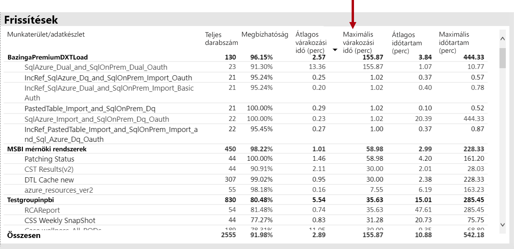

Emellett az **átlagos frissítési várakozási idő** vizualizációja azt jelzi, hogy a frissítési várakozási idő csúcsa minden nap 16:00 körül van.

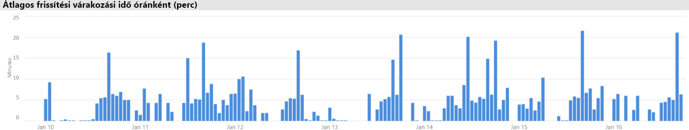

Az eredmények több lehetséges magyarázattal is rendelkeznek:

- Túl sok frissítési kísérlet zajlik egyszerre, ami meghaladja a kapacitási csomópont által megszabott korlátokat (hat egyidejű frissítés a P1-ben az alapértelmezett memória-kiosztással)

- Előfordulhat, hogy a frissítendő adatkészletek túl nagyok ahhoz, hogy a rendelkezésre álló memóriába illeszkedjenek (legalább 2x memóriát igényel a teljes frissítéshez)
- Az adatkészletek frissítése során nem hatékony Power Query logika okozhatja a memóriahasználat terhelését. Egy foglalt kapacitás esetén ez esetenként elérheti a fizikai korlátot, a frissítés meghiúsul, és potenciálisan hatással lehet más jelentési nézet műveleteire a kapacitáson.
- A memóriában lévő, gyakran lekérdezett adatkészletek a korlátozott rendelkezésre álló memória miatt befolyásolhatják a más adatkészletek frissítésének képességét.

Ennek a vizsgálatnak a kivizsgálása érdekében a Power BI-rendszergazda megkeresheti a következőket:

- Kevés a rendelkezésre álló memória az Adatfrissítés időpontjában, ha a rendelkezésre álló memória mérete kisebb, mint 2 – a frissíteni kívánt adatkészlet mérete
- Azokat az adatkészleteket, amelyeket nem frissítettek, és a frissítés előtt nem voltak a memóriában, de a nagy frissítési idő során megkezdődött az interaktív forgalom megjelenítése. Ha szeretné megtekinteni, hogy mely adatkészletek lettek a memóriába betöltve, egy Power BI rendszergazda megtekintheti az alkalmazás adatkészletek **lapján található** adatkészletek lapot, és megvizsgálhatja a szűrőt egy adott időpontra az **óránként betöltött adatkészlet**számának egyik sávjára kattintva. Egy helyi csúcs (az alábbi képen látható) azt jelzi, hogy egy óra, ha több adatkészlet töltődik be a memóriába, ami késleltetheti az ütemezett frissítések indítását.
- Megnövelt adatkészlet-kizárások zajlanak az adatfrissítések ütemezésekor, ami azt jelzi, hogy a frissítés időpontját megelőzően túl sok különböző interaktív jelentés szolgál a nagy memória-nyomás miatt. Az **óránkénti adatkészlet-kizárások és a memória-felhasználás** vizualizációja egyértelműen jelzi a kizárásokban lévő tüskéket.

Az alábbi képen egy helyi csúcs látható a betöltött adatkészletekben, ami a frissítések késleltetett kezdésének interaktív lekérdezését javasolja. Ha kijelöl egy időszakot az **óránként betöltött adatkészlet** megszámlálása során, a vizualizáció keresztben szűri az adathalmazok **méretét** .

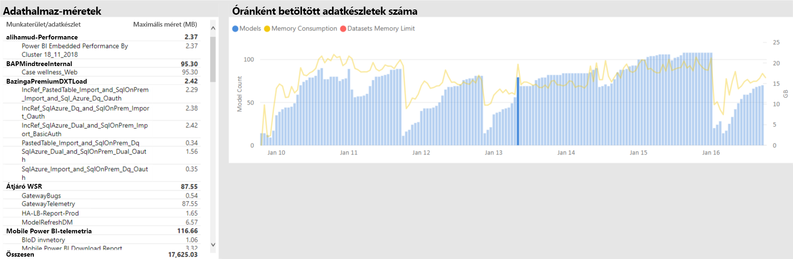

A Power BI rendszergazdája a következő lépések végrehajtásával próbálkozhat a probléma megoldásához szükséges lépésekkel, így biztosítva, hogy elegendő memória álljon rendelkezésre az adatfrissítéshez:

- Kapcsolatfelvétel az adatkészlet-tulajdonosokkal, és az adatfrissítési ütemezések lépcsőzetes és kilépésének megkérdezése
- Az adatkészlet-lekérdezések terhelésének csökkentése a szükségtelen irányítópultok és irányítópult-csempék eltávolításával, különösen azokkal, amelyek a sor szintű biztonságot kényszerítik
- Az adatok frissítésének felgyorsítása Power Query logika optimalizálásával, számított oszlopok vagy táblák modellezésével, az adathalmazok méretének csökkentésével, vagy nagyobb adatkészletek konfigurálásával a növekményes adatok frissítése érdekében

### A lassú Válaszú adatkészletek azonosítása

Ebben a forgatókönyvben egy vizsgálatot indítottak, amikor a felhasználók arról panaszkodtak, hogy bizonyos jelentések hosszú ideig tartanak nyitva, és időnként lefagynak.

Az alkalmazásban a Power BI rendszergazdája használhatja a lekérdezési **időtartamok** vizualizációját, hogy meghatározza a legrosszabb teljesítményt nyújtó adatkészleteket az adathalmazok csökkenő **átlagos időtartam**szerinti rendezésével. Ez a vizualizáció az adatkészlet-lekérdezések számát is megjeleníti, így láthatja, hogy az adatkészletek milyen gyakran kérdeznek le.

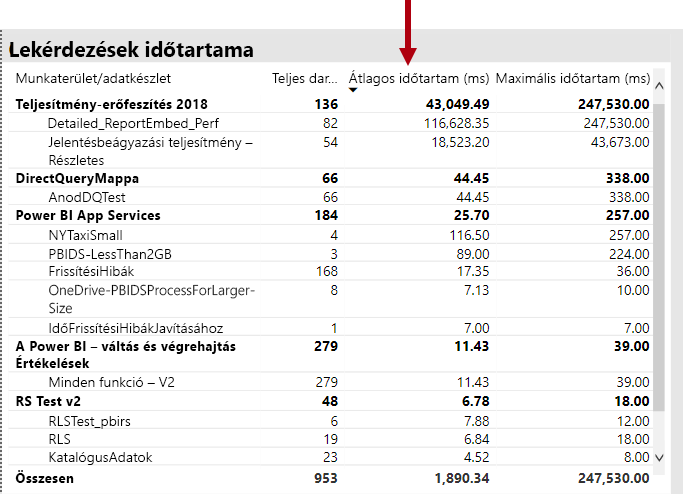

A Power BI rendszergazdája hivatkozhat a lekérdezési **időtartam eloszlási** vizualizációra, amely a szűrt időszakra vonatkozóan a gyűjtő lekérdezési teljesítmény (< = 30ms, 0 100ms stb.) teljes eloszlását mutatja. Általában egy másodpercet vagy annál kisebb lekérdezéseket a legtöbb felhasználó válaszol. a hosszabb időt igénylő lekérdezések a rossz teljesítmény érzékelését idézik elő.

Az **óránkénti lekérdezés időtartamának eloszlási** vizualizációja lehetővé teszi, hogy a Power bi rendszergazdája egy órás időszakot azonosítson, ha a kapacitás teljesítménye gyengenak bizonyulhat. Minél nagyobb a lekérdezési időtartamokat jelképező sáv egy másodpercen keresztül, annál nagyobb a kockázata, hogy a felhasználók a gyenge teljesítményt fogják észlelni.

A vizualizáció interaktív, és a sáv egy szegmensének kiválasztásakor a jelentés oldalának megfelelő **lekérdezési időtartam** a táblázat vizualizációja az általa képviselt adatkészletek megjelenítéséhez. Ez a szűrés lehetővé teszi, hogy a Power BI rendszergazda könnyedén azonosítsa, hogy mely adatkészletek lassan válaszolnak.

Az alábbi képen egy, az óránkénti **lekérdezés időtartamának eloszlása**alapján szűrt vizualizáció látható, amely a legrosszabb teljesítményű adatkészletekre összpontosít egy órás gyűjtőben. 

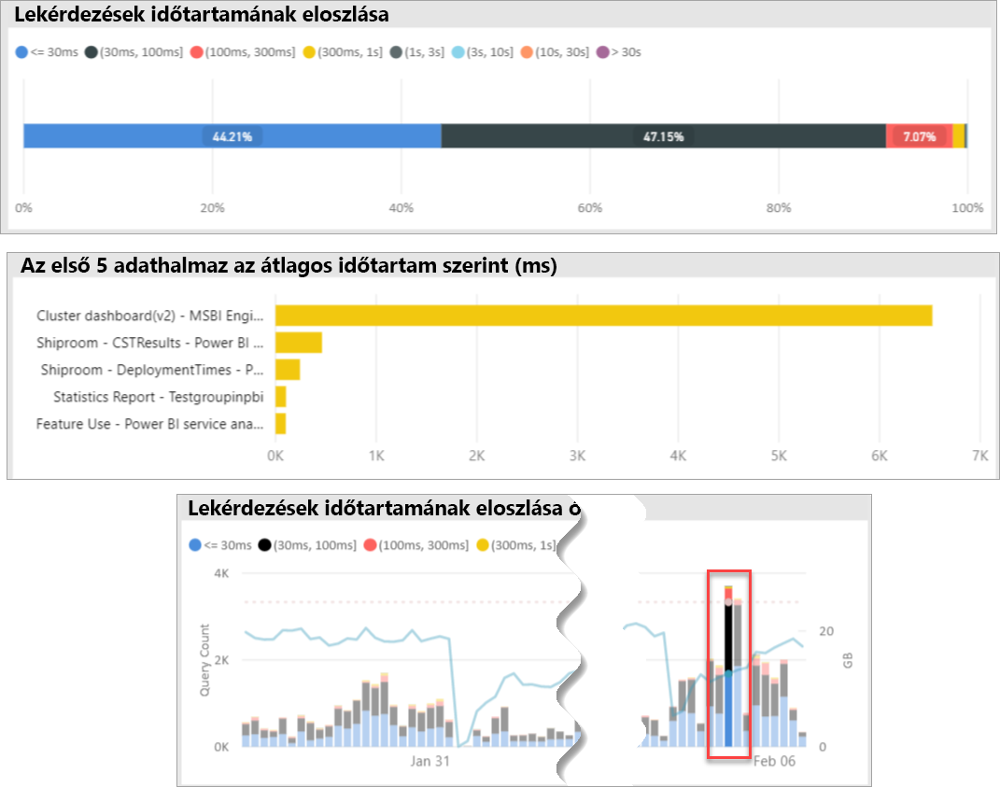

Ha azonosítják a gyenge teljesítményű adatkészletet egy adott 1 órás TimeSpan, akkor a Power BI rendszergazdája megvizsgálhatja, hogy a gyenge teljesítményt okozta-e túlterhelt kapacitás, vagy egy rosszul megtervezett adatkészlet vagy jelentés miatt. Ennek eléréséhez hivatkozhat a **lekérdezés várakozási idejének** vizualizációra, és rendezheti az adatkészleteket az átlagos lekérdezési várakozási idő csökkenő sorrendbe állításával. Ha a lekérdezések nagy hányada várakozik, az adatkészlet nagy igénye valószínűleg a sok lekérdezési várakozás oka. Ha az átlagos lekérdezési várakozási idő jelentős (> 100ms), érdemes megtekinteni az adatkészletet és a jelentést, és megtudhatja, hogy lehet-e optimalizálást végezni. Előfordulhat például, hogy a jelentés lapjain kevesebb vizualizációt vagy egy DAX-kifejezés optimalizálását adja meg.

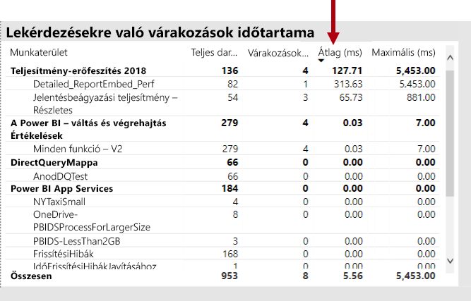

Több lehetséges oka van annak, hogy a lekérdezések várakozási ideje felépíthető az adatkészletekben:

- Optimális modell-kialakítás, mérték kifejezés, vagy akár jelentés tervezése – minden olyan körülmény, amely hozzájárulhat a nagy mennyiségű CPU-t használó hosszú távú lekérdezésekhez. Ez kényszeríti az új lekérdezéseket, hogy várjon, amíg a CPU-szálak elérhetővé válnak, és létre tud hozni egy konvoj-hatást (gondolja a forgalmi dugót), amelyet általában a munkaidőben láthat. A **lekérdezési várakozások** oldal lesz a fő erőforrás, amely meghatározza, hogy az adatkészletek nagy átlagos lekérdezési várakozási idővel rendelkeznek-e.
- Nagy számú egyidejű kapacitású felhasználó (több százezer) ugyanazt a jelentést vagy adatkészletet felhasználva. Még a jól megtervezett adathalmazok is rosszul végezhetők el a egyidejűségi küszöbértékeken túl. Ezt általában egyetlen adatkészlet jelzi, amely jóval magasabb értéket mutat a lekérdezési számokhoz, mint a többi adatkészletnél (azaz az egyik adathalmaz 300K-lekérdezései, mint az összes többi adatkészlet < 30K-lekérdezése). Egy ponton a lekérdezés várakozási ideje, hogy ez az adatkészlet megdöbbentő lesz, és ezt a **lekérdezés időtartamainak** vizualizációja fogja látni.
- Számos különböző adatkészlet egyidejűleg kérdezi le az adatokat, így az adathalmazok gyakran a memóriában és a memóriában is leállnak. Ez azt eredményezi, hogy a felhasználók lassú teljesítményt tapasztalnak, amikor az adatkészlet betöltődik a memóriába. Ennek megerősítéséhez az Power BI rendszergazdája hivatkozhat az **óránkénti adatkészlet kizárására és a memóriahasználat** vizualizációra, ami arra utalhat, hogy a memóriába betöltött adathalmazok nagy száma ismételten ki van zárva.

### A szórványosan lassan válaszoló adatkészletek okainak azonosítása

Ebben a forgatókönyvben egy vizsgálatot váltott ki, amikor a felhasználók azt írják le, hogy a jelentés vizualizációi néha lassúak, vagy nem válaszolnak, de más időpontokban elfogadhatóan reagálnak.

Az alkalmazáson belül a **lekérdezési időtartamok** szakaszban a következő módon találta meg a bűnös adatkészletet:

- A **lekérdezés időtartama alatt** a rendszergazda szűrt adatkészletet az adatkészlet alapján (a legfelső szintű adatkészletek kiindulásával), majd megvizsgálta az **óránkénti lekérdezés eloszlások** vizualizációjában lévő, szűrt sávokat.
- Ha egy egyórás sáv az összes lekérdezési időtartam csoport és az adott adatkészlethez tartozó egyéb egyórás sávok közötti arányban jelentős változásokat mutatott (azaz a színek közötti arányok drasztikusan változnak), ez azt jelenti, hogy ez az adatkészlet szórványos változást mutat be a következőben: teljesítmény.
- Az egyórás sávok a rossz teljesítményű lekérdezések szabálytalan részét mutatják, jelezve egy TimeSpan, amelyben az adathalmazt egy zajos szomszédi hatás befolyásolta, amelyet más adatkészletek tevékenységei okoztak.

Az alábbi képen egy óra jelenik meg január 30-ig, ahol jelentős visszaesés történt az adatkészlet teljesítményében, amelyet a "(3, tízes]" végrehajtási időtartam gyűjtője jelez). Ha az egyórás sáv elemre kattint, a rendszer az adott időszakban a memóriába betöltött összes adatkészletet felfedi, így a jelölt bűnös adatkészleteket felszínre helyezi, ami a zajos szomszéd hatást

A problémás TimeSpan észlelése után (azaz a fenti képen látható január 30-ig) a Power BI rendszergazdája eltávolíthatja az összes adatkészlet szűrőjét, majd a szűrést csak az adott TimeSpan alapján határozhatja meg, hogy mely adatkészletek aktívan voltak lekérdezve ebben az időszakban. A zajos szomszéd effektushoz tartozó bűnös adatkészlet általában a legfelső lekérdezési adatkészlet, vagy az a leghosszabb átlagos lekérdezési időtartammal rendelkező egy.

A probléma megoldásához a bűnös adatkészleteket különböző munkaterületeken, eltérő prémium szintű kapacitáson vagy megosztott kapacitáson lehet terjeszteni, ha az adatkészlet mérete, a felhasználási követelmények és az adatfrissítési minták támogatottak.

A fordított érték is igaz lehet. A Power BI rendszergazdája azonosíthatja az időpontokat, amikor egy adatkészlet lekérdezési teljesítménye drasztikusan javul, majd megkeresi, hogy milyen eltűntek. Ha bizonyos információk hiányoznak ezen a ponton, akkor ez segíthet a problémát okozó problémára mutatni.

### Annak megállapítása, hogy van-e elegendő memória

Annak megállapításához, hogy van-e elegendő memória a kapacitáshoz a munkaterhelések teljesítéséhez, a Power BI rendszergazdája a **felhasznált memória százalékos arányát** az alkalmazás adatkészletek lapján tekintheti meg. **Az összes** (Total) memória a memóriába betöltött adatkészletek által felhasznált memóriát jelenti, függetlenül attól, hogy a rendszer aktívan kérdezi le vagy dolgozza fel azokat. Az **aktív** memória az aktívan feldolgozott adatkészletek által felhasznált memóriát jelenti.

A vizualizáció a következőképpen fog kinézni, így az összes (összesen) és az aktív memória közötti hézag látható:

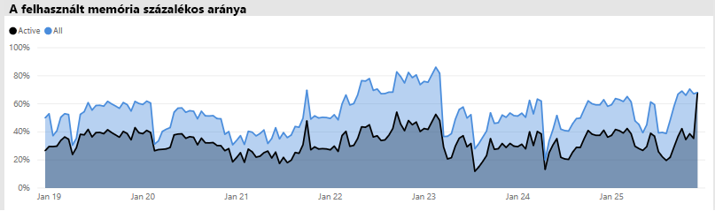

A memória-nyomást észlelő kapacitás esetén ugyanaz a vizualizáció egyértelműen megjeleníti az aktív memóriát és a teljes memória-átszervezést, ami azt jelenti, hogy az adott időpontban nem lehet további adatkészleteket betölteni a memóriába. Ebben az esetben a Power BI rendszergazdája a kapacitás- **Újraindítás** lehetőségre is kattinthat (a felügyeleti portál kapacitás beállításai területének **speciális beállításaiban** ). Ha újraindítja a kapacitást, a rendszer a memóriából kiüríti az összes adatkészletet, és lehetővé teszi, hogy a szükséges módon töltse be a memóriába (lekérdezés vagy Adatfrissítés alapján).

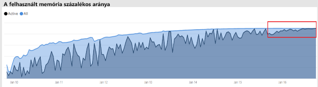

### Annak megállapítása, hogy van-e elég CPU

Általánosságban elmondható, hogy a kapacitás átlagos CPU-kihasználtsága 80% alatt marad. Ez az érték meghaladja azt, hogy a kapacitás közeledik a CPU-telítettséghez.

A CPU-telítettség hatásait a működésük hosszabb ideig tarthatja, mint amennyi a CPU-környezet számos olyan kapcsolójának kapacitása miatt, amely az összes művelet feldolgozását kísérli meg. A nagy mennyiségű egyidejű lekérdezéssel rendelkező prémium kapacitásban ezt a lekérdezési várakozási idő jelzi. A nagy lekérdezések várakozási idejének következményei a szokásosnál lassabban reagálnak. A Power BI rendszergazdája könnyedén azonosíthatja, hogy mikor telített a CPU az **óránkénti lekérdezés várakozási ideje eloszlások** vizualizációjának megtekintésével. A lekérdezési várakozási idő időszakos csúcsai a lehetséges CPU-telítettséget jelzik.

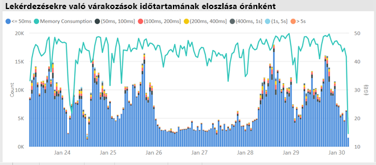

A háttérben futó műveletekben hasonló minta is észlelhető, ha azok a CPU-telítettséghez járulnak hozzá. Egy Power BI rendszergazda megkeresheti a frissítési időpontokban egy időszakos csúcsot egy adott adatkészlethez, amely a CPU-telítettséget jelzi (valószínűleg más, folyamatban lévő adatkészlet-frissítések és/vagy interaktív lekérdezések miatt). Ebben az esetben előfordulhat, hogy az alkalmazás **rendszernézetére** hivatkozva nem feltétlenül mutatja, hogy a processzor 100%-os. A **rendszernézet** óránkénti átlagokat jelenít meg, de a processzor több percig is telített lehet, és a várakozási idő során tüskék láthatók.

A CPU-telítettség hatásának megjelenítéséhez több finomításra van lehetőség. A várakozást okozó lekérdezések száma azonban fontos, a lekérdezési várakozási idő mindig bizonyos mértékig fog történni anélkül, hogy ez a teljesítmény felismerhető legyen. Egyes adatkészletek (a hosszabb átlagos lekérdezési ideje, ami az összetettséget vagy a méretet jelzi) hajlamosabbak a CPU-telítettség hatásaira, mint mások. Az adatkészletek egyszerű azonosításához a Power BI rendszergazdája megkeresheti a sávok színösszeállításának változásait az óránkénti **várakozási idő eloszlási** vizualizációjában. A kiugró sáv megfigyelése után megkereshetik azokat az adatkészleteket, amelyeken a lekérdezés megvárja az időt, és az átlagos lekérdezési várakozási időt is megtekintheti az átlagos lekérdezési időtartamhoz képest. Ha ez a két metrika azonos nagyságrendű, és az adatkészlet lekérdezési munkaterhelése nem triviális, valószínű, hogy az adatkészletet a nem elegendő processzor befolyásolja.

Ez a hatás különösen akkor lehet hasznos, ha egy adatkészletet több felhasználó (például egy betanítási munkamenetben) rövid, nagy gyakoriságú lekérdezései használják fel, ami a CPU-telítettséget eredményezi az egyes adattörések során. Ebben az esetben az adatkészlet jelentős lekérdezési várakozási idejét is tapasztalhatja, és hatással lehet a kapacitásban lévő többi adatkészletre (a zajos szomszéd hatás).

Bizonyos esetekben Power BI rendszergazdák kérhetik, hogy az adatkészletek tulajdonosai a jelentés helyett hozzon létre egy kevésbé változékony lekérdezési munkaterhelést egy irányítópult létrehozásával (amely rendszeresen lekérdezi a gyorsítótárazott csempék adatkészlet-frissítését). Ez segít megakadályozni a tüskéket az irányítópult betöltésekor. Előfordulhat, hogy ez a megoldás nem mindig lehetséges az adott üzleti követelmények esetében, azonban a CPU-telítettség elkerülésének hatékony módja lehet az adatkészlet módosítása nélkül.

## Összegzés

A Power BI Premium konzisztens teljesítményt nyújt, támogatja a nagyméretű adatmennyiségeket, és egy egységesített önkiszolgáló és nagyvállalati BI-platform rugalmasságát biztosítja a szervezet minden tagja számára. Ezt a 300-es szintű technikai tanulmányt kifejezetten Power BI-rendszergazdák, valamint a tartalmi szerzők és kiadók írták. Ennek célja, hogy segítsen megérteni a Power BI Premium rejlő lehetőségeket, valamint azt, hogy miként lehet megtervezni, üzembe helyezni, figyelni és elhárítani a méretezhető megoldásokat.

Power BI Premium kapacitások üzembe helyezéséhez és kezeléséhez a rendszergazdáknak és a modell-fejlesztőknek nagyon jól kell ismerniük, hogy a kapacitások hogyan működnek, hogyan kezelhetők és figyelhetők, valamint hogyan optimalizálható a modellek a megfelelő reagálás érdekében teljesítménnyel kapcsolatos problémák és szűk keresztmetszetek.

## Záró megjegyzések

\[1\] ez a technikai dokumentum olyan Power bi Premium vonatkozik, amelyet csak a Power bi Cloud Service támogat, és így Power bi jelentéskészítő kiszolgáló nincs a hatókörben, azzal a kivétellel, hogy az Power bi jelentéskészítő kiszolgáló telepítéséhez szükséges licenc tartalmaz néhányat Power BI Premium SKU-ket.

\[2\] Power bi felhőalapú szolgáltatásként, ha a tartalom beágyazására használatos a felhasználók nevében, a szolgáltatásként nyújtott platform (Péter). Ezt a beágyazási típust különböző két termékkel lehet megvalósítani, amelyek közül az egyik Power BI Premium.

\[3\] a leküldéses, a folyamatos átviteli és a hibrid adatkészletek nem a prémium szintű kapacitásban tárolódnak, ezért nem veszik figyelembe a prémium szintű kapacitások üzembe helyezése, kezelése és monitorozása során.

\[4\] az Excel-munkafüzetek Power bi tartalomtípusa nem a prémium szintű kapacitásban van tárolva, ezért nem veszi figyelembe a prémium szintű kapacitások üzembe helyezése, kezelése vagy figyelése során.

\[5\] vizualizáció konfigurálható a szeletelők interakcióinak figyelmen kívül hagyásához. További információkért tekintse meg a [vizualizációk interakcióit egy Power bi jelentési](service-reports-visual-interactions.md) dokumentumban.

\[6\] a méret különbsége a Power bi Desktop fájl méretének és a Feladatkezelő memóriájának a fájlhoz való összehasonlításával határozható meg.

\[7\] a Microsoft-adatforrások támogatása többek között az SQL Server, az Azure-adattéglák, a Azure HDInsight Spark (bétaverzió), a Azure SQL Database és a Azure SQL Data Warehouse. További információk a további forrásokról: [közvetlen lekérdezés által támogatott adatforrások Power bi](desktop-directquery-data-sources.md) dokumentumban.

\[a\] 8 Power bi Premium legfeljebb 10 GB méretű Power bi Desktop-(. pbix-) fájlok feltöltését támogatja. A feltöltést követően egy adatkészlet akár 12 GB-ot is nőhet a frissítés eredményeképpen. A feltöltés maximális mérete az SKU-tól függ. További információkért tekintse meg a [nagyméretű adatkészletek Power bi Premium támogatását](service-premium-large-datasets.md) ismertető dokumentumot.

\[a legfeljebb négy virtuális maggal rendelkezőSKU-ranemfutdedikáltinfrastruktúra.\] Ez magában foglalja a EM1, a EM2, az a1 és az a2 SKU-t.

\[10\] míg ritka, a modellek a szolgáltatás műveletei miatt el lesznek távolítva a memóriából.

\[11\] ezek az időzítések bármikor módosulhatnak.

\[12\] ez az úgynevezett több földrajzi terület, amely jelenleg előzetes verzióban érhető el. A többrégiós telepítésre való ésszerűség a teljesítmény és a méretezés helyett általában a vállalati és a kormányzati megfelelőség szempontjából szükséges. A jelentés és az irányítópult betöltése továbbra is magában foglalja a metaadatokat a hazai régióban. További információkért tekintse meg a [Power bi Premium (előzetes verzió) dokumentációjának multi-geo támogatása](service-admin-premium-multi-geo.md) című dokumentumot.

\[13\] lehetséges, hogy a felhasználók teljesítménybeli problémákat okozhatnak, ha túlterhelik a Power bi szolgáltatást a feladatokkal, a túlságosan összetett lekérdezéseket, a körkörös hivatkozások létrehozását stb.

\[14\] a teljes szervezet munkaterületek hozzárendelésének lehetősége nem ajánlott, és célzottabb megközelítés javasolt. Általában nem ajánlott a személyes munkaterületeket használni éles tartalomhoz.

\[15\] az alkalmazásban vagy a Azure Portalban is figyelheti az SKU-t, de nem a Power bi felügyeleti portálon. Egy SKU figyeléséhez a jelentés frissítése sikertelen lesz, ha az alkalmazás nem lett hozzáadva az erőforrás olvasó szerepköréhez. További információkért tekintse meg a [figyelő Power bi Premium és Power bi Embedded](service-admin-premium-monitor-capacity.md) a kapacitások című dokumentumot.

\[a\] 16 frissítés megvárhatja, ha nincs elegendő CPU vagy memória a kezdéshez.

\[17\] az adathalmaz mérete a memóriában nagyobb lehet, mint a lemez mérete akár 20%-kal.

\[18\] átlagos memóriahasználat (GB) és a maximális memóriahasználat (GB)

\[19\] adatkészlet kizárása

\[20\] adatkészlet-lekérdezés, adatkészlet átlagos lekérdezési időtartama (MS), adatkészlet várakozási száma és adatkészletek átlagos várakozási ideje (MS)

\[21\] CPU – magas kihasználtsági szám és a legmagasabb kihasználtságú CPU-idő (az elmúlt hét napban)

\[22\] DQ/LC – magas kihasználtsági szám és DQ/LC a legmagasabb kihasználtsági idő (az elmúlt hét napban)